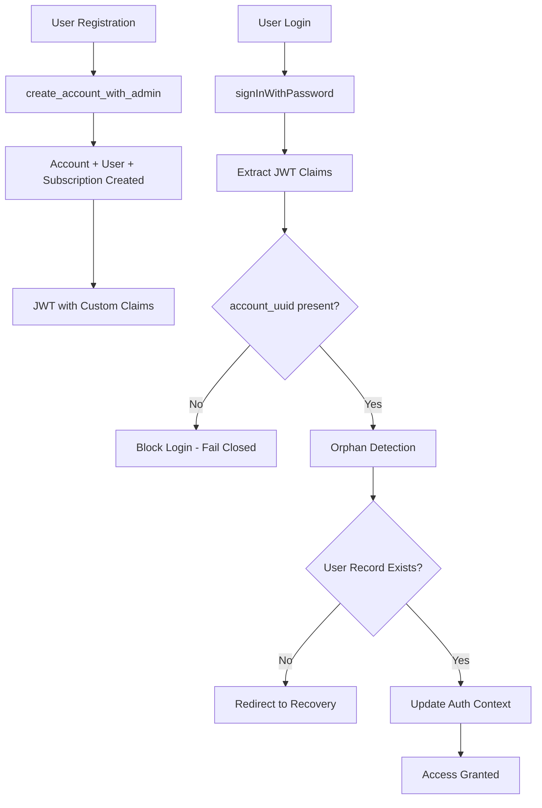
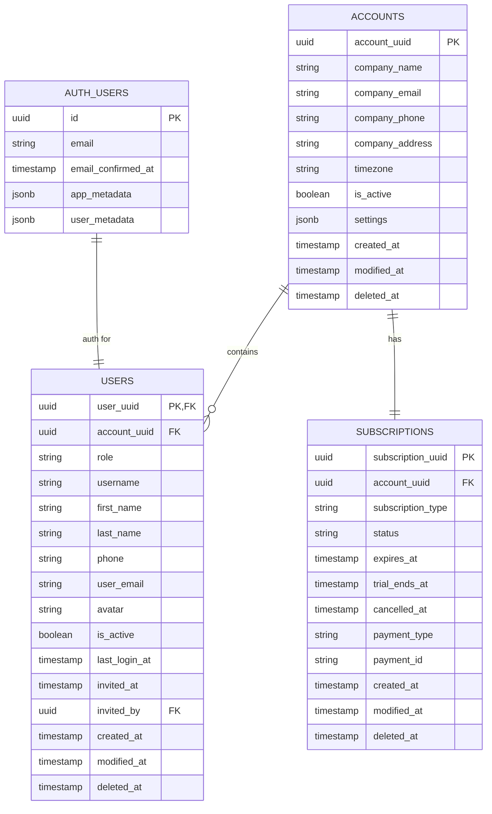

# Design Document: Auth B2B Implementation

## Overview

This design document specifies the implementation approach for adapting the existing Login/Registration code to work with the deployed B2B multi-tenant Supabase schema. The design focuses on minimal breaking changes while ensuring secure data isolation and proper account management.

### Key Design Principles

1. **Fail-Closed Security**: Block access when validation checks fail or return uncertain results
2. **Additive Changes**: Extend existing interfaces without breaking current consumers
3. **Type Safety**: Use comprehensive TypeScript types with no `any` types
4. **Performance First**: Meet strict latency targets (login < 2s, orphan detection < 200ms p95)
5. **Backward Compatibility**: Maintain existing patterns and local SQLite sync

## Architecture

### High-Level Flow



### Component Integration Points

1. **AuthProvider Context**: Extended with `accountUuid` and `userRole` fields
2. **Registration Flow**: Modified to call `create_account_with_admin()` function
3. **Orphan Detection**: Updated to query `public.users` table with account context
4. **TypeScript Types**: New interfaces matching deployed schema
5. **Local Profile Sync**: Extended to include account context

## Components and Interfaces

### Component 1: JWT Claims Extraction

**Purpose**: Extract and validate `account_uuid` and `user_role` from JWT custom claims

**Interface**:
```typescript
// JWT Claims Extraction Utilities
export function extractAccountUuid(session: Session | null): string | null
export function extractUserRole(session: Session | null): MemberRole | null  
export function validateJwtClaims(session: Session | null): boolean
```

**Implementation Strategy**:
- Try primary path: `session.user.app_metadata.account_uuid`
- Fallback to `session.user.user_metadata.account_uuid` with warning
- Fail-closed policy: return null if not found
- UUID format validation for account_uuid
- Default to 'member' role if user_role missing

### Component 2: Extended AuthProvider Context

**Purpose**: Expose account information throughout the application

**Interface**:
```typescript
interface AuthContextType {
  // Existing fields (unchanged)
  user: User | null
  isAuthenticated: boolean
  isVerified: boolean
  session: Session | null
  isLoading: boolean
  login: (email: string, password: string) => Promise<void>
  logout: () => Promise<void>

  // NEW: Account context fields
  accountUuid: string | null
  userRole: MemberRole | null
}
```

**Implementation Strategy**:
- Add nullable fields to maintain backward compatibility
- Extract claims during login flow after JWT validation
- Clear account context on logout
- Update context on session refresh

### Component 3: Registration Flow Integration

**Purpose**: Create accounts atomically using Supabase function

**Interface**:
```typescript
interface CreateAccountPayload {
  attemptId: string
  company: {
    name: string
    email?: string | null
    phone?: string | null
    // ... other company fields
  }
  admin: {
    email: string
    password: string
    firstName?: string | null
    lastName?: string | null
  }
}

interface CreateAccountResponse {
  accountId: string
  userId: string
  subscriptionId: string
  userRole: 'owner'
}
```

**Implementation Strategy**:
- Replace existing `register-organization` call with `create_account_with_admin`
- Map form payload to function signature
- Handle function-specific errors (email_already_exists, etc.)
- Preserve existing state machine phases
- Return account context in success result

### Component 4: Multi-Tenant Orphan Detection

**Purpose**: Verify users have valid account associations in multi-tenant model

**Interface**:
```typescript
interface OrphanCheckResult {
  isOrphaned: boolean
  orphanType: 'case_1_1' | 'case_1_2' | null
  latencyMs: number
}

export async function checkIfOrphaned(
  userId: string, 
  accountUuid: string | null
): Promise<OrphanCheckResult>
```

**Implementation Strategy**:
- Query `public.users` table instead of legacy tables
- Use RLS policies for automatic account filtering
- Validate account_uuid matches JWT claim (security check)
- Maintain fail-closed retry policy (3 attempts, exponential backoff)
- Log performance metrics (p95, p99 latency)

### Component 5: TypeScript Schema Types

**Purpose**: Provide type safety for database operations

**Interface**:
```typescript
export interface Account {
  account_uuid: string
  company_name: string
  company_email: string | null
  company_phone: string | null
  company_address: string | null
  timezone: string
  is_active: boolean
  settings: Record<string, any>
  created_at: string
  modified_at: string
  deleted_at: string | null
}

export interface User {
  user_uuid: string
  account_uuid: string
  role: MemberRole
  username: string | null
  first_name: string | null
  last_name: string | null
  phone: string | null
  user_email: string
  avatar: string | null
  is_active: boolean
  last_login_at: string | null
  invited_at: string
  invited_by: string | null
  created_at: string
  modified_at: string
  deleted_at: string | null
}

export interface Subscription {
  subscription_uuid: string
  account_uuid: string
  subscription_type: 'trial' | 'basic' | 'professional' | 'enterprise'
  status: 'trial' | 'active' | 'past_due' | 'cancelled' | 'expired'
  expires_at: string | null
  trial_ends_at: string | null
  cancelled_at: string | null
  payment_type: string | null
  payment_id: string | null
  created_at: string
  modified_at: string
  deleted_at: string | null
}

export type MemberRole = 'owner' | 'admin' | 'member' | 'viewer'
```

## Data Models

### Multi-Tenant Data Hierarchy



## Error Handling

### Error Classification and Handling

| Error Type | Source | Handling Strategy | User Message |
|------------|--------|-------------------|--------------|
| Missing account_uuid | JWT Claims | Fail-closed: Block login | "Unable to validate account information. Please contact support." |
| Invalid account_uuid format | JWT Claims | Fail-closed: Block login | "Unable to validate account information. Please contact support." |
| Orphan detected | Orphan Detection | Redirect to recovery | "Your account setup is incomplete. Redirecting to recovery..." |
| Orphan detection failed | Database/Network | Fail-closed: Block login | "Unable to verify account. Please try again." |
| Email already exists | Registration | Show login link | "This email is already registered with an account. Please log in." |
| Account creation failed | Supabase Function | Allow retry | "Unable to create account. Please try again or contact support." |
| Network error | Various | Show retry option | "Connection error. Please check your internet and try again." |

### Error Types

```typescript
export class OrphanedUserError extends Error {
  constructor(
    message: string,
    public orphanType: 'case_1_1' | 'case_1_2'
  ) {
    super(message)
    this.name = 'OrphanedUserError'
  }
}

export class JwtClaimsError extends Error {
  constructor(
    message: string,
    public missingClaim: 'account_uuid' | 'user_role'
  ) {
    super(message)
    this.name = 'JwtClaimsError'
  }
}

export class SubmissionError extends Error {
  constructor(
    public code: string,
    message: string,
    public source: 'auth' | 'function' | 'network' | 'unknown'
  ) {
    super(message)
    this.name = 'SubmissionError'
  }
}
```

## Testing Strategy

### Unit Testing
- JWT claim extraction functions (all paths, error cases)
- Orphan detection logic (orphaned, non-orphaned, account mismatch)
- Error mapping functions (all error types)
- Type validation utilities

### Integration Testing
- Complete registration flow (form → function → success)
- Complete login flow (credentials → claims → context)
- Error scenarios (duplicate email, network errors, orphan detection)
- Auth context updates (login, logout, session refresh)

### Manual Testing
- RLS policy enforcement (cross-account isolation)
- Performance validation (login < 2s, orphan detection < 200ms p95)
- JWT claims structure verification
- Backward compatibility with existing features

## Performance Considerations

### Latency Targets
- **Registration**: < 3s (excluding email verification wait)
- **Login**: < 2s (credential submit → auth context ready)
- **Orphan Detection**: < 200ms (p95), < 350ms (p99)
- **JWT Extraction**: < 50ms (synchronous operation)

### Optimization Strategies
- JWT claim extraction is synchronous (no network calls)
- Single query for orphan detection with indexed lookups
- RLS policies handle filtering at database level
- Fail-fast timeouts for network operations
- Non-blocking profile sync (errors don't block auth flow)

## Security Considerations

### JWT Validation
- Verify account_uuid presence and format (UUID v4)
- Validate user_role is valid enum value
- Fail-closed policy for missing claims
- Log security violations for monitoring

### RLS Enforcement
- All queries automatically filtered by account context
- No manual account_uuid filtering needed in application code
- Cross-account access prevented at database level
- Regular testing of policy effectiveness

### Data Isolation
- Account UUID mismatch detection (JWT vs database)
- Orphan detection prevents unauthorized access
- All sensitive operations require valid account context
- Audit logging for security events

## Migration Strategy

### Deployment Approach
1. **Verify Prerequisites**: JWT hooks, RLS policies, Supabase function
2. **Deploy Types**: Add new TypeScript interfaces
3. **Deploy JWT Extraction**: Add claim extraction utilities
4. **Deploy Auth Context**: Extend AuthProvider with account fields
5. **Deploy Registration**: Update to use create_account_with_admin
6. **Deploy Orphan Detection**: Update to use public.users table
7. **Deploy Profile Sync**: Add account context to local sync

### Backward Compatibility
- All AuthContext additions are nullable (default to null)
- Existing consumers continue to work without modification
- Local SQLite profile structure extended but compatible
- State machine phases preserved in registration flow
- No breaking changes to public APIs

### Rollback Plan
- Each component can be rolled back independently
- Feature flags for gradual rollout if needed
- Database schema is already deployed (no migrations)
- Fallback to existing behavior if JWT claims missing