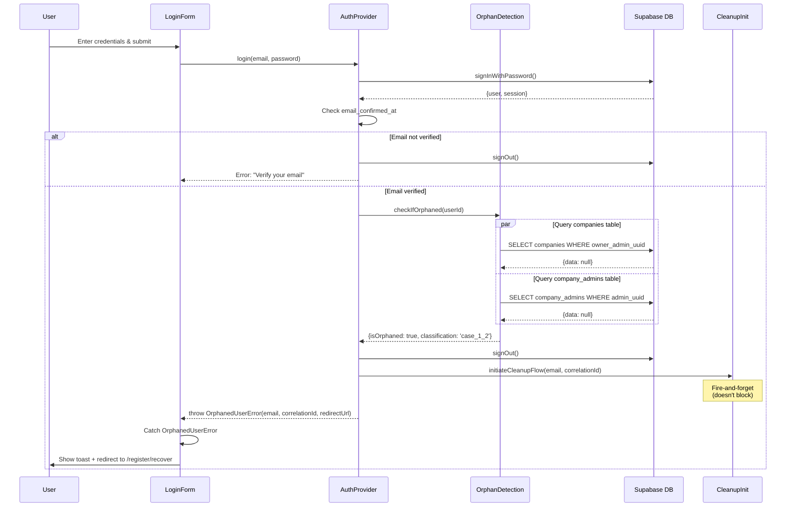

# Orphan Detection Architecture

## Overview

This document describes the architecture and implementation of the orphan detection system in Tr-entic Desktop. Orphan detection identifies users who exist in Supabase Auth (`auth.users` table) but have no corresponding data in the application's database tables (`companies` and `company_admins`). These "orphaned" users indicate incomplete registration flows that require recovery mechanisms.

## Table of Contents

- [Orphan Classifications](#orphan-classifications)
- [System Components](#system-components)
- [Detection Flow](#detection-flow)
- [Performance Characteristics](#performance-characteristics)
- [Error Handling & Graceful Degradation](#error-handling--graceful-degradation)
- [Metrics & Observability](#metrics--observability)
- [Security Considerations](#security-considerations)
- [Future Enhancements](#future-enhancements)

---

## Orphan Classifications

Orphaned users fall into two categories based on email verification status:

### Case 1.1: Orphaned Unverified

**Description**: User registered but never verified their email address.

**Characteristics**:
- `email_confirmed_at` in `auth.users` is `NULL`
- No records in `companies` table where `owner_admin_uuid = user.id`
- No records in `company_admins` table where `admin_uuid = user.id`

**Cause**: User initiated registration (`auth.signUp()`) but:
- Never clicked email verification link
- Email verification link expired (24 hours default)
- Email delivery failed

**Recovery Path**:
1. User attempts to log in
2. Login blocked at email verification check (before orphan detection)
3. User can resend verification email
4. After verification, orphan detection runs
5. If still orphaned, user redirected to recovery flow

**Current System Behavior**: Case 1.1 users are blocked at email verification check, so orphan detection never runs for them. The system assumes they'll either verify their email (allowing orphan detection) or remain stuck at verification stage.

---

### Case 1.2: Orphaned Verified

**Description**: User verified their email but registration flow was interrupted before company data was created.

**Characteristics**:
- `email_confirmed_at` in `auth.users` is set (not `NULL`)
- No records in `companies` table where `owner_admin_uuid = user.id`
- No records in `company_admins` table where `admin_uuid = user.id`

**Cause**: User completed email verification but:
- Browser crashed/closed before `register-organization` edge function call
- Edge function call failed (network error, database timeout)
- Database transaction rolled back (constraint violation, deadlock)
- User abandoned registration mid-flow

**Recovery Path**:
1. User attempts to log in
2. Email verification passes
3. Orphan detection runs and identifies Case 1.2
4. User signed out immediately
5. Cleanup flow initiated (verification code sent)
6. User redirected to `/register/recover` route
7. User enters verification code and deletes orphaned account
8. User completes registration with fresh account

**Current System Behavior**: Case 1.2 is the primary focus of orphan detection since these users can authenticate but have no application data.

---

## System Components

### 1. Orphan Detection Utility

**File**: `src/modules/auth/utils/orphanDetection.ts`

**Function**: `checkIfOrphaned(userId: string): Promise<OrphanCheckResult>`

**Responsibilities**:
- Query `companies` and `company_admins` tables in parallel
- Classify user as orphaned or non-orphaned
- Track performance metrics (duration, timeouts, errors)
- Generate correlation IDs for tracing
- Implement graceful degradation on timeout/error

**Return Type**:
```typescript
interface OrphanCheckResult {
  isOrphaned: boolean;
  classification: 'case_1_1' | 'case_1_2' | null;
  metrics?: OrphanCheckMetrics;
}
```

**Algorithm**:
1. Start performance timer
2. Generate correlation ID (UUID v4)
3. Execute parallel queries:
   - `SELECT id FROM companies WHERE owner_admin_uuid = $userId LIMIT 1`
   - `SELECT admin_uuid FROM company_admins WHERE admin_uuid = $userId LIMIT 1`
4. Race queries against 500ms timeout
5. Handle query errors (except PGRST116 "no rows")
6. Classify orphan status: `!hasCompanyData && !hasAdminData`
7. Return result with metrics

---

### 2. AuthProvider Integration

**File**: `src/app/providers/auth/AuthProvider.tsx`

**Function**: `login(email: string, password: string): Promise<void>`

**Integration Point**: After successful authentication and email verification check, before setting authenticated state.

**Flow**:
```typescript
async function login(email, password) {
  // 1. Authenticate with Supabase
  const { data, error } = await supabase.auth.signInWithPassword({ email, password });

  // 2. Verify email confirmation
  if (!data.user.email_confirmed_at) {
    await supabase.auth.signOut();
    throw new Error("Please verify your email...");
  }

  // 3. Run orphan detection
  const correlationId = crypto.randomUUID();
  const orphanResult = await checkIfOrphaned(data.user.id);

  // 4. Handle orphan classification
  if (orphanResult.isOrphaned) {
    // Sign out immediately
    await supabase.auth.signOut();

    // Initiate cleanup (fire-and-forget)
    void initiateCleanupFlow(email, correlationId);

    // Throw OrphanedUserError with redirect URL
    throw new OrphanedUserError(email, correlationId, `/register/recover?...`);
  }

  // 5. Success: Set authenticated state
  setUser(data.user);
  setSession(data.session);
  setIsAuthenticated(true);
}
```

**Error Handling**:
- `OrphanedUserError` caught by LoginForm → redirects to `/register/recover`
- Other errors displayed in form error state

---

### 3. OrphanedUserError Class

**File**: `src/modules/auth/errors/OrphanedUserError.ts`

**Purpose**: Custom error type for orphan detection results, carrying metadata for recovery flow.

**Properties**:
```typescript
class OrphanedUserError extends Error {
  email: string;
  correlationId: string;
  redirectUrl: string;
}
```

**Usage**:
```typescript
throw new OrphanedUserError(
  'user@example.com',
  crypto.randomUUID(),
  '/register/recover?email=user@example.com&reason=orphaned&correlationId=...'
);
```

**Redirect URL Format**:
```
/register/recover
  ?email={urlencoded-email}
  &reason=orphaned
  &correlationId={uuid}
```

---

### 4. Correlation ID Utilities

**File**: `src/shared/utils/correlationId.ts`

**Functions**:
- `generateCorrelationId(): string` - Generate UUID v4
- `extractCorrelationId(headers: Headers): string | null` - Extract from `x-correlation-id` header
- `addCorrelationIdHeader(headers: Record<string, string>, correlationId: string): void` - Add to request
- `isValidCorrelationId(value: string): boolean` - Validate UUID v4 format

**Purpose**: Enable end-to-end request tracing from frontend → edge functions → database operations.

**Usage Example**:
```typescript
const correlationId = generateCorrelationId();
const headers = { 'Content-Type': 'application/json' };
addCorrelationIdHeader(headers, correlationId);

const { data, error } = await supabase.functions.invoke('cleanup-orphaned-user', {
  body: payload,
  headers,
});

const responseCorrelationId = extractCorrelationId(response.headers);
```

---

## Detection Flow

### High-Level Sequence Diagram



---

### Detailed Step-by-Step Flow

#### Step 1: User Submits Login Credentials

**Component**: `LoginForm.tsx`

**Actions**:
1. Validate email and password fields (required, format)
2. Set `isLoading` state to `true`
3. Call `AuthProvider.login(email, password)`

**Error Handling**:
- Field validation errors displayed inline
- Authentication errors displayed in form error state

---

#### Step 2: Supabase Authentication

**Component**: `AuthProvider.login()`

**Actions**:
1. Call `supabase.auth.signInWithPassword({ email, password })`
2. Handle Supabase `AuthError` instances (wrong password, user not found, etc.)
3. Extract user object from response

**Possible Errors**:
- `invalid_credentials`: Wrong email/password
- `email_not_confirmed`: Email not verified (Supabase may block here)
- `user_not_found`: No account with this email
- `too_many_requests`: Rate limited

---

#### Step 3: Email Verification Check

**Component**: `AuthProvider.login()`

**Logic**:
```typescript
const verified = Boolean(supabaseUser?.email_confirmed_at);
if (!verified || !supabaseUser) {
  await supabase.auth.signOut();
  throw new Error("Please verify your email before signing in...");
}
```

**Purpose**: Block Case 1.1 users (unverified orphans) before orphan detection runs.

**User Experience**: User sees error message directing them to check email for verification link.

---

#### Step 4: Orphan Detection Execution

**Component**: `checkIfOrphaned(userId)`

**Parallel Queries**:
```typescript
const [companiesResult, adminsResult] = await Promise.race([
  Promise.all([
    supabase.from("companies").select("id").eq("owner_admin_uuid", userId).limit(1).maybeSingle(),
    supabase.from("company_admins").select("admin_uuid").eq("admin_uuid", userId).limit(1).maybeSingle(),
  ]),
  timeoutPromise(500), // Reject after 500ms
]);
```

**Performance**:
- Target: <100ms at p95
- Timeout: 500ms maximum
- Queries use indexed columns: `owner_admin_uuid`, `admin_uuid`
- `LIMIT 1` ensures constant query cost

**Metrics Tracked**:
- `totalDurationMs`: Full operation time
- `queryDurationMs`: Time spent in database queries
- `correlationId`: UUID for tracing
- `startedAt`: ISO 8601 timestamp (start)
- `completedAt`: ISO 8601 timestamp (end)
- `timedOut`: Boolean flag if timeout occurred
- `hadError`: Boolean flag if error occurred

---

#### Step 5: Orphan Classification

**Logic**:
```typescript
const hasCompanyData = companiesResult.data !== null;
const hasAdminData = adminsResult.data !== null;
const isOrphaned = !hasCompanyData && !hasAdminData;
```

**Classification Rules**:
- **Orphaned**: No company data AND no admin data
- **Not Orphaned**: Has company data OR has admin data (or both)

**Email Verification Assumption**: Since email verification check happened before orphan detection, all orphaned users at this point are Case 1.2 (verified).

---

#### Step 6: Orphan Handling

**Component**: `AuthProvider.login()`

**Actions on Orphan Detection**:
1. Sign out user: `await supabase.auth.signOut()`
2. Log orphan detection with metrics
3. Initiate cleanup flow (fire-and-forget): `void initiateCleanupFlow(email, correlationId)`
4. Throw `OrphanedUserError` with redirect URL

**Fire-and-Forget Pattern**:
```typescript
void initiateCleanupFlow(email, correlationId);
// Returns immediately, doesn't await completion
// Edge function call happens in background
// Errors logged but not thrown
```

**Purpose**: Send verification code email without blocking login flow response.

---

#### Step 7: Login Form Redirect

**Component**: `LoginForm.tsx`

**Error Handling**:
```typescript
try {
  await login(email, password);
} catch (err) {
  if (err instanceof Error && err.message === "REDIRECT_TO_RECOVERY") {
    const redirectUrl = (err as Error & { redirectUrl?: string }).redirectUrl;
    if (redirectUrl) {
      await router.navigate({ to: redirectUrl });
      return; // Don't show general error
    }
  }
  // Show general error
  setError(err instanceof Error ? err.message : "Login failed");
}
```

**Navigation**:
- Route: `/register/recover`
- Query Params: `email`, `reason=orphaned`, `correlationId`
- Toast shown by AuthProvider before redirect

---

## Performance Characteristics

### Target Performance

| Metric | Target | Measurement Point |
|--------|--------|-------------------|
| Query Duration (p50) | <50ms | Database queries only |
| Query Duration (p95) | <100ms | Database queries only |
| Query Duration (p99) | <200ms | Database queries only |
| Total Duration (p95) | <200ms | Full operation including overhead |
| Maximum Duration | 500ms | Hard timeout via Promise.race() |
| Timeout Rate | <0.1% | Queries exceeding 500ms |
| Error Rate | <0.01% | Queries returning errors |

### Performance Optimization Techniques

1. **Parallel Query Execution**:
   - `Promise.all()` executes both queries simultaneously
   - Reduces total time from `T(companies) + T(admins)` to `max(T(companies), T(admins))`
   - Expected savings: ~50% vs sequential execution

2. **Indexed Columns**:
   - `companies.owner_admin_uuid` indexed for fast lookup
   - `company_admins.admin_uuid` indexed for fast lookup
   - Index scan vs table scan: 100x-1000x faster for large tables

3. **LIMIT 1 Optimization**:
   - Database stops scanning after first match
   - Constant query cost regardless of result count
   - Critical for orphan detection (only need existence check, not full list)

4. **Timeout with Promise.race()**:
   - Prevents hanging requests from blocking login flow
   - 500ms is aggressive enough to catch slow queries but forgiving for network latency
   - Timeout triggers graceful degradation (returns false, logs warning)

5. **maybeSingle() vs first()**:
   - `maybeSingle()` returns null if no rows (expected for orphans)
   - `first()` would throw error on no rows
   - Avoids unnecessary error handling overhead

---

## Error Handling & Graceful Degradation

### Error Classification

**1. Supabase PGRST116 Error ("No rows returned")**:
- **Meaning**: Query returned zero rows (expected for orphaned users)
- **Handling**: Treat as success, user is orphaned
- **Code**: `error.code === 'PGRST116'` → ignore error, proceed with `data: null`

**2. Other Supabase Errors (PGRST500, PGRST5XX)**:
- **Meaning**: Database connection error, query syntax error, permission denied
- **Handling**: Graceful degradation → return `{isOrphaned: false, hadError: true}`
- **Logging**: Warn level with correlation ID, error details

**3. Query Timeout (>500ms)**:
- **Meaning**: Queries taking too long (slow database, high load)
- **Handling**: Graceful degradation → return `{isOrphaned: false, timedOut: true}`
- **Logging**: Warn level with correlation ID, duration

**4. Unexpected Exceptions**:
- **Meaning**: Runtime errors (network, JavaScript errors)
- **Handling**: Graceful degradation → return `{isOrphaned: false, hadError: true}`
- **Logging**: Error level with stack trace, correlation ID

### Graceful Degradation Policy

**Current Implementation (Fail-Open)**:

When orphan detection fails (timeout or error), the system allows login to proceed:

```typescript
// On timeout or error
return {
  isOrphaned: false,  // Safe default: assume not orphaned
  classification: null,
  metrics: {
    ...
    timedOut: true,  // or hadError: true
  },
};
```

**Rationale**:
- Login is a critical flow; blocking users on detection failures creates poor UX
- False negatives (missing orphaned users) are recoverable via other mechanisms
- False positives (blocking valid users) would be catastrophic

**Trade-offs**:
- **Pro**: Users can always log in (unless Supabase auth itself fails)
- **Pro**: System resilient to database performance degradation
- **Con**: Orphaned users might bypass detection temporarily
- **Con**: Requires monitoring to catch high timeout/error rates

**Mitigation**:
- Log all failures with correlation IDs for investigation
- Monitor timeout/error rates with alerts (target: <0.1% timeouts, <0.01% errors)
- Warn if p95 duration exceeds 200ms
- Users can still be caught on subsequent login attempts (retry mechanism)

---

### Future Enhancement: Fail-Closed with Retry

**Planned Implementation (Tasks 1.1-1.4)**:

When orphan detection fails, retry up to 3 times with exponential backoff:

```typescript
async function checkIfOrphaned(userId: string, options?: { maxRetries?: number }) {
  const maxRetries = options?.maxRetries ?? 3;
  const backoffs = [0, 200, 500]; // milliseconds

  for (let attempt = 1; attempt <= maxRetries; attempt++) {
    try {
      // Wait for backoff
      if (attempt > 1) {
        await new Promise(resolve => setTimeout(resolve, backoffs[attempt - 1]));
      }

      // Execute queries...
      const result = await executeQueries(userId);
      return result; // Success

    } catch (error) {
      if (attempt === maxRetries) {
        // All retries exhausted → fail-closed
        throw new OrphanDetectionError(
          "Orphan detection failed after retries",
          correlationId,
          metrics
        );
      }
      // Continue to next retry
    }
  }
}
```

**Behavior Change**:
- **Before**: Timeout/error → return `{isOrphaned: false}` (allow login)
- **After**: Timeout/error after 3 retries → throw error (block login)

**Error Message** (shown to user):
```
"Authentication system is temporarily unavailable.
Please try again in a few minutes.
If this persists, contact support."
```

**Total Maximum Latency**:
- Attempt 1: 0ms + 500ms (timeout) = 500ms
- Attempt 2: 200ms + 500ms (timeout) = 700ms
- Attempt 3: 500ms + 500ms (timeout) = 1000ms
- **Total**: 2200ms (2.2 seconds)

**Benefits**:
- Higher confidence in orphan detection results
- Fewer false negatives (missed orphaned users)
- More resilient to transient failures

**Trade-offs**:
- Slightly higher latency on failures (2.2s vs instant)
- Users blocked on persistent failures (must contact support)
- Requires robust monitoring and alerting

---

## Metrics & Observability

### Logged Metrics

Every orphan detection operation logs the following metrics:

```typescript
interface OrphanCheckMetrics {
  totalDurationMs: number;       // Full operation time (includes overhead)
  queryDurationMs: number;       // Time spent in database queries only
  correlationId: string;         // UUID for end-to-end tracing
  startedAt: string;             // ISO 8601 timestamp (operation start)
  completedAt: string;           // ISO 8601 timestamp (operation end)
  timedOut: boolean;             // True if queries exceeded 500ms
  hadError: boolean;             // True if database errors occurred
}
```

### Logging Levels

**Info Level** (successful detection):
```typescript
console.info("[orphanDetection] Orphaned user detected:", {
  correlationId,
  userId,
  classification: "case_1_2",
  metrics: {
    totalDurationMs,
    queryDurationMs,
  },
});
```

**Warn Level** (timeout or slow queries):
```typescript
console.warn("[orphanDetection] Query timeout (>500ms):", {
  correlationId,
  userId,
  error: "Queries exceeded 500ms timeout",
  metrics: {
    totalDurationMs,
    queryDurationMs,
  },
});
```

**Error Level** (unexpected exceptions):
```typescript
console.error("[orphanDetection] Unexpected error:", {
  correlationId,
  userId,
  error: {
    name: error.name,
    message: error.message,
    stack: error.stack,
  },
  metrics: {
    totalDurationMs,
    queryDurationMs,
  },
});
```

### Monitoring Dashboard (Recommended)

**Key Metrics to Track**:
1. **Orphan Detection Rate**: Percentage of login attempts that detect orphaned users
2. **Timeout Rate**: Percentage of detections that exceed 500ms timeout
3. **Error Rate**: Percentage of detections that encounter database errors
4. **Performance Percentiles**: p50, p95, p99 duration
5. **Correlation ID Coverage**: Ensure all logs include correlation IDs

**Alerts**:
- **Critical**: Timeout rate >1% (indicates database performance issues)
- **Critical**: Error rate >0.1% (indicates database connectivity/permission issues)
- **Warning**: p95 duration >200ms (approaching timeout threshold)
- **Warning**: Orphan detection rate >5% (indicates widespread registration failures)

### Correlation ID Tracing

Correlation IDs enable end-to-end request tracing:

1. **Frontend**: `AuthProvider.login()` generates correlation ID
2. **Orphan Detection**: Uses same correlation ID in logs
3. **Cleanup Flow**: Passes correlation ID to edge function
4. **Edge Function**: Returns correlation ID in response headers
5. **Database Logs**: Includes correlation ID in cleanup audit log

**Example Trace**:
```
[Frontend] AuthProvider.login() - correlationId: 550e8400-...
[Frontend] checkIfOrphaned() - correlationId: 550e8400-...
[Frontend] initiateCleanupFlow() - correlationId: 550e8400-...
[Edge Function] cleanup-orphaned-user - x-correlation-id: 550e8400-...
[Database] auth_cleanup_log - correlation_id: 550e8400-...
```

**Benefits**:
- Trace failures across system boundaries
- Debug user-reported issues by correlation ID
- Measure end-to-end latency of multi-step flows

---

## Security Considerations

### 1. Privacy: User Email Hashing

**Requirement**: Email addresses must not appear in plaintext in logs (NFR-16).

**Implementation**:
```typescript
function hashEmail(email: string): string {
  const normalized = email.toLowerCase().trim();
  const encoder = new TextEncoder();
  const data = encoder.encode(normalized);
  const hashBuffer = await crypto.subtle.digest('SHA-256', data);
  const hashArray = Array.from(new Uint8Array(hashBuffer));
  return hashArray.map(b => b.toString(16).padStart(2, '0')).join('');
}
```

**Usage**: All log entries containing emails use hash instead of plaintext.

**Limitation**: Simple hash (no salt) allows rainbow table attacks if attacker has log access. Future enhancement: use salted hash or keyed hash (HMAC).

---

### 2. Timing Attack Prevention

**Threat**: Attackers could measure orphan detection response time to infer:
- Whether a user exists in auth.users
- Whether a user has company data

**Current Mitigation**: Graceful degradation with same response structure:
```typescript
// Success path
return { isOrphaned: false, classification: null, metrics };

// Error path (timeout/error)
return { isOrphaned: false, classification: null, metrics };
```

**Response Time Variation**:
- Success: 50-200ms typical
- Timeout: 500ms fixed
- Error: Variable (10-500ms)

**Residual Risk**: Timeout/error cases have distinct timing (500ms vs <200ms), potentially leaking information.

**Future Enhancement (Task 0.7)**: Apply constant-time response pattern with Gaussian jitter across all paths (target 500ms ±50ms).

---

### 3. Rate Limiting

**Current State**: No rate limiting on orphan detection (runs on every login attempt).

**Potential Abuse**:
- Attacker could trigger orphan detection repeatedly to:
  - Enumerate valid user IDs (via timing analysis)
  - Overload database with parallel queries
  - Cause service degradation

**Mitigation**: Rate limiting implemented at Supabase auth level (login attempts rate limited).

**Future Enhancement**: Implement orphan detection-specific rate limiting if abuse detected.

---

### 4. Database Query Injection

**Protection**: All queries use parameterized statements via Supabase client:

```typescript
// Safe: userId is passed as parameter, not concatenated
supabase.from("companies").eq("owner_admin_uuid", userId)

// Unsafe (never do this): SQL injection vulnerability
// supabase.rpc('custom_query', { sql: `SELECT * FROM companies WHERE owner_admin_uuid = '${userId}'` })
```

**Validation**: `userId` is a UUID validated by Supabase Auth before reaching orphan detection.

---

### 5. Row-Level Security (RLS)

**Database Permissions**:
- `companies` table: RLS policies restrict access to company owners/admins
- `company_admins` table: RLS policies restrict access to same company admins

**Orphan Detection Access**: Uses anon key (public role), subject to RLS policies.

**Potential Issue**: If RLS policies block access, queries return zero rows (interpreted as orphaned user).

**Resolution**: Ensure RLS policies allow checking for existence of records by user ID, even if full row data is restricted.

---

## Future Enhancements

### Phase 1 Enhancements (Planned - Tasks 1.1-1.4)

1. **Fail-Closed with Retry Logic**:
   - Retry up to 3 times with exponential backoff (0ms, 200ms, 500ms)
   - Block login if all retries fail (throw `OrphanDetectionError`)
   - User message: "Authentication system temporarily unavailable"
   - Reduces false negatives (missed orphans) at cost of occasional blocked logins

2. **OrphanDetectionError Class**:
   - New error type for fail-closed scenarios
   - Properties: `correlationId`, `metrics`, `attemptCount`
   - Enables specific handling vs general errors

3. **Remove orphanCheckFailed Flag**:
   - Current: `AuthContext` has `orphanCheckFailed` boolean for graceful degradation tracking
   - Future: Remove flag since fail-closed approach blocks login on detection failures
   - Simplifies auth state management

---

### Phase 0 Enhancements (Already Designed)

1. **Postgres-Based Storage** (Phase 0 design complete):
   - Replace conceptual Deno KV with Postgres `verification_codes` table
   - Benefits: Transactional consistency, easier backup/restore, simpler architecture
   - Migration: `supabase/migrations/YYYYMMDDHHMMSS_create_verification_codes.sql`

2. **8-Character Alphanumeric Codes** (Phase 0 design complete):
   - Upgrade from 6-digit numeric (1M combinations) to 8-char alphanumeric (1.1T combinations)
   - Alphabet: [A-Z except O, 2-9 except 0/1] to avoid ambiguity (32 chars)
   - Display format: `XXXX-XXXX` (hyphen for readability)
   - Expiry: 5 minutes (reduced from 10)

3. **Supabase Vault Integration** (Phase 0 design complete):
   - Move `SUPABASE_SERVICE_ROLE_KEY` from environment variables to Supabase Vault
   - Benefits: Zero-trust secret management, easier rotation, audit trail
   - Fallback: Allow `Deno.env.get()` in dev environments with warning log

4. **Gaussian Jitter for Constant-Time Response** (Phase 0 design complete):
   - Replace uniform random jitter (±50ms) with Gaussian distribution
   - Benefits: Harder timing analysis, more natural latency patterns
   - Implementation: Box-Muller transform for Gaussian random values

---

### Long-Term Enhancements (Not Yet Planned)

1. **Machine Learning-Based Anomaly Detection**:
   - Train model on orphan detection patterns (duration, time of day, user behavior)
   - Flag suspicious patterns (e.g., 100 orphan detections from same IP in 1 hour)
   - Adaptive rate limiting based on anomaly scores

2. **Distributed Orphan Detection Cache**:
   - Cache orphan detection results for short TTL (30 seconds)
   - Reduce database load for users attempting multiple logins quickly
   - Requires cache invalidation strategy (when user completes registration)

3. **Real-Time Dashboard**:
   - Live monitoring of orphan detection metrics
   - Correlation ID search and trace visualization
   - Alerting integration (PagerDuty, Slack)

4. **A/B Testing Framework**:
   - Test different timeout values (300ms vs 500ms vs 1000ms)
   - Test different retry strategies (2 vs 3 vs 4 attempts)
   - Measure impact on false negatives, user experience, database load

---

## Related Documentation

- **Requirements**: `/plans/registration-edge-case-fix/registration-edge-case-fix_Requirements.md`
- **Design**: `/plans/registration-edge-case-fix/registration-edge-case-fix_Design.md`
- **Task List**: `/plans/registration-edge-case-fix/registration-edge-case-fix_TaskList.md`
- **Phase 0 Designs**: `/plans/registration-edge-case-fix/designs/*.md`
- **API Documentation**: `/docs/registration-recovery-api.md`
- **Codebase Analysis**: `/plans/registration-edge-case-fix/registration-edge-case-fix_CodebaseAnalysis.md`

---

## Revision History

| Version | Date | Author | Changes |
|---------|------|--------|---------|
| 1.0 | 2025-10-28 | Claude (coding-agent) | Initial architecture documentation for current implementation |

---

**End of Document**
