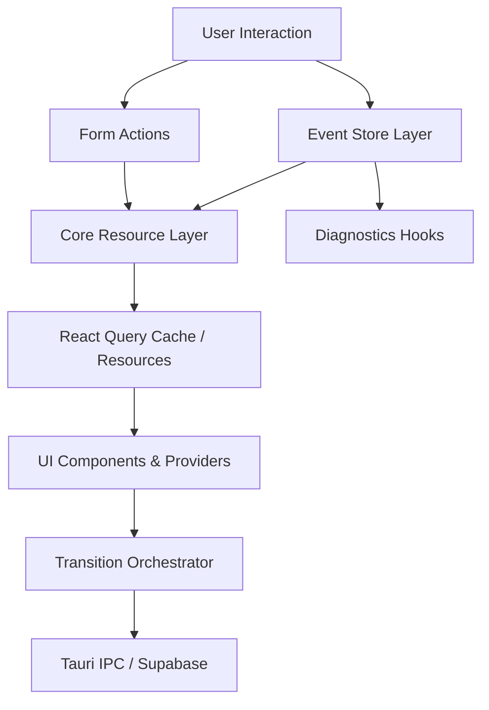

# Design Document

## Overview

The refactor introduces a declarative side-effect architecture that replaces every `useEffect` with React 19-centric primitives. Core ideas include (1) a Resource layer built atop React Query and suspense-friendly helpers, (2) an Event Store abstraction powered by `useSyncExternalStore` for DOM/Tauri bridge events, (3) a Transition Orchestrator that drives router feedback via deterministic state machines, and (4) Form Actions that encapsulate mutations using React 19 Actions and compiler-compatible callbacks. These modules eliminate lifecycle flags, unify polling/subscription handling, and ensure the React Compiler can optimize state usage.

## Architecture

- **Core Resource Layer**: Wraps IPC/Supabase calls inside reusable `createResource` helpers, surfacing data through `use` or React Query selectors. Provides mutation hooks aligned with Server/Client Actions.
- **Event Store Layer**: Exposes `createEventStore(target, subscribeFn)` factories returning hooks that leverage `useSyncExternalStore`. Covers navigation events, media queries, window metrics, file-drop, and log streaming.
- **Transition Orchestrator**: Finite-state machine managing `"idle" | "exiting" | "entering"` phases, subscribed to router transitions via TanStack Router listeners invoked through stable `useEffectEvent` handlers (no `useEffect` in consumer code).
- **Form & Wizard Actions**: Move registration, recovery, and wizard flows to action-based mutations, sharing scheduler utilities for debounced validation, address autocomplete, and optimistic updates.
- **Testing/Diagnostics**: Utilities expose mockable stores/resources enabling deterministic unit and integration testing without timers.

### High-Level Flow

### Integration Points

- **Tauri IPC**: Resource layer wraps `notifyShellReady`, translation history commands, file-drop notifications, and log streams.
- **Supabase**: Auth provider consumes Supabase session/resource while React Query manages health checks and subscriptions.
- **TanStack Router**: Transition orchestrator listens to router events via stable callbacks and updates state machine; route loaders leverage resources.
- **Toast & Logging Providers**: Form actions dispatch success/error notifications; log streaming feeds `LogConsole` through event stores.

## Components and Interfaces

- **`createResource<T>`**: Factory producing `{ read(): T, mutate(fn): Promise<void>, invalidate(): void }` objects backed by React Query caches and suspense wrappers.
- **`useResourceSelector(resource, selector)`**: Hook returning derived data with compiler-friendly memoization, keeping components effect-free.
- **`createEventStore<T>`**: Accepts `subscribe: (emit: (value: T) => void) => () => void` and `getSnapshot: () => T`. Returns `useEventStore()` for components.
- **`TransitionStateController`**: Pure module providing `nextState(current, event)` transitions and optional timers via scheduler queue.
- **`FormActionSuite`**: Wraps auth/wizard flows using `useActionState` and typed submit handlers, optionally bridging to Supabase mutations via Tauri if needed.
- **`Scheduler` Utility**: Declarative `schedule(delay, callback)` returning cancel handles to manage timers outside component bodies.

## Data Models 1 (Resource Descriptor)

| Field | Type | Description |
| --- | --- | --- |
| `key` | `string | readonly unknown[]` | Key used for cache lookup/invalidation |
| `loader` | `() => Promise<T>` | Async function to resolve data |
| `options` | `{ staleTime?: number; refetchInterval?: number }` | Configuration for cache/runtime behavior |

## Data Models 2 (Event Channel)

| Field | Type | Description |
| --- | --- | --- |
| `target` | `EventTarget | null` | Lifecycle-managed target (window, router, IPC bridge) |
| `subscribe` | `(emit: (payload: T) => void) => () => void` | Subscription hook used by `useSyncExternalStore` |
| `getSnapshot` | `() => T` | Getter providing current state |
| `diagnostics` | `{ name: string; tags?: string[] }` | Metadata for logging/observability |

## Error Handling 1

- Resource failures propagate suspense errors caught by `AppErrorBoundary`, which now accepts declarative resets triggered by action responses.
- Event store subscriptions capture errors in subscription callbacks and forward them to `logger.error` with context (no manual try/catch inside effects).

### Graceful Degradation 1

- If React Query/cache APIs fail, fall back to immediate Promise-based resolution with warnings while maintaining UI responsiveness.
- Event stores detect unsupported browser APIs (e.g., `matchMedia`) and serve default snapshots with feature flags for analytics.

### Diagnostic Integration 1

- Each resource/event channel emits structured logs via the existing `logger` interface, enriched with correlation IDs and scope (e.g., `"resource:translationHistory"`).
- Testing helpers provide `withMockResource(key, data)` for deterministic assertions.

## Testing Strategy

- Update unit tests to target new resource/event factories with deterministic mocks (no reliance on fake timers).
- Introduce integration tests verifying auth bootstrap, translation history updates, and transition states under concurrent renders.
- Ensure existing Vitest suites run with React 19 features and React Compiler instrumentation enabled.
- Add diagnostics assertions (log capture) covering failure modes (Supabase offline, IPC errors).

## Implementation Phases

### Phase 1 - Core Infrastructure

- Extract `createResource` and `createEventStore` utilities with initial coverage.
- Refactor `LogProvider`, `AuthProvider`, and `useShellReadyEmitter` to use the new primitives.
- Replace shell bootstrapping in `main.tsx` with resource/suspense flows and verify logging.
- Update AppErrorBoundary to respond to resource resets.

### Phase 2 - Data Hooks & Subscriptions

- Migrate `useTranslationHistory`, `useSupabaseHealth`, `useAppHealth`, and client/project data hooks to the resource layer.
- Consolidate polling into scheduler utilities referenced by resources.
- Apply event store abstractions to media queries, file drop, navigation, and workspace layout modules.
- Update related unit tests and add new ones where gaps exist.

### Phase 3 - Transitions & Forms

- Rebuild `PageTransitionProvider` and `TransitionSuspenseFallback` using the transition state controller and scheduler.
- Refactor auth/wizard form hooks and components to action-based submissions and resource-driven status updates.
- Conduct feature-level regression (auth onboarding, project creation, translation flows) with QA sign-off.
- Finalize documentation, remove dead utilities, and prepare rollout communication.

## Performance Considerations

- **Minimal Impact Design**: Scheduler avoids unnecessary timers; resources share caches; event stores push incremental updates only when snapshots change.
- **Scalability**: Resource keys align with route params/entities, ensuring easy extension for new modules; event stores support multiple subscribers.
- **Backward Compatibility**: Legacy shell remains operational; new abstractions expose identical public APIs for consuming components, minimizing downstream changes.

## Migration and Compatibility

- Introduce new utilities behind feature flags where needed, migrate consumers gradually, and remove flags once coverage is complete.
- Provide compatibility adapters (e.g., `useMediaQueryLegacy`) during transition for modules migrated later in the rollout.
- Coordinate with QA to run full regression on macOS/Windows Tauri builds before removing legacy pathways.
