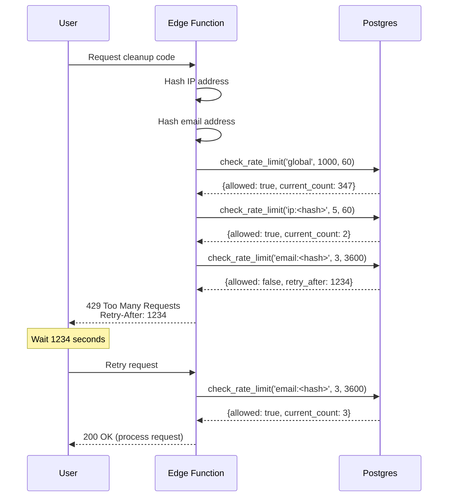

# Postgres-Based Rate Limiting System Design

## Overview

This document specifies the Postgres-based rate limiting system for orphaned user cleanup operations. The system implements a **bucketed sliding window algorithm** with atomic operations to prevent abuse while maintaining distributed consistency across Supabase Edge Function instances.

## Requirements Addressed

- **Req#3**: Cleanup Edge Function Without Auth
- **Req#8**: Security Requirements for Cleanup Without Auth
- **NFR-6**: Global rate limit support (1000 req/60s)
- **NFR-7**: Distributed support across edge function instances
- **NFR-8**: Exponential backoff for conflicts
- **NFR-22**: RFC 7231 compliant Retry-After headers

## Rate Limiting Tiers

### Tier 1: Global Rate Limit
- **Purpose**: Protect backend infrastructure from overload
- **Limit**: 1000 requests per 60 seconds (aggregate across all users)
- **Key**: `'global'`
- **Action on Exceed**: Return 429 with Retry-After header

### Tier 2: Per-IP Rate Limit
- **Purpose**: Prevent single-source abuse/brute force
- **Limit**: 5 requests per 60 seconds
- **Key**: `'ip:<hashed-ip>'` (e.g., `'ip:a1b2c3...'`)
- **Action on Exceed**: Return 429 with Retry-After header

### Tier 3: Per-Email Rate Limit
- **Purpose**: Prevent targeted attacks on specific accounts
- **Limit**: 3 requests per 60 minutes (note: longer window)
- **Key**: `'email:<hashed-email>'` (e.g., `'email:d4e5f6...'`)
- **Action on Exceed**: Return 429 with Retry-After header

**Evaluation Order**: Check all three tiers; if any tier is exceeded, reject request with lowest retry-after value.

## Algorithm: Bucketed Sliding Window

### Concept

The sliding window algorithm tracks requests within a moving time window. Traditional implementations store every request timestamp, which is memory-intensive. The **bucketed** approach divides the window into fixed-size buckets, storing only aggregate counts per bucket.

**Example** (60-second window with 1-second buckets):
```
Current time: 12:00:45

Buckets:
12:00:40 -> count: 3
12:00:41 -> count: 1
12:00:42 -> count: 0
12:00:43 -> count: 5
12:00:44 -> count: 2
12:00:45 -> count: 1  (current bucket, incrementing)

Window start: 12:00:45 - 60s = 11:59:45
Sum counts in buckets from 11:59:45 to 12:00:45 = total requests in window
```

### Bucket Size Trade-off

- **1-second buckets**: High accuracy, more storage (60 rows per key per minute)
- **10-second buckets**: Lower accuracy, less storage (6 rows per key per minute)
- **60-second buckets**: Lowest accuracy (approximates fixed window), minimal storage (1 row per key per minute)

**Recommended**: **1-second buckets** for precision, with automatic cleanup to control storage.

## Database Schema

### Table: `rate_limits`

```sql
CREATE TABLE rate_limits (
  -- Rate limit identifier (global, ip:<hash>, email:<hash>)
  key TEXT NOT NULL,

  -- Bucket timestamp (truncated to second)
  bucket_time TIMESTAMPTZ NOT NULL,

  -- Request count in this bucket
  count INTEGER NOT NULL DEFAULT 1,

  -- Composite primary key (unique bucket per key)
  PRIMARY KEY (key, bucket_time)
);
```

### Index

```sql
-- Efficient window queries and cleanup
CREATE INDEX idx_rate_limits_bucket_time
  ON rate_limits(bucket_time);
```

**Why This Index**:
- Cleanup queries scan by bucket_time: `DELETE WHERE bucket_time < threshold`
- Window queries filter by key (covered by PRIMARY KEY) and bucket_time range
- Composite index (key, bucket_time) provided automatically by PRIMARY KEY

## Column Specifications

### `key` (TEXT)
- **Type**: TEXT
- **Purpose**: Identifies the rate limit being tracked
- **Format**:
  - Global: `'global'`
  - Per-IP: `'ip:' + SHA256(ip_address)` (64-char hex)
  - Per-Email: `'email:' + SHA256(email)` (64-char hex)
- **Nullability**: NOT NULL (enforced by PRIMARY KEY)
- **Security**: IP and email are hashed before use as keys

### `bucket_time` (TIMESTAMPTZ)
- **Type**: TIMESTAMPTZ (timestamp with timezone)
- **Purpose**: Identifies the time bucket (truncated to second)
- **Calculation**: `DATE_TRUNC('second', NOW())`
- **Nullability**: NOT NULL (enforced by PRIMARY KEY)
- **Precision**: Second-level granularity (e.g., `2025-10-28 12:00:45+00`)

### `count` (INTEGER)
- **Type**: INTEGER
- **Default**: 1
- **Purpose**: Number of requests in this bucket
- **Range**: Typically 1-10 per bucket (rarely higher)
- **Nullability**: NOT NULL

## PostgreSQL Function: `check_rate_limit`

### Function Signature

```sql
CREATE OR REPLACE FUNCTION check_rate_limit(
  p_key TEXT,
  p_limit INTEGER,
  p_window_seconds INTEGER
) RETURNS TABLE(
  allowed BOOLEAN,
  current_count INTEGER,
  retry_after INTEGER
) AS $$
```

### Function Logic

```sql
CREATE OR REPLACE FUNCTION check_rate_limit(
  p_key TEXT,
  p_limit INTEGER,
  p_window_seconds INTEGER
) RETURNS TABLE(
  allowed BOOLEAN,
  current_count INTEGER,
  retry_after INTEGER
) AS $$
DECLARE
  v_window_start TIMESTAMPTZ;
  v_current_count INTEGER;
  v_bucket_time TIMESTAMPTZ;
  v_oldest_bucket TIMESTAMPTZ;
  v_retry_seconds INTEGER;
BEGIN
  -- Calculate window start (e.g., NOW() - 60 seconds)
  v_window_start := NOW() - (p_window_seconds || ' seconds')::INTERVAL;

  -- Truncate current time to second (bucket granularity)
  v_bucket_time := DATE_TRUNC('second', NOW());

  -- Calculate current count in sliding window
  SELECT COALESCE(SUM(count), 0) INTO v_current_count
  FROM rate_limits
  WHERE key = p_key
    AND bucket_time > v_window_start;

  -- Clean up old buckets (older than 2x window duration)
  DELETE FROM rate_limits
  WHERE bucket_time <= v_window_start - (p_window_seconds || ' seconds')::INTERVAL;

  -- Check if limit exceeded
  IF v_current_count >= p_limit THEN
    -- Find oldest bucket contributing to limit
    SELECT MIN(bucket_time) INTO v_oldest_bucket
    FROM rate_limits
    WHERE key = p_key
      AND bucket_time > v_window_start;

    -- Calculate retry-after: time until oldest bucket exits window
    v_retry_seconds := EXTRACT(EPOCH FROM (
      v_oldest_bucket + (p_window_seconds || ' seconds')::INTERVAL - NOW()
    ))::INTEGER;

    -- Return: not allowed, current count, retry-after
    RETURN QUERY SELECT FALSE, v_current_count, v_retry_seconds;
  ELSE
    -- Increment current bucket (atomic upsert)
    INSERT INTO rate_limits (key, bucket_time, count)
    VALUES (p_key, v_bucket_time, 1)
    ON CONFLICT (key, bucket_time)
    DO UPDATE SET count = rate_limits.count + 1;

    -- Return: allowed, updated count, no retry
    RETURN QUERY SELECT TRUE, v_current_count + 1, 0;
  END IF;
END;
$$ LANGUAGE plpgsql;
```

### Function Behavior

**Input Parameters**:
- `p_key`: Rate limit key (e.g., `'global'`, `'ip:abc123'`, `'email:def456'`)
- `p_limit`: Maximum requests allowed in window (e.g., 1000, 5, 3)
- `p_window_seconds`: Window duration in seconds (e.g., 60, 3600)

**Return Values** (single row, three columns):
- `allowed`: `TRUE` if request is within limit, `FALSE` if exceeded
- `current_count`: Total requests in current window
- `retry_after`: Seconds to wait before retrying (0 if allowed)

**Side Effects**:
1. **If allowed**: Atomically increments (or inserts) current bucket count
2. **If not allowed**: No state change (does not increment)
3. **Always**: Deletes buckets older than 2x window duration (cleanup)

### Usage Example

```sql
-- Check global rate limit (1000 req/60s)
SELECT * FROM check_rate_limit('global', 1000, 60);

-- Example output:
--  allowed | current_count | retry_after
-- ---------+---------------+-------------
--  true    | 347           | 0

-- Check per-IP rate limit (5 req/60s)
SELECT * FROM check_rate_limit('ip:a1b2c3...', 5, 60);

-- Example output (rate limited):
--  allowed | current_count | retry_after
-- ---------+---------------+-------------
--  false   | 5             | 42
```

## Rate Limit Enforcement Flow



## Edge Function Integration

### Rate Limit Checking

```typescript
interface RateLimitResult {
  allowed: boolean;
  currentCount: number;
  retryAfter: number;
}

async function checkRateLimit(
  key: string,
  limit: number,
  windowSeconds: number
): Promise<RateLimitResult> {
  const { data, error } = await supabase.rpc('check_rate_limit', {
    p_key: key,
    p_limit: limit,
    p_window_seconds: windowSeconds,
  });

  if (error) {
    throw new Error(`Rate limit check failed: ${error.message}`);
  }

  // Function returns single row with three columns
  return {
    allowed: data[0].allowed,
    currentCount: data[0].current_count,
    retryAfter: data[0].retry_after,
  };
}
```

### Multi-Tier Enforcement

```typescript
async function enforceRateLimits(
  email: string,
  ipAddress: string
): Promise<RateLimitResult | null> {
  // Hash identifiers
  const emailHash = await hashEmail(email);
  const ipHash = await hashIPAddress(ipAddress);

  // Check all three tiers
  const globalResult = await checkRateLimit('global', 1000, 60);
  if (!globalResult.allowed) {
    return globalResult;
  }

  const ipResult = await checkRateLimit(`ip:${ipHash}`, 5, 60);
  if (!ipResult.allowed) {
    return ipResult;
  }

  const emailResult = await checkRateLimit(`email:${emailHash}`, 3, 3600);
  if (!emailResult.allowed) {
    return emailResult;
  }

  // All tiers passed
  return null;
}

// Usage in edge function
const rateLimitResult = await enforceRateLimits(email, requestIP);

if (rateLimitResult) {
  return new Response(
    JSON.stringify({
      error: {
        code: 'ORPHAN_CLEANUP_003',
        message: 'Rate limit exceeded. Please try again later.',
      },
    }),
    {
      status: 429,
      headers: {
        'Content-Type': 'application/json',
        'Retry-After': rateLimitResult.retryAfter.toString(),
        'X-RateLimit-Limit': limit.toString(),
        'X-RateLimit-Remaining': Math.max(0, limit - rateLimitResult.currentCount).toString(),
        'X-RateLimit-Reset': (Math.floor(Date.now() / 1000) + rateLimitResult.retryAfter).toString(),
      },
    }
  );
}
```

### IP Address Hashing

```typescript
async function hashIPAddress(ip: string): Promise<string> {
  const encoder = new TextEncoder();
  const data = encoder.encode(ip.trim());
  const hashBuffer = await crypto.subtle.digest('SHA-256', data);
  const hashArray = Array.from(new Uint8Array(hashBuffer));
  return hashArray.map(b => b.toString(16).padStart(2, '0')).join('');
}
```

## Retry-After Header Calculation

### RFC 7231 Compliance

**Retry-After Header Formats**:
1. **HTTP-date**: `Retry-After: Wed, 21 Oct 2025 07:28:00 GMT`
2. **Delay-seconds**: `Retry-After: 120`

**Recommended**: Delay-seconds (simpler, no timezone issues)

**Calculation**:
```typescript
const retryAfterSeconds = rateLimitResult.retryAfter;

// Add to response headers
headers['Retry-After'] = retryAfterSeconds.toString();
```

**User-Friendly Message**:
```typescript
const minutes = Math.ceil(retryAfterSeconds / 60);
const message = retryAfterSeconds < 60
  ? `Please wait ${retryAfterSeconds} seconds before trying again.`
  : `Please wait ${minutes} minute${minutes > 1 ? 's' : ''} before trying again.`;
```

## Additional Rate Limit Headers

### X-RateLimit-* Headers

Following GitHub/Twitter conventions:

```typescript
headers['X-RateLimit-Limit'] = limit.toString();
headers['X-RateLimit-Remaining'] = Math.max(0, limit - currentCount).toString();
headers['X-RateLimit-Reset'] = (Math.floor(Date.now() / 1000) + retryAfter).toString(); // Unix timestamp
```

**Example**:
```
HTTP/1.1 429 Too Many Requests
Retry-After: 42
X-RateLimit-Limit: 5
X-RateLimit-Remaining: 0
X-RateLimit-Reset: 1730120400
```

## Cleanup Strategy

### Automatic Cleanup in Function

The `check_rate_limit` function includes automatic cleanup:
```sql
DELETE FROM rate_limits
WHERE bucket_time <= v_window_start - (p_window_seconds || ' seconds')::INTERVAL;
```

**Cleanup Threshold**: Buckets older than **2x window duration** are deleted.

**Example**:
- 60-second window → delete buckets older than 120 seconds
- 3600-second window (1 hour) → delete buckets older than 7200 seconds (2 hours)

**Why 2x**:
- Safety margin for clock skew or delayed cleanup
- Ensures no valid bucket is deleted prematurely
- Minimal storage overhead (extra 60 buckets per key = ~5 KB)

### Alternative: Scheduled Cleanup

If in-function cleanup adds latency, use scheduled job:

```sql
-- Scheduled cleanup function
CREATE OR REPLACE FUNCTION cleanup_old_rate_limit_buckets()
RETURNS INTEGER AS $$
DECLARE
  deleted_count INTEGER;
  v_threshold TIMESTAMPTZ;
BEGIN
  -- Delete buckets older than 2 hours (covers all window sizes)
  v_threshold := NOW() - INTERVAL '2 hours';

  DELETE FROM rate_limits
  WHERE bucket_time < v_threshold;

  GET DIAGNOSTICS deleted_count = ROW_COUNT;

  RAISE NOTICE 'Cleaned up % old rate limit buckets', deleted_count;

  RETURN deleted_count;
END;
$$ LANGUAGE plpgsql;

-- Schedule with pg_cron (every 10 minutes)
-- SELECT cron.schedule(
--   'cleanup-old-rate-limit-buckets',
--   '*/10 * * * *',
--   'SELECT cleanup_old_rate_limit_buckets();'
-- );
```

## Concurrency and Atomicity

### Atomic Bucket Increment

**ON CONFLICT DO UPDATE**:
```sql
INSERT INTO rate_limits (key, bucket_time, count)
VALUES (p_key, v_bucket_time, 1)
ON CONFLICT (key, bucket_time)
DO UPDATE SET count = rate_limits.count + 1;
```

**Behavior**:
- **No Existing Bucket**: Insert new row with count = 1
- **Existing Bucket**: Atomically increment count by 1
- **Concurrent Requests**: Postgres serializes increments (no lost updates)

### Race Condition Handling

**Scenario**: Two edge function instances check rate limit simultaneously.

**Timeline**:
1. Instance A: `SELECT SUM(count)` → returns 4 (under limit of 5)
2. Instance B: `SELECT SUM(count)` → returns 4 (under limit of 5)
3. Instance A: `INSERT ... count = 1` → total becomes 5
4. Instance B: `INSERT ... count = 1` → total becomes 6 (over limit!)

**Mitigation**:
- Accept slight overage (6 instead of 5) as acceptable trade-off
- Alternative: Row-level locking (higher latency):
  ```sql
  SELECT SUM(count) FROM rate_limits
  WHERE key = p_key AND bucket_time > v_window_start
  FOR UPDATE;  -- Lock all matching rows
  ```

**Recommended**: Accept slight overage (simpler, faster, negligible impact)

## Performance Characteristics

### Query Performance

**Window Count Query**:
```sql
SELECT SUM(count) FROM rate_limits
WHERE key = $1 AND bucket_time > $2;
```
- **Selectivity**: Depends on key cardinality and window size
  - Global key: Low selectivity (single key, many buckets)
  - IP/Email keys: High selectivity (many keys, few buckets each)
- **Index Used**: PRIMARY KEY index on (key, bucket_time)
- **Expected Rows**: 1-60 rows per query (1-second buckets, 60-second window)
- **Latency**: <10ms (p95)

**Bucket Upsert**:
```sql
INSERT INTO rate_limits (key, bucket_time, count)
VALUES ($1, $2, 1)
ON CONFLICT (key, bucket_time) DO UPDATE SET count = rate_limits.count + 1;
```
- **Latency**: <5ms (single-row operation)

**Cleanup Delete**:
```sql
DELETE FROM rate_limits
WHERE bucket_time <= $1;
```
- **Rows Deleted**: Varies (0-1000s depending on traffic)
- **Latency**: <50ms for 1000 rows

### Storage Estimates

**Per Key Storage**:
- 1-second buckets, 60-second window → 60 active buckets
- 2x cleanup threshold → 120 buckets max per key
- Row size: ~50 bytes (key + bucket_time + count + overhead)
- **Per key**: 120 * 50 = 6 KB

**Capacity**:
- 1000 unique IPs/emails (typical) → 6 MB
- 10,000 unique IPs/emails → 60 MB
- 100,000 unique IPs/emails → 600 MB

**Cleanup Effectiveness**: With 2x cleanup, storage remains bounded even under heavy traffic.

## Testing Considerations

### Unit Tests

1. **Function Correctness**:
   - Test `check_rate_limit` allows requests under limit
   - Test `check_rate_limit` rejects requests over limit
   - Test retry_after calculation is accurate

2. **Bucket Atomicity**:
   - Test concurrent increments don't lose counts
   - Test ON CONFLICT DO UPDATE works correctly

3. **Cleanup**:
   - Test old buckets are deleted
   - Test buckets within 2x window are not deleted

### Integration Tests

1. **Multi-Tier Enforcement**:
   - Test global limit is checked first
   - Test IP and email limits are independent

2. **Sliding Window Behavior**:
   - Test requests at window boundaries
   - Test count decreases as old buckets exit window

3. **Retry-After Accuracy**:
   - Test retry-after value allows request when reached
   - Test early retry still gets rate limited

### Load Tests

1. **High Concurrency**:
   - Simulate 100 simultaneous requests to same key
   - Verify count accuracy (allow slight overage)

2. **Storage Growth**:
   - Simulate 10,000 requests/minute for 10 minutes
   - Verify cleanup prevents unbounded growth

## Migration SQL

```sql
-- Migration: Create rate limiting system
-- File: supabase/migrations/YYYYMMDDHHMMSS_create_rate_limiting_system.sql

-- Create rate_limits table
CREATE TABLE rate_limits (
  key TEXT NOT NULL,
  bucket_time TIMESTAMPTZ NOT NULL,
  count INTEGER NOT NULL DEFAULT 1,
  PRIMARY KEY (key, bucket_time)
);

-- Create index for efficient cleanup
CREATE INDEX idx_rate_limits_bucket_time
  ON rate_limits(bucket_time);

-- Create rate limit checking function
CREATE OR REPLACE FUNCTION check_rate_limit(
  p_key TEXT,
  p_limit INTEGER,
  p_window_seconds INTEGER
) RETURNS TABLE(
  allowed BOOLEAN,
  current_count INTEGER,
  retry_after INTEGER
) AS $$
DECLARE
  v_window_start TIMESTAMPTZ;
  v_current_count INTEGER;
  v_bucket_time TIMESTAMPTZ;
  v_oldest_bucket TIMESTAMPTZ;
  v_retry_seconds INTEGER;
BEGIN
  v_window_start := NOW() - (p_window_seconds || ' seconds')::INTERVAL;
  v_bucket_time := DATE_TRUNC('second', NOW());

  SELECT COALESCE(SUM(count), 0) INTO v_current_count
  FROM rate_limits
  WHERE key = p_key
    AND bucket_time > v_window_start;

  DELETE FROM rate_limits
  WHERE bucket_time <= v_window_start - (p_window_seconds || ' seconds')::INTERVAL;

  IF v_current_count >= p_limit THEN
    SELECT MIN(bucket_time) INTO v_oldest_bucket
    FROM rate_limits
    WHERE key = p_key
      AND bucket_time > v_window_start;

    v_retry_seconds := EXTRACT(EPOCH FROM (
      v_oldest_bucket + (p_window_seconds || ' seconds')::INTERVAL - NOW()
    ))::INTEGER;

    RETURN QUERY SELECT FALSE, v_current_count, v_retry_seconds;
  ELSE
    INSERT INTO rate_limits (key, bucket_time, count)
    VALUES (p_key, v_bucket_time, 1)
    ON CONFLICT (key, bucket_time)
    DO UPDATE SET count = rate_limits.count + 1;

    RETURN QUERY SELECT TRUE, v_current_count + 1, 0;
  END IF;
END;
$$ LANGUAGE plpgsql;

-- Create optional scheduled cleanup function
CREATE OR REPLACE FUNCTION cleanup_old_rate_limit_buckets()
RETURNS INTEGER AS $$
DECLARE
  deleted_count INTEGER;
BEGIN
  DELETE FROM rate_limits
  WHERE bucket_time < NOW() - INTERVAL '2 hours';

  GET DIAGNOSTICS deleted_count = ROW_COUNT;
  RAISE NOTICE 'Cleaned up % old rate limit buckets', deleted_count;

  RETURN deleted_count;
END;
$$ LANGUAGE plpgsql;
```

## Rollback Plan

**Rollback SQL**:
```sql
-- Drop table and functions
DROP TABLE IF EXISTS rate_limits CASCADE;
DROP FUNCTION IF EXISTS check_rate_limit(TEXT, INTEGER, INTEGER);
DROP FUNCTION IF EXISTS cleanup_old_rate_limit_buckets();
```

**Data Loss**: Acceptable (rate limit counters are ephemeral)

## Acceptance Criteria

- [x] Complete schema specification documented
- [x] Bucketed sliding window algorithm explained
- [x] Three-tier rate limiting system designed
- [x] PostgreSQL function `check_rate_limit` fully specified
- [x] Atomic bucket increment with ON CONFLICT DO UPDATE
- [x] Cleanup strategy documented (in-function + scheduled options)
- [x] Retry-After calculation specified
- [x] Edge function integration examples provided
- [x] Performance characteristics analyzed
- [x] Testing considerations documented
- [x] Migration SQL ready for creation
- [x] Rollback procedure documented

**Status**: Ready for SQL migration creation in Phase 2
