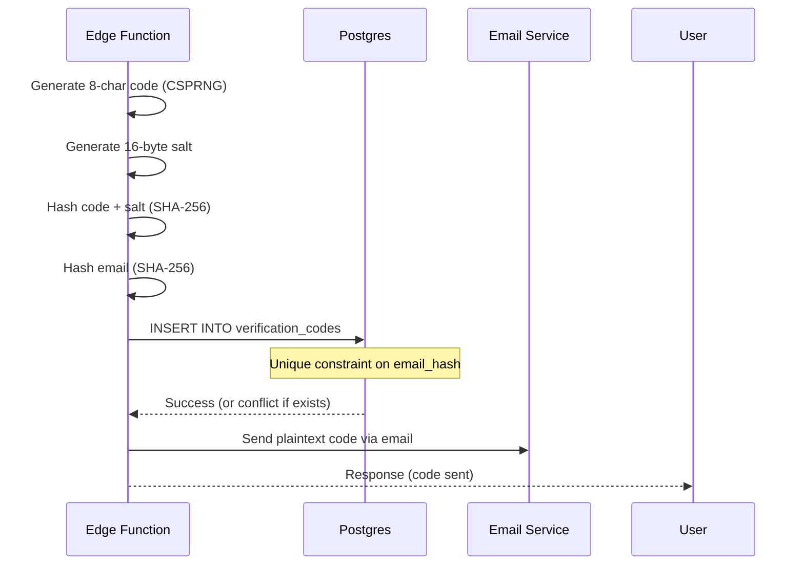
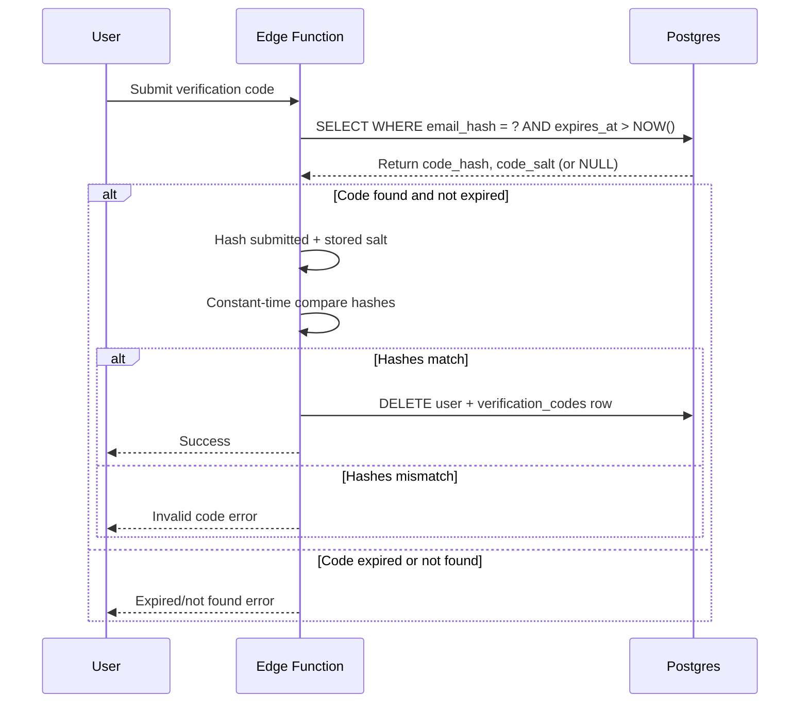

# Postgres-Based Verification Code Storage System Design

## Overview

This document specifies the Postgres-based storage system for verification codes used in orphaned user cleanup operations. This replaces the originally planned Deno KV approach (unavailable in Supabase Edge Functions) with a robust, durable PostgreSQL solution.

## Requirements Addressed

- **Req#3**: Cleanup Edge Function Without Auth
- **Req#8**: Security Requirements for Cleanup Without Auth
- **NFR-10**: Hash-Based Storage (codes stored as SHA-256 hash with salt)
- **NFR-12**: Code Expiry (automatic cleanup via TTL)

## Database Schema

### Table: `verification_codes`

```sql
CREATE TABLE verification_codes (
  -- Primary identifier
  id UUID PRIMARY KEY DEFAULT gen_random_uuid(),

  -- Email identification (hashed for privacy)
  email_hash TEXT NOT NULL,

  -- Code storage (hash + salt for security)
  code_hash BYTEA NOT NULL,
  code_salt BYTEA NOT NULL,

  -- Tracing and audit
  correlation_id UUID NOT NULL,

  -- Time-based expiry
  expires_at TIMESTAMPTZ NOT NULL DEFAULT (NOW() + INTERVAL '5 minutes'),
  created_at TIMESTAMPTZ NOT NULL DEFAULT NOW(),

  -- Constraints
  CONSTRAINT verification_codes_email_hash_unique UNIQUE (email_hash)
);
```

### Indexes

```sql
-- Fast lookup by email hash (primary query pattern)
CREATE INDEX idx_verification_codes_email_hash
  ON verification_codes(email_hash);

-- Efficient expiry cleanup queries
CREATE INDEX idx_verification_codes_expires_at
  ON verification_codes(expires_at);

-- Audit trail queries by correlation ID
CREATE INDEX idx_verification_codes_correlation_id
  ON verification_codes(correlation_id);
```

## Column Specifications

### `id` (UUID)
- **Type**: UUID
- **Default**: `gen_random_uuid()`
- **Purpose**: Primary key for internal references
- **Nullability**: NOT NULL (enforced by PRIMARY KEY)

### `email_hash` (TEXT)
- **Type**: TEXT
- **Purpose**: SHA-256 hash of lowercase, trimmed email address
- **Format**: 64-character hexadecimal string (e.g., "a1b2c3...")
- **Uniqueness**: UNIQUE constraint prevents multiple active codes per email
- **Nullability**: NOT NULL
- **Security**: Hash prevents email exposure in logs or database dumps

**Hash Generation**:
```typescript
async function hashEmail(email: string): Promise<string> {
  const encoder = new TextEncoder();
  const data = encoder.encode(email.toLowerCase().trim());
  const hashBuffer = await crypto.subtle.digest('SHA-256', data);
  const hashArray = Array.from(new Uint8Array(hashBuffer));
  return hashArray.map(b => b.toString(16).padStart(2, '0')).join('');
}
```

### `code_hash` (BYTEA)
- **Type**: BYTEA (binary data)
- **Purpose**: SHA-256 hash of verification code + salt
- **Length**: 32 bytes (256 bits)
- **Nullability**: NOT NULL
- **Security**: Never store plaintext codes; hash prevents database compromise leaking codes

**Hash Generation**:
```typescript
async function hashVerificationCode(code: string, salt: Uint8Array): Promise<Uint8Array> {
  const encoder = new TextEncoder();
  const codeBytes = encoder.encode(code);

  // Combine code + salt
  const combined = new Uint8Array(codeBytes.length + salt.length);
  combined.set(codeBytes, 0);
  combined.set(salt, codeBytes.length);

  // Hash with SHA-256
  const hashBuffer = await crypto.subtle.digest('SHA-256', combined);
  return new Uint8Array(hashBuffer);
}
```

### `code_salt` (BYTEA)
- **Type**: BYTEA (binary data)
- **Purpose**: Random 16-byte salt for hash computation
- **Length**: 16 bytes (128 bits)
- **Nullability**: NOT NULL
- **Security**: Unique salt per code prevents rainbow table attacks

**Salt Generation**:
```typescript
function generateSalt(): Uint8Array {
  const salt = new Uint8Array(16);
  crypto.getRandomValues(salt);
  return salt;
}
```

### `correlation_id` (UUID)
- **Type**: UUID
- **Purpose**: End-to-end request tracing identifier
- **Format**: UUID v4 (e.g., "550e8400-e29b-41d4-a716-446655440000")
- **Nullability**: NOT NULL
- **Usage**: Links verification code to original cleanup request for debugging

### `expires_at` (TIMESTAMPTZ)
- **Type**: TIMESTAMPTZ (timestamp with timezone)
- **Default**: `NOW() + INTERVAL '5 minutes'`
- **Purpose**: Automatic expiry timestamp (5-minute TTL)
- **Nullability**: NOT NULL
- **Behavior**: Codes invalid after this timestamp; cleaned up by scheduled job

**Rationale for 5-minute TTL**:
- Reduced from original 10-minute design per UserQA security recommendation
- Balances user convenience (time to check email) with security (shorter attack window)
- Industry standard for high-risk account recovery scenarios

### `created_at` (TIMESTAMPTZ)
- **Type**: TIMESTAMPTZ
- **Default**: `NOW()`
- **Purpose**: Audit trail and metrics tracking
- **Nullability**: NOT NULL
- **Usage**: Debug slow code delivery, measure cleanup flow duration

## Data Flow

### Code Creation Flow



### Code Validation Flow



## Cleanup Strategy

### Expired Code Cleanup Function

```sql
-- Scheduled cleanup function (run every 5 minutes)
CREATE OR REPLACE FUNCTION cleanup_expired_codes()
RETURNS INTEGER AS $$
DECLARE
  deleted_count INTEGER;
BEGIN
  DELETE FROM verification_codes
  WHERE expires_at < NOW();

  GET DIAGNOSTICS deleted_count = ROW_COUNT;

  RETURN deleted_count;
END;
$$ LANGUAGE plpgsql;
```

### Cleanup Invocation Options

**Option 1: PostgreSQL pg_cron Extension**
```sql
-- Schedule cleanup every 5 minutes
SELECT cron.schedule(
  'cleanup-expired-verification-codes',
  '*/5 * * * *',  -- Every 5 minutes
  'SELECT cleanup_expired_codes();'
);
```

**Option 2: Validation-Time Cleanup**
- Cleanup occurs during code validation query
- Uses WHERE clause: `WHERE expires_at > NOW()` (automatically excludes expired)
- Periodic batch delete every N validations to reclaim storage

**Option 3: Supabase Edge Function Cron**
- Create scheduled edge function invoked every 5 minutes
- Calls `cleanup_expired_codes()` via Supabase client
- Logs cleanup metrics

**Recommended**: Option 1 (pg_cron) for simplicity and reliability

## Security Considerations

### Hash-Based Storage

**Why Hash Codes**:
- Database compromise does not leak valid verification codes
- Attacker with DB access cannot determine valid codes for active users
- Complies with NFR-10 (hash-based storage requirement)

**Salt Usage**:
- Unique 16-byte salt per code prevents rainbow table attacks
- Even if two users get same code (unlikely with 8 chars), hashes differ
- Salt stored alongside hash for validation

### Unique Constraint on `email_hash`

**Behavior**:
- Prevents multiple active codes per email address
- INSERT with duplicate email_hash fails with unique constraint violation
- Edge function must handle conflict: reuse existing code or update row

**Conflict Handling Strategy**:
```sql
-- Option A: Fail if code exists (force user to use existing code)
INSERT INTO verification_codes (email_hash, code_hash, code_salt, correlation_id)
VALUES ($1, $2, $3, $4)
ON CONFLICT (email_hash) DO NOTHING
RETURNING id;

-- Option B: Replace existing code (generate new code)
INSERT INTO verification_codes (email_hash, code_hash, code_salt, correlation_id, expires_at)
VALUES ($1, $2, $3, $4, NOW() + INTERVAL '5 minutes')
ON CONFLICT (email_hash) DO UPDATE
SET code_hash = EXCLUDED.code_hash,
    code_salt = EXCLUDED.code_salt,
    correlation_id = EXCLUDED.correlation_id,
    expires_at = EXCLUDED.expires_at,
    created_at = NOW()
RETURNING id;
```

**Recommended**: Option B (replace) for better UX (users can request new code if lost/expired)

### Time-Based Expiry

**Expiry Enforcement**:
- All validation queries include `WHERE expires_at > NOW()`
- Expired codes never validate, even if hash matches
- 5-minute window balances security and usability

**Clock Skew Handling**:
- Use Postgres server time (`NOW()`) consistently
- Avoid client-generated timestamps (untrusted)
- Edge function server clock irrelevant (Postgres is source of truth)

## Performance Characteristics

### Index Usage

**Query 1: Code Lookup by Email**
```sql
SELECT code_hash, code_salt, expires_at
FROM verification_codes
WHERE email_hash = $1 AND expires_at > NOW();
```
- **Index Used**: `idx_verification_codes_email_hash`
- **Selectivity**: High (email_hash is unique)
- **Expected Cost**: Index scan → single row fetch
- **Latency**: <5ms (p95)

**Query 2: Cleanup Expired Codes**
```sql
DELETE FROM verification_codes
WHERE expires_at < NOW();
```
- **Index Used**: `idx_verification_codes_expires_at`
- **Selectivity**: Low (all expired rows)
- **Expected Cost**: Index scan → batch delete
- **Latency**: <50ms for 1000 expired rows

**Query 3: Audit by Correlation ID**
```sql
SELECT * FROM verification_codes
WHERE correlation_id = $1;
```
- **Index Used**: `idx_verification_codes_correlation_id`
- **Selectivity**: High (UUID is unique in practice)
- **Expected Cost**: Index scan → single row fetch
- **Latency**: <5ms

### Storage Estimates

**Row Size**:
- `id`: 16 bytes (UUID)
- `email_hash`: ~68 bytes (64-char hex + overhead)
- `code_hash`: 32 bytes (SHA-256 output)
- `code_salt`: 16 bytes
- `correlation_id`: 16 bytes (UUID)
- `expires_at`: 8 bytes (timestamptz)
- `created_at`: 8 bytes (timestamptz)
- **Total per row**: ~164 bytes + PostgreSQL overhead (~40 bytes) = **~200 bytes**

**Capacity**:
- 1 million active codes: ~200 MB
- 10 million active codes: ~2 GB
- Cleanup every 5 minutes keeps active set minimal (<1000 rows typical)

### Concurrent Access

**Unique Constraint Behavior**:
- Two edge functions inserting same email_hash concurrently → one succeeds, one gets conflict
- Use `ON CONFLICT DO UPDATE` to atomically replace existing code
- No deadlocks (single-row operations)

**Advisory Lock Interaction**:
- Distributed lock (separate system) prevents concurrent cleanup attempts
- verification_codes table only accessed after lock acquired
- No row-level locks needed for INSERT/DELETE (single-row, atomic)

## Migration SQL

```sql
-- Migration: Create verification_codes table
-- File: supabase/migrations/YYYYMMDDHHMMSS_create_verification_codes.sql

-- Create table
CREATE TABLE verification_codes (
  id UUID PRIMARY KEY DEFAULT gen_random_uuid(),
  email_hash TEXT NOT NULL,
  code_hash BYTEA NOT NULL,
  code_salt BYTEA NOT NULL,
  correlation_id UUID NOT NULL,
  expires_at TIMESTAMPTZ NOT NULL DEFAULT (NOW() + INTERVAL '5 minutes'),
  created_at TIMESTAMPTZ NOT NULL DEFAULT NOW(),
  CONSTRAINT verification_codes_email_hash_unique UNIQUE (email_hash)
);

-- Create indexes
CREATE INDEX idx_verification_codes_email_hash
  ON verification_codes(email_hash);

CREATE INDEX idx_verification_codes_expires_at
  ON verification_codes(expires_at);

CREATE INDEX idx_verification_codes_correlation_id
  ON verification_codes(correlation_id);

-- Create cleanup function
CREATE OR REPLACE FUNCTION cleanup_expired_codes()
RETURNS INTEGER AS $$
DECLARE
  deleted_count INTEGER;
BEGIN
  DELETE FROM verification_codes
  WHERE expires_at < NOW();

  GET DIAGNOSTICS deleted_count = ROW_COUNT;

  -- Optional: Log cleanup event
  RAISE NOTICE 'Cleaned up % expired verification codes', deleted_count;

  RETURN deleted_count;
END;
$$ LANGUAGE plpgsql;

-- Schedule cleanup (requires pg_cron extension)
-- Run manually if pg_cron not available: SELECT cleanup_expired_codes();
-- SELECT cron.schedule(
--   'cleanup-expired-verification-codes',
--   '*/5 * * * *',
--   'SELECT cleanup_expired_codes();'
-- );
```

## Edge Function Integration

### Code Storage (Step 1)

```typescript
// Generate and store verification code
async function storeVerificationCode(
  email: string,
  correlationId: string
): Promise<string> {
  // Generate 8-character code
  const code = generateSecureCode(); // Returns e.g., "ABCD5678"

  // Generate salt
  const salt = generateSalt(); // 16 bytes

  // Hash code
  const codeHash = await hashVerificationCode(code, salt);

  // Hash email
  const emailHash = await hashEmail(email);

  // Store in database (replace if exists)
  const { error } = await supabase
    .from('verification_codes')
    .insert({
      email_hash: emailHash,
      code_hash: Array.from(codeHash), // Convert Uint8Array to number[]
      code_salt: Array.from(salt),
      correlation_id: correlationId,
      expires_at: new Date(Date.now() + 5 * 60 * 1000).toISOString(), // 5 minutes
    })
    .onConflict('email_hash')
    .merge();

  if (error) throw new Error(`Failed to store verification code: ${error.message}`);

  // Return plaintext code for email sending
  return code;
}
```

### Code Validation (Step 2)

```typescript
// Validate submitted verification code
async function validateVerificationCode(
  email: string,
  submittedCode: string
): Promise<boolean> {
  // Hash email
  const emailHash = await hashEmail(email);

  // Retrieve stored code
  const { data, error } = await supabase
    .from('verification_codes')
    .select('code_hash, code_salt')
    .eq('email_hash', emailHash)
    .gt('expires_at', new Date().toISOString())
    .single();

  if (error || !data) {
    throw new Error('ORPHAN_CLEANUP_001: Verification code expired or not found');
  }

  // Convert stored arrays back to Uint8Array
  const storedHash = new Uint8Array(data.code_hash);
  const storedSalt = new Uint8Array(data.code_salt);

  // Hash submitted code with stored salt
  const submittedHash = await hashVerificationCode(submittedCode, storedSalt);

  // Constant-time comparison
  const isValid = constantTimeEquals(submittedHash, storedHash);

  if (!isValid) {
    throw new Error('ORPHAN_CLEANUP_002: Invalid verification code');
  }

  // Delete code after successful validation (single-use)
  await supabase
    .from('verification_codes')
    .delete()
    .eq('email_hash', emailHash);

  return true;
}
```

## Testing Considerations

### Unit Tests

1. **Schema Validation**:
   - Test migration creates table with correct columns and types
   - Test indexes exist and are used in query plans
   - Test unique constraint on email_hash

2. **Hash Functions**:
   - Test hashEmail produces consistent output for same input
   - Test hashVerificationCode with same code + salt produces same hash
   - Test different salts produce different hashes for same code

3. **Expiry Behavior**:
   - Test codes expire after 5 minutes
   - Test cleanup_expired_codes() deletes only expired codes
   - Test validation rejects expired codes

### Integration Tests

1. **Concurrent Insertions**:
   - Test two simultaneous code generation requests for same email
   - Verify ON CONFLICT DO UPDATE atomically replaces code

2. **Clock Skew**:
   - Test with edge function and Postgres in different timezones
   - Verify expires_at calculation uses Postgres time

3. **Storage Capacity**:
   - Test 10,000 code insertions (stress test)
   - Verify cleanup maintains reasonable table size

## Rollback Plan

**Rollback SQL**:
```sql
-- Drop table and all dependent objects
DROP TABLE IF EXISTS verification_codes CASCADE;

-- Drop cleanup function
DROP FUNCTION IF EXISTS cleanup_expired_codes();

-- Remove cron job (if using pg_cron)
-- SELECT cron.unschedule('cleanup-expired-verification-codes');
```

**Data Loss**: Acceptable (verification codes are ephemeral, 5-minute lifetime)

## Acceptance Criteria

- [x] Complete schema specification documented
- [x] Indexes defined for all query patterns
- [x] Unique constraint on email_hash specified
- [x] Cleanup strategy documented with SQL function
- [x] 5-minute TTL behavior documented
- [x] Hash-based storage rationale provided
- [x] Security considerations addressed
- [x] Edge function integration examples provided
- [x] Migration SQL ready for creation
- [x] Rollback procedure documented

**Status**: Ready for SQL migration creation in Phase 2
