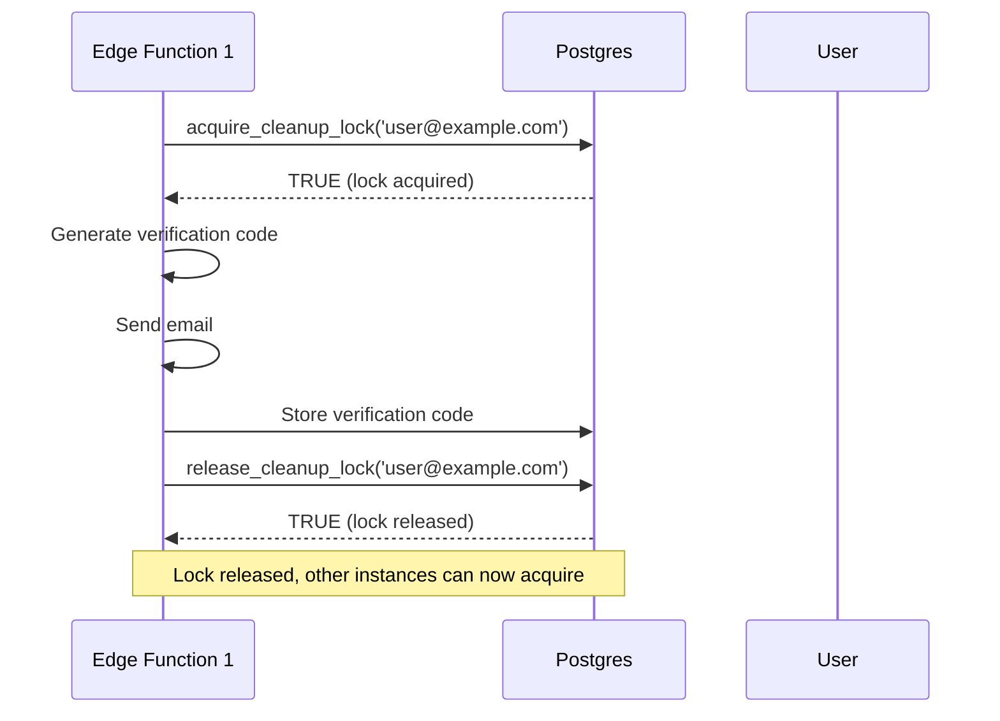
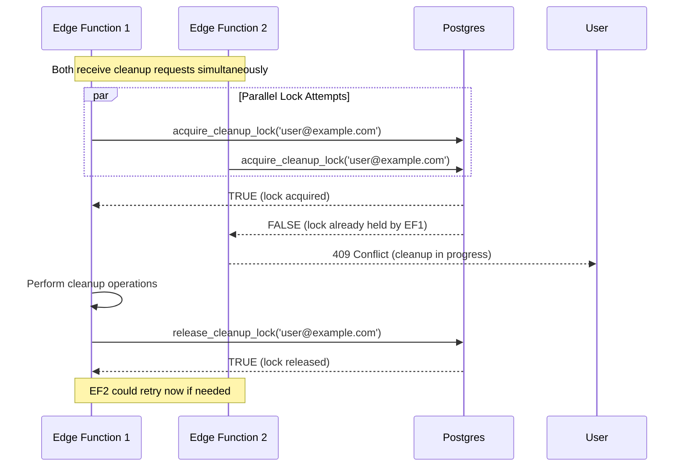
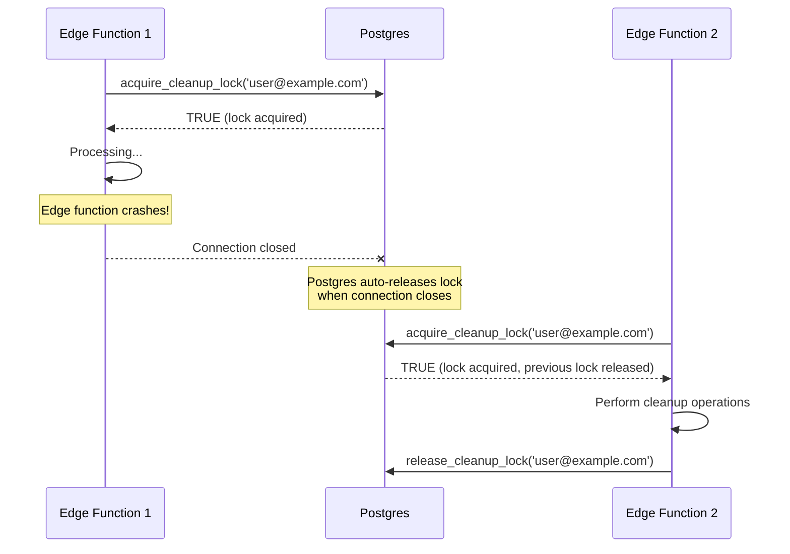

# PostgreSQL Advisory Locks for Distributed Locking Design

## Overview

This document specifies the PostgreSQL advisory lock system for preventing concurrent cleanup operations on the same user account. Advisory locks provide distributed coordination across multiple Supabase Edge Function instances without requiring external locking services (Redis, etc.).

## Requirements Addressed

- **Req#3**: Cleanup Edge Function Without Auth
- **Req#7**: Data Integrity and Atomicity
- **NFR-23**: Lock auto-expiry (30-second timeout)

## What Are Advisory Locks?

PostgreSQL advisory locks are application-level locks that:
- **Do not lock database rows/tables** (purely advisory)
- **Are managed entirely by the application** (Postgres provides primitives, app enforces semantics)
- **Are automatically released** when database connection closes
- **Are identified by 64-bit integers** (bigint) or pairs of 32-bit integers

**Key Property**: Advisory locks exist only during the database session. If edge function crashes or connection drops, lock is automatically released (no orphaned locks).

## Advisory Lock Functions

PostgreSQL provides several functions for advisory locking:

### Session-Level Locks (Used for Cleanup)

```sql
-- Try to acquire lock (non-blocking)
pg_try_advisory_lock(key bigint) → boolean

-- Try to acquire lock (blocking, with optional timeout)
pg_advisory_lock(key bigint) → void

-- Release lock
pg_advisory_unlock(key bigint) → boolean
```

**Session-Level Behavior**:
- Lock persists for the database session (connection)
- Lock automatically released when connection closes
- Same session can acquire same lock multiple times (reference counted)

### Transaction-Level Locks (Alternative)

```sql
-- Try to acquire lock within transaction
pg_try_advisory_xact_lock(key bigint) → boolean

-- Lock released automatically at transaction end (COMMIT/ROLLBACK)
```

**Recommendation**: Use **session-level locks** for cleanup operations (long-running, may span multiple queries).

## Lock Key Generation

### Lock ID from Email

Advisory locks require a 64-bit integer key. Emails must be consistently hashed to generate lock IDs.

**Requirements**:
- **Deterministic**: Same email → same lock ID
- **Well-distributed**: Different emails → different lock IDs (avoid collisions)
- **64-bit range**: Lock ID must fit in PostgreSQL bigint (-2^63 to 2^63-1)

### Hash Function: Email to Lock ID

```sql
CREATE OR REPLACE FUNCTION email_to_lock_id(p_email TEXT)
RETURNS BIGINT AS $$
DECLARE
  v_hash BYTEA;
  v_lock_id BIGINT;
BEGIN
  -- Normalize email: lowercase and trim
  p_email := LOWER(TRIM(p_email));

  -- Hash email using SHA-256
  v_hash := digest(p_email, 'sha256');

  -- Extract first 8 bytes and convert to bigint
  -- Use get_byte() to extract bytes 0-7
  v_lock_id := (
    (get_byte(v_hash, 0)::BIGINT << 56) |
    (get_byte(v_hash, 1)::BIGINT << 48) |
    (get_byte(v_hash, 2)::BIGINT << 40) |
    (get_byte(v_hash, 3)::BIGINT << 32) |
    (get_byte(v_hash, 4)::BIGINT << 24) |
    (get_byte(v_hash, 5)::BIGINT << 16) |
    (get_byte(v_hash, 6)::BIGINT << 8)  |
    (get_byte(v_hash, 7)::BIGINT)
  );

  -- Handle negative values (bigint is signed)
  -- Convert to signed representation if needed
  IF v_lock_id > 9223372036854775807 THEN
    v_lock_id := v_lock_id - 18446744073709551616;
  END IF;

  RETURN v_lock_id;
END;
$$ LANGUAGE plpgsql IMMUTABLE;
```

**Why SHA-256**:
- Cryptographically secure distribution (no patterns/collisions)
- Standard hash function available in PostgreSQL (via pgcrypto extension)
- 256 bits → 32 bytes → use first 8 bytes for 64-bit lock ID

**Collision Probability**:
- 64 bits of SHA-256 → ~18 quintillion possible values
- Birthday paradox: ~5 billion users needed for 50% collision probability
- **Conclusion**: Negligible collision risk for any realistic user base

### Alternative: CRC32 Checksum (Simpler, Less Secure)

```sql
CREATE OR REPLACE FUNCTION email_to_lock_id_simple(p_email TEXT)
RETURNS BIGINT AS $$
BEGIN
  -- Use built-in hashtext function (CRC32-based)
  RETURN hashtext(LOWER(TRIM(p_email)));
END;
$$ LANGUAGE plpgsql IMMUTABLE;
```

**Trade-off**:
- **Pros**: No pgcrypto dependency, simpler
- **Cons**: Higher collision probability, only 32 bits (cast to bigint)

**Recommendation**: Use SHA-256 approach for production.

## Lock Acquisition Pattern

### Helper Function: `acquire_cleanup_lock`

```sql
CREATE OR REPLACE FUNCTION acquire_cleanup_lock(p_email TEXT)
RETURNS BOOLEAN AS $$
DECLARE
  v_lock_id BIGINT;
  v_acquired BOOLEAN;
BEGIN
  -- Generate lock ID from email
  v_lock_id := email_to_lock_id(p_email);

  -- Try to acquire lock (non-blocking)
  v_acquired := pg_try_advisory_lock(v_lock_id);

  -- Log lock attempt
  IF v_acquired THEN
    RAISE NOTICE 'Acquired cleanup lock for email hash: %', v_lock_id;
  ELSE
    RAISE NOTICE 'Failed to acquire cleanup lock (already held): %', v_lock_id;
  END IF;

  RETURN v_acquired;
END;
$$ LANGUAGE plpgsql;
```

### Helper Function: `release_cleanup_lock`

```sql
CREATE OR REPLACE FUNCTION release_cleanup_lock(p_email TEXT)
RETURNS BOOLEAN AS $$
DECLARE
  v_lock_id BIGINT;
  v_released BOOLEAN;
BEGIN
  -- Generate lock ID from email
  v_lock_id := email_to_lock_id(p_email);

  -- Release lock
  v_released := pg_advisory_unlock(v_lock_id);

  -- Log lock release
  IF v_released THEN
    RAISE NOTICE 'Released cleanup lock for email hash: %', v_lock_id;
  ELSE
    RAISE WARNING 'Failed to release cleanup lock (not held by this session): %', v_lock_id;
  END IF;

  RETURN v_released;
END;
$$ LANGUAGE plpgsql;
```

## Lock Usage Flow

### Edge Function Pseudocode

```typescript
async function cleanupOrphanedUser(email: string) {
  const normalizedEmail = email.toLowerCase().trim();

  // Step 1: Acquire distributed lock
  const { data: lockAcquired } = await supabase.rpc('acquire_cleanup_lock', {
    p_email: normalizedEmail,
  });

  if (!lockAcquired) {
    // Another edge function instance is processing this email
    return {
      error: {
        code: 'ORPHAN_CLEANUP_009',
        message: 'Cleanup operation already in progress for this email',
      },
      status: 409,
    };
  }

  try {
    // Step 2: Perform cleanup operations
    // - Verify user exists
    // - Verify orphan status
    // - Generate verification code
    // - Send email
    // - Update logs

    // ... cleanup logic ...

    return { success: true };
  } catch (error) {
    throw error;
  } finally {
    // Step 3: ALWAYS release lock in finally block
    await supabase.rpc('release_cleanup_lock', {
      p_email: normalizedEmail,
    });
  }
}
```

## Lock Behavior and Edge Cases

### Scenario 1: Normal Execution



### Scenario 2: Concurrent Requests (Lock Prevents Race)



### Scenario 3: Edge Function Crash (Auto-Release)



**Critical Property**: No orphaned locks! Connection close = automatic lock release.

### Scenario 4: Application-Level Timeout (30-Second Limit)

Edge functions should implement application-level timeout to prevent long-running operations from holding locks indefinitely.

```typescript
async function cleanupWithTimeout(email: string) {
  const TIMEOUT_MS = 30_000; // 30 seconds

  const lockAcquired = await supabase.rpc('acquire_cleanup_lock', { p_email: email });

  if (!lockAcquired) {
    return { error: 'ORPHAN_CLEANUP_009' };
  }

  try {
    // Wrap cleanup in timeout
    const cleanupPromise = performCleanup(email);
    const timeoutPromise = new Promise((_, reject) =>
      setTimeout(() => reject(new Error('Cleanup timeout')), TIMEOUT_MS)
    );

    const result = await Promise.race([cleanupPromise, timeoutPromise]);

    return result;
  } catch (error) {
    if (error.message === 'Cleanup timeout') {
      // Log timeout event
      console.error('Cleanup timed out after 30 seconds', { email });
    }

    throw error;
  } finally {
    // Release lock even on timeout
    await supabase.rpc('release_cleanup_lock', { p_email: email });
  }
}
```

**Rationale for 30-Second Timeout**:
- Cleanup operations should complete in <5 seconds normally
- 30 seconds provides large safety margin
- Prevents edge function from holding lock indefinitely if stuck
- Aligns with NFR-23 requirement

## Lock Key Namespace (Optional Enhancement)

To support multiple lock types in the future, consider adding namespace prefixes:

```sql
-- Enhanced lock ID function with namespace
CREATE OR REPLACE FUNCTION generate_lock_id(p_namespace TEXT, p_key TEXT)
RETURNS BIGINT AS $$
DECLARE
  v_combined TEXT;
  v_hash BYTEA;
  v_lock_id BIGINT;
BEGIN
  -- Combine namespace and key
  v_combined := p_namespace || ':' || LOWER(TRIM(p_key));

  -- Hash combined string
  v_hash := digest(v_combined, 'sha256');

  -- Extract first 8 bytes as bigint (same logic as before)
  v_lock_id := (
    (get_byte(v_hash, 0)::BIGINT << 56) |
    (get_byte(v_hash, 1)::BIGINT << 48) |
    (get_byte(v_hash, 2)::BIGINT << 40) |
    (get_byte(v_hash, 3)::BIGINT << 32) |
    (get_byte(v_hash, 4)::BIGINT << 24) |
    (get_byte(v_hash, 5)::BIGINT << 16) |
    (get_byte(v_hash, 6)::BIGINT << 8)  |
    (get_byte(v_hash, 7)::BIGINT)
  );

  RETURN v_lock_id;
END;
$$ LANGUAGE plpgsql IMMUTABLE;

-- Usage example
SELECT generate_lock_id('cleanup', 'user@example.com');
SELECT generate_lock_id('registration', 'user@example.com');
```

**Current Recommendation**: Not needed for Phase 0 (only one lock type), but keep in mind for future expansion.

## Comparison: Advisory Locks vs Row-Level Locks

### Row-Level Locks (Alternative Approach)

```sql
-- Acquire lock by locking verification_codes row
SELECT * FROM verification_codes
WHERE email_hash = $1
FOR UPDATE NOWAIT;
```

**Pros**:
- Locks specific database row (explicit association)
- Works across different database connections
- Standard SQL (not Postgres-specific)

**Cons**:
- Requires row to exist (can't lock before row created)
- Held until transaction commits (can't span multiple transactions)
- More complex rollback logic (transaction management)

### Advisory Locks (Chosen Approach)

**Pros**:
- No database row required (can lock arbitrary keys)
- Flexible scope (session-level or transaction-level)
- Auto-release on connection close (no orphaned locks)
- Simpler for cross-operation locking (code generation + email sending + validation)

**Cons**:
- Postgres-specific (not portable to other databases)
- Requires consistent key generation (email → bigint)

**Decision**: Use **advisory locks** for cleanup operations (more flexible, auto-cleanup).

## Migration SQL

```sql
-- Migration: Create advisory lock helper functions
-- File: supabase/migrations/YYYYMMDDHHMMSS_create_advisory_lock_helpers.sql

-- Enable pgcrypto extension for digest() function
CREATE EXTENSION IF NOT EXISTS pgcrypto;

-- Function: Convert email to 64-bit lock ID
CREATE OR REPLACE FUNCTION email_to_lock_id(p_email TEXT)
RETURNS BIGINT AS $$
DECLARE
  v_hash BYTEA;
  v_lock_id BIGINT;
BEGIN
  p_email := LOWER(TRIM(p_email));

  v_hash := digest(p_email, 'sha256');

  v_lock_id := (
    (get_byte(v_hash, 0)::BIGINT << 56) |
    (get_byte(v_hash, 1)::BIGINT << 48) |
    (get_byte(v_hash, 2)::BIGINT << 40) |
    (get_byte(v_hash, 3)::BIGINT << 32) |
    (get_byte(v_hash, 4)::BIGINT << 24) |
    (get_byte(v_hash, 5)::BIGINT << 16) |
    (get_byte(v_hash, 6)::BIGINT << 8)  |
    (get_byte(v_hash, 7)::BIGINT)
  );

  IF v_lock_id > 9223372036854775807 THEN
    v_lock_id := v_lock_id - 18446744073709551616;
  END IF;

  RETURN v_lock_id;
END;
$$ LANGUAGE plpgsql IMMUTABLE;

-- Function: Acquire cleanup lock for email
CREATE OR REPLACE FUNCTION acquire_cleanup_lock(p_email TEXT)
RETURNS BOOLEAN AS $$
DECLARE
  v_lock_id BIGINT;
  v_acquired BOOLEAN;
BEGIN
  v_lock_id := email_to_lock_id(p_email);

  v_acquired := pg_try_advisory_lock(v_lock_id);

  IF v_acquired THEN
    RAISE NOTICE 'Acquired cleanup lock for email hash: %', v_lock_id;
  ELSE
    RAISE NOTICE 'Failed to acquire cleanup lock (already held): %', v_lock_id;
  END IF;

  RETURN v_acquired;
END;
$$ LANGUAGE plpgsql;

-- Function: Release cleanup lock for email
CREATE OR REPLACE FUNCTION release_cleanup_lock(p_email TEXT)
RETURNS BOOLEAN AS $$
DECLARE
  v_lock_id BIGINT;
  v_released BOOLEAN;
BEGIN
  v_lock_id := email_to_lock_id(p_email);

  v_released := pg_advisory_unlock(v_lock_id);

  IF v_released THEN
    RAISE NOTICE 'Released cleanup lock for email hash: %', v_lock_id;
  ELSE
    RAISE WARNING 'Failed to release cleanup lock (not held by this session): %', v_lock_id;
  END IF;

  RETURN v_released;
END;
$$ LANGUAGE plpgsql;
```

## Testing Considerations

### Unit Tests

1. **Lock ID Consistency**:
   - Test same email → same lock ID
   - Test email case insensitivity (USER@EXAMPLE.COM = user@example.com)
   - Test whitespace trimming

2. **Lock Acquisition**:
   - Test acquire_cleanup_lock returns TRUE when lock available
   - Test acquire_cleanup_lock returns FALSE when lock held

3. **Lock Release**:
   - Test release_cleanup_lock returns TRUE when lock was held
   - Test release_cleanup_lock returns FALSE if lock not held

### Integration Tests

1. **Concurrent Acquisitions**:
   - Open two database connections
   - Both try to acquire lock for same email
   - Verify only one succeeds

2. **Auto-Release on Connection Close**:
   - Acquire lock in connection A
   - Close connection A without releasing
   - Acquire lock in connection B
   - Verify connection B succeeds (lock was auto-released)

3. **Same-Session Multiple Acquisitions**:
   - Acquire lock twice in same session
   - Verify both succeed (reference counting)
   - Release once → lock still held
   - Release twice → lock released

## Monitoring and Debugging

### View Active Advisory Locks

```sql
-- Query pg_locks system view to see active advisory locks
SELECT
  locktype,
  objid AS lock_id,
  mode,
  granted,
  pid AS process_id,
  pg_backend_pid() AS current_pid
FROM pg_locks
WHERE locktype = 'advisory'
  AND classid = 0  -- Session-level advisory locks
ORDER BY objid;
```

**Example Output**:
```
 locktype | lock_id         | mode         | granted | process_id | current_pid
----------+-----------------+--------------+---------+------------+-------------
 advisory | 1234567890      | ExclusiveLock| t       | 12345      | 12345
 advisory | 9876543210      | ExclusiveLock| t       | 12346      | 12345
```

### Debugging Stuck Locks

**Scenario**: Lock appears to be held indefinitely.

**Investigation Steps**:
1. Query pg_locks to find process holding lock
2. Query pg_stat_activity to see what query is running:
   ```sql
   SELECT pid, state, query, query_start
   FROM pg_stat_activity
   WHERE pid = <process_id>;
   ```
3. Check if connection is idle or running long query
4. If stuck, terminate connection:
   ```sql
   SELECT pg_terminate_backend(<process_id>);
   ```
5. Lock automatically released when connection terminates

## Performance Characteristics

### Lock Acquisition Latency

- **pg_try_advisory_lock()**: <1ms (in-memory operation, no disk I/O)
- **Collision**: Instant return (non-blocking)
- **No contention overhead**: Lock IDs are well-distributed (SHA-256)

### Memory Overhead

- **Per lock**: ~40 bytes in shared memory (PostgreSQL lock table)
- **Capacity**: Thousands of concurrent locks with negligible memory impact

### Scalability

- **Concurrency**: Advisory locks scale to thousands of concurrent sessions
- **Lock ID distribution**: SHA-256 ensures even distribution (no hot spots)
- **No deadlocks**: Single-key locking pattern (can't form cycles)

## Rollback Plan

**Rollback SQL**:
```sql
-- Drop helper functions
DROP FUNCTION IF EXISTS acquire_cleanup_lock(TEXT);
DROP FUNCTION IF EXISTS release_cleanup_lock(TEXT);
DROP FUNCTION IF EXISTS email_to_lock_id(TEXT);

-- Note: Cannot "drop" advisory locks - they are released when connections close
-- If locks are stuck, restart Postgres or terminate backend processes
```

**No Data Loss**: Advisory locks are transient (no persistent state).

## Acceptance Criteria

- [x] Advisory lock pattern documented using pg_try_advisory_lock/pg_advisory_unlock
- [x] Lock ID derivation specified (email → SHA-256 → 64-bit bigint)
- [x] Lock acquisition and release helper functions designed
- [x] Concurrency scenarios documented (normal, race, crash, timeout)
- [x] 30-second application-level timeout pattern specified
- [x] Auto-release on connection close behavior explained
- [x] Comparison with row-level locks provided
- [x] Migration SQL ready with pgcrypto extension requirement
- [x] Monitoring and debugging procedures documented
- [x] Performance characteristics analyzed
- [x] Rollback procedure documented

**Status**: Ready for SQL migration creation in Phase 2
