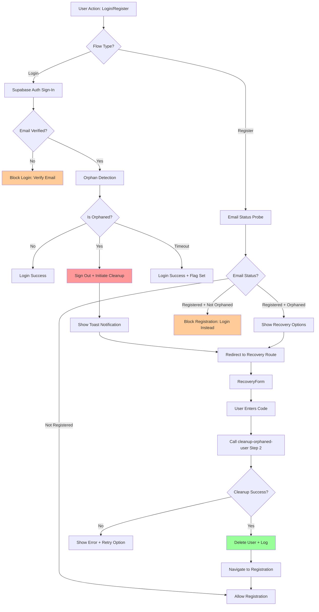

# Design Document

## Overview

This design document provides a comprehensive technical blueprint for enhancing the registration and login flows in the Weg Translator application to correctly handle orphaned user accounts. The solution implements a secure, user-friendly recovery system that detects incomplete registrations, guides users through cleanup, and ensures seamless retry mechanisms.

### High-Level Approach

The design implements a three-layer architecture:

1. **Detection Layer**: Real-time orphan detection during login and registration flows with parallel database queries and graceful degradation
2. **Cleanup Layer**: Secure two-step verification flow using Supabase Edge Functions with service role authentication, constant-time responses, and hash-based code storage
3. **Recovery Layer**: Frontend components (RecoveryForm, enhanced EmailStatusBanner) providing guided user experience with clear notifications and actionable next steps

**Key Design Principles**:
- **Security without Authentication**: Cleanup operations execute without user sessions using service role keys and email verification
- **Graceful Degradation**: Non-critical failures (orphan detection timeouts) log warnings but don't block primary flows
- **Atomic Operations**: Database transactions ensure consistency; distributed locking prevents race conditions
- **Constant-Time Responses**: All cleanup responses target 500ms ±50ms to prevent timing attacks
- **Comprehensive Logging**: Correlation IDs trace operations end-to-end; all PII is hashed before logging

### Components Overview

**Frontend Components**:
- **AuthProvider.login()**: Orchestrates orphan detection with performance monitoring and redirect handling
- **LoginForm**: Catches redirect errors and navigates to recovery route
- **RecoveryForm**: New component for verification code entry and cleanup submission
- **EmailStatusBanner**: Enhanced to display orphan states with contextual actions
- **useEmailStatusProbe**: Detects orphaned accounts during registration with debouncing and caching

**Backend Components**:
- **cleanup-orphaned-user Edge Function**: Two-step verification flow with service role authentication, Deno KV storage, and constant-time responses
- **check-email-status Edge Function**: Enhanced to return orphan status (isOrphaned, hasCompanyData)
- **orphanDetection.ts**: Client-side utility with parallel queries and 500ms timeout
- **cleanupOrphanedUser.ts**: Type-safe client library wrapping edge function calls

**Data Layer**:
- **auth_cleanup_log table**: Audit trail for all cleanup operations (already exists per codebase analysis)
- **Deno KV**: Distributed storage for verification codes (hash + salt) and cleanup locks
- **Supabase Auth**: User deletion via admin.deleteUser() with service role key

## Architecture

### High-Level Flow



### Integration Points

#### 1. AuthProvider Integration

**Location**: `/src/app/providers/auth/AuthProvider.tsx`

The AuthProvider's login method integrates orphan detection between authentication and session establishment:

```typescript
async function login(email: string, password: string): Promise<void> {
  loginInProgress.current = true;
  setIsLoading(true);

  try {
    // Step 1: Supabase authentication
    const { data, error } = await supabase.auth.signInWithPassword({
      email,
      password,
    });

    if (error) throw error;

    const supabaseUser = data.user;
    if (!supabaseUser) throw new Error("No user returned from sign-in");

    // Step 2: Email verification check
    const verified = Boolean(supabaseUser.email_confirmed_at);
    if (!verified) {
      await supabase.auth.signOut();
      throw new Error("Please verify your email before signing in...");
    }

    // Step 3: Orphan detection (Case 1.2)
    const correlationId = crypto.randomUUID();
    const startTime = performance.now();

    const orphanResult = await checkIfOrphaned(supabaseUser.id);

    const duration = performance.now() - startTime;

    // Step 4: Log performance metrics
    if (duration > 200) {
      void logger.warn("Orphan detection slow", {
        correlationId,
        durationMs: duration,
        target: 200,
      });
    }

    // Step 5: Handle orphan detection result
    if (orphanResult.isOrphaned) {
      // Immediately sign out
      await supabase.auth.signOut();

      // Fire-and-forget cleanup initiation
      void initiateCleanupFlow(email, correlationId);

      // Throw redirect error
      throw new OrphanedUserError(
        email,
        correlationId,
        `/register/recover?email=${encodeURIComponent(email)}&reason=orphaned&correlationId=${correlationId}`
      );
    }

    // Step 6: Success - set authenticated state
    setUser(supabaseUser);
    setSession(data.session);
    setIsAuthenticated(true);

  } catch (error) {
    // Special handling for orphaned user redirect
    if (error instanceof OrphanedUserError) {
      toast({
        title: "Registration Incomplete",
        description: "Your registration was incomplete. Check your email for a verification code...",
        variant: "warning",
        duration: 8000,
      });

      const redirectError = new Error("REDIRECT_TO_RECOVERY");
      redirectError.redirectUrl = error.redirectUrl;
      throw redirectError;
    }

    // Other errors
    throw error;
  } finally {
    setIsLoading(false);
    loginInProgress.current = false;
  }
}
```

#### 2. Edge Function Integration

**check-email-status Enhancement**

The existing edge function is enhanced to return orphan status:

```typescript
// Location: /supabase/functions/check-email-status/index.ts

interface ClassificationResult {
  status: "not_registered" | "registered_verified" | "registered_unverified";
  verifiedAt: string | null;
  lastSignInAt: string | null;
  hasCompanyData: boolean | null;  // Enhanced
  isOrphaned: boolean | null;      // Enhanced
  attemptId?: string;
  correlationId: string;
}

async function classifyEmail(
  email: string,
  attemptId: string | null,
  correlationId: string
): Promise<ClassificationResult> {
  const emailLower = email.toLowerCase().trim();

  // Query auth.users
  const { data: users } = await supabase.auth.admin.listUsers({
    filter: `email=ilike(%)${emailLower}(%)`,
  });

  const user = users?.users?.find(u => u.email?.toLowerCase() === emailLower);

  if (!user) {
    return {
      status: "not_registered",
      verifiedAt: null,
      lastSignInAt: null,
      hasCompanyData: null,
      isOrphaned: null,
      attemptId: attemptId ?? undefined,
      correlationId,
    };
  }

  // Check company data with 100ms timeout
  let hasCompanyData: boolean | null = null;
  let hasAdminData: boolean | null = null;

  try {
    const timeoutPromise = new Promise((_, reject) =>
      setTimeout(() => reject(new Error("Timeout")), 100)
    );

    const [companiesResult, adminsResult] = await Promise.race([
      Promise.all([
        supabase.from("companies").select("id").eq("owner_admin_uuid", user.id).limit(1),
        supabase.from("company_admins").select("admin_uuid").eq("admin_uuid", user.id).limit(1),
      ]),
      timeoutPromise,
    ]);

    hasCompanyData = Boolean(companiesResult.data?.length);
    hasAdminData = Boolean(adminsResult.data?.length);
  } catch (error) {
    // Graceful degradation: return null if query fails
    console.warn("Company data check failed", { correlationId, error });
  }

  const isOrphaned = hasCompanyData !== null && hasAdminData !== null
    ? !hasCompanyData && !hasAdminData
    : null;

  const verified = Boolean(user.email_confirmed_at);

  return {
    status: verified ? "registered_verified" : "registered_unverified",
    verifiedAt: user.email_confirmed_at ?? null,
    lastSignInAt: user.last_sign_in_at ?? null,
    hasCompanyData,
    isOrphaned,
    attemptId: attemptId ?? undefined,
    correlationId,
  };
}
```

#### 3. Registration Form Integration

**Location**: `/src/modules/auth/components/RegistrationForm.tsx`

The registration form uses the enhanced email status probe to detect orphaned accounts:

```typescript
function RegistrationForm() {
  const [email, setEmail] = useState("");
  const [attemptId] = useState(() => crypto.randomUUID());

  // Email status probe with orphan detection
  const probe = useEmailStatusProbe({
    email,
    attemptId,
    enabled: true,
    debounceMs: 450,
  });

  // Block submission if registered and not orphaned
  const canSubmit = useMemo(() => {
    if (probe.phase !== "success") return false;

    const status = probe.result?.status;
    const isOrphaned = probe.result?.isOrphaned;

    // Block if registered and has company data
    if (status === "registered_verified" && isOrphaned === false) {
      return false;
    }

    return true;
  }, [probe.phase, probe.result]);

  return (
    <form>
      <input
        type="email"
        value={email}
        onChange={(e) => setEmail(e.target.value)}
      />

      {/* Enhanced email status banner */}
      <EmailStatusBanner probe={probe} />

      <button type="submit" disabled={!canSubmit}>
        Request Organization Access
      </button>
    </form>
  );
}
```

#### 4. Router Integration

**New Recovery Route**: `/src/modules/auth/routes/RecoveryRoute.tsx`

```typescript
import { createFileRoute } from '@tanstack/react-router';
import { RecoveryForm } from '../components/RecoveryForm';

export const Route = createFileRoute('/register/recover')({
  validateSearch: (search: Record<string, unknown>) => {
    return {
      email: (search.email as string) ?? '',
      reason: (search.reason as string) ?? 'orphaned',
      correlationId: (search.correlationId as string) ?? '',
    };
  },
  component: RecoveryPage,
});

function RecoveryPage() {
  const { email, reason, correlationId } = Route.useSearch();

  return (
    <div className="recovery-page">
      <h1>Account Recovery</h1>
      <RecoveryForm
        initialEmail={email}
        reason={reason}
        correlationId={correlationId}
      />
    </div>
  );
}
```

## Components and Interfaces

### 1. RecoveryForm Component

**Purpose**: User interface for entering verification codes and initiating cleanup

**Location**: `/src/modules/auth/components/RecoveryForm.tsx`

```typescript
import { useState, useCallback, useEffect } from 'react';
import { useNavigate } from '@tanstack/react-router';
import { requestCleanupCode, validateAndCleanup } from '../utils/cleanupOrphanedUser';
import { useToast } from '@/shared/ui/toast';
import { Button } from '@/shared/ui/button';
import { Input } from '@/shared/ui/input';
import { Alert, AlertDescription } from '@/shared/ui/alert';

interface RecoveryFormProps {
  initialEmail: string;
  reason: string;
  correlationId: string;
}

interface FormState {
  phase: 'idle' | 'submitting' | 'success' | 'error';
  error: string | null;
  resendCooldown: number;
}

export function RecoveryForm({ initialEmail, reason, correlationId }: RecoveryFormProps) {
  const navigate = useNavigate();
  const { toast } = useToast();

  const [code, setCode] = useState('');
  const [state, setState] = useState<FormState>({
    phase: 'idle',
    error: null,
    resendCooldown: 0,
  });

  // Countdown timer for resend cooldown
  useEffect(() => {
    if (state.resendCooldown > 0) {
      const timer = setTimeout(() => {
        setState(prev => ({ ...prev, resendCooldown: prev.resendCooldown - 1 }));
      }, 1000);
      return () => clearTimeout(timer);
    }
  }, [state.resendCooldown]);

  // Format code input (XX-XX-XX)
  const handleCodeChange = useCallback((value: string) => {
    // Strip non-digits
    const digits = value.replace(/\D/g, '').slice(0, 6);

    // Format with hyphens
    let formatted = '';
    for (let i = 0; i < digits.length; i++) {
      if (i > 0 && i % 2 === 0) formatted += '-';
      formatted += digits[i];
    }

    setCode(formatted);
  }, []);

  // Submit verification code
  const handleSubmit = useCallback(async (e: React.FormEvent) => {
    e.preventDefault();

    const sanitizedCode = code.replace(/-/g, '');

    // Validate format
    if (!/^\d{6}$/.test(sanitizedCode)) {
      setState(prev => ({
        ...prev,
        error: 'Please enter a valid 6-digit code',
      }));
      return;
    }

    setState(prev => ({ ...prev, phase: 'submitting', error: null }));

    try {
      const result = await validateAndCleanup(
        initialEmail,
        sanitizedCode,
        correlationId
      );

      if (result.success) {
        setState(prev => ({ ...prev, phase: 'success' }));

        toast({
          title: 'Account Cleanup Complete',
          description: 'You can now register again with this email address.',
          variant: 'success',
          duration: 5000,
        });

        // Wait 2 seconds then navigate to registration
        setTimeout(() => {
          navigate({
            to: '/register',
            search: { email: initialEmail },
          });
        }, 2000);
      }
    } catch (error) {
      const message = error instanceof Error ? error.message : 'Cleanup failed';

      setState(prev => ({
        ...prev,
        phase: 'error',
        error: message,
      }));

      // Check if code expired
      if (message.includes('expired')) {
        setState(prev => ({ ...prev, resendCooldown: 0 }));
      }
    }
  }, [code, initialEmail, correlationId, navigate, toast]);

  // Resend verification code
  const handleResend = useCallback(async () => {
    if (state.resendCooldown > 0) return;

    setState(prev => ({ ...prev, phase: 'submitting' }));

    try {
      await requestCleanupCode(initialEmail, crypto.randomUUID());

      toast({
        title: 'Verification Code Sent',
        description: 'Please check your email for a new 6-digit code.',
        variant: 'info',
        duration: 6000,
      });

      setState(prev => ({
        ...prev,
        phase: 'idle',
        error: null,
        resendCooldown: 60,
      }));
    } catch (error) {
      const message = error instanceof Error ? error.message : 'Failed to resend code';

      setState(prev => ({
        ...prev,
        phase: 'error',
        error: message,
      }));
    }
  }, [initialEmail, state.resendCooldown, toast]);

  return (
    <div className="recovery-form">
      <Alert variant="info" className="mb-4">
        <AlertDescription>
          Your previous registration was incomplete. Enter the verification code sent to{' '}
          <strong>{initialEmail}</strong> to clean up and start fresh.
        </AlertDescription>
      </Alert>

      <form onSubmit={handleSubmit}>
        <div className="form-group">
          <label htmlFor="recovery-code">Verification Code</label>
          <Input
            id="recovery-code"
            type="text"
            value={code}
            onChange={(e) => handleCodeChange(e.target.value)}
            placeholder="XX-XX-XX"
            maxLength={8}
            disabled={state.phase === 'submitting' || state.phase === 'success'}
            autoComplete="off"
          />
          <p className="text-sm text-muted-foreground mt-1">
            Enter the 6-digit code from your email
          </p>
        </div>

        {state.error && (
          <Alert variant="destructive" className="mt-4">
            <AlertDescription>{state.error}</AlertDescription>
          </Alert>
        )}

        <div className="form-actions mt-6 flex gap-3">
          <Button
            type="submit"
            disabled={
              code.replace(/-/g, '').length !== 6 ||
              state.phase === 'submitting' ||
              state.phase === 'success'
            }
          >
            {state.phase === 'submitting' ? 'Verifying...' : 'Verify and Cleanup'}
          </Button>

          <Button
            type="button"
            variant="outline"
            onClick={handleResend}
            disabled={state.resendCooldown > 0 || state.phase === 'submitting'}
          >
            {state.resendCooldown > 0
              ? `Resend in ${state.resendCooldown}s`
              : 'Resend Code'}
          </Button>

          <Button
            type="button"
            variant="ghost"
            onClick={() => navigate({ to: '/login', search: { email: initialEmail } })}
          >
            Cancel
          </Button>
        </div>
      </form>

      <div className="mt-6">
        <Button
          variant="link"
          onClick={() => navigate({ to: '/login', search: { email: initialEmail } })}
        >
          I want to log in instead
        </Button>
      </div>
    </div>
  );
}
```

### 2. Enhanced EmailStatusBanner Component

**Location**: `/src/modules/auth/components/forms/EmailStatusBanner.tsx`

Enhanced to handle orphaned states:

```typescript
// Add new cases for orphaned users
export function EmailStatusBanner({ probe }: EmailStatusBannerProps) {
  const navigate = useNavigate();

  // ... existing loading and error states ...

  // Case: Registered + Verified + Orphaned (Case 1.2)
  if (status === "registered_verified" && result.isOrphaned === true) {
    return (
      <Alert variant="warning">
        <AlertCircle className="h-4 w-4" />
        <AlertTitle>Registration incomplete - email verified</AlertTitle>
        <AlertDescription>
          Your email is verified but your organization setup is incomplete.
        </AlertDescription>
        <div className="flex gap-2 mt-3">
          <Button
            size="sm"
            onClick={() =>
              navigate({
                to: '/register/recover',
                search: {
                  email: result.email ?? '',
                  reason: 'orphaned',
                  correlationId: result.correlationId,
                },
              })
            }
          >
            Complete Registration
          </Button>
          <Button
            size="sm"
            variant="outline"
            onClick={async () => {
              await requestCleanupCode(result.email ?? '', crypto.randomUUID());
              navigate({
                to: '/register/recover',
                search: { email: result.email ?? '', reason: 'cleanup-initiated' },
              });
            }}
          >
            Start Fresh
          </Button>
        </div>
      </Alert>
    );
  }

  // Case: Registered + Unverified + Orphaned (Case 1.1)
  if (status === "registered_unverified" && result.isOrphaned === true) {
    return (
      <Alert variant="warning">
        <AlertCircle className="h-4 w-4" />
        <AlertTitle>Incomplete registration detected</AlertTitle>
        <AlertDescription>
          Your email needs verification to complete registration.
        </AlertDescription>
        <div className="flex gap-2 mt-3">
          <Button
            size="sm"
            onClick={() => probe.resendVerification()}
            disabled={probe.resendHint !== null}
          >
            {probe.resendHint
              ? `Resent - wait ${probe.resendHint}s`
              : 'Resend Verification Email'}
          </Button>
          <Button
            size="sm"
            variant="outline"
            onClick={() =>
              navigate({
                to: '/register',
                search: { email: result.email ?? '', resumeVerification: true },
              })
            }
          >
            Resume Verification
          </Button>
        </div>
      </Alert>
    );
  }

  // ... existing cases for non-orphaned states ...
}
```

### 3. Orphan Detection Utility

**Location**: `/src/modules/auth/utils/orphanDetection.ts`

```typescript
interface OrphanCheckResult {
  isOrphaned: boolean;
  hasCompanyData: boolean | null;
  hasAdminData: boolean | null;
  metrics: {
    totalDurationMs: number;
    queryDurationMs: number;
    startedAt: string;
    completedAt: string;
    timedOut: boolean;
    hadError: boolean;
  };
}

export async function checkIfOrphaned(userId: string): Promise<OrphanCheckResult> {
  const startTime = performance.now();
  const startedAt = new Date().toISOString();

  let hasCompanyData: boolean | null = null;
  let hasAdminData: boolean | null = null;
  let timedOut = false;
  let hadError = false;

  try {
    const queryStartTime = performance.now();

    // Create timeout promise
    const timeoutPromise = new Promise<never>((_, reject) =>
      setTimeout(() => reject(new Error("Timeout")), 500)
    );

    // Parallel queries with timeout
    const [companiesResult, adminsResult] = await Promise.race([
      Promise.all([
        supabase
          .from("companies")
          .select("id")
          .eq("owner_admin_uuid", userId)
          .limit(1),
        supabase
          .from("company_admins")
          .select("admin_uuid")
          .eq("admin_uuid", userId)
          .limit(1),
      ]),
      timeoutPromise,
    ]);

    const queryDurationMs = performance.now() - queryStartTime;

    // Extract results
    hasCompanyData = Boolean(companiesResult.data?.length);
    hasAdminData = Boolean(adminsResult.data?.length);

    const totalDurationMs = performance.now() - startTime;

    return {
      isOrphaned: !hasCompanyData && !hasAdminData,
      hasCompanyData,
      hasAdminData,
      metrics: {
        totalDurationMs,
        queryDurationMs,
        startedAt,
        completedAt: new Date().toISOString(),
        timedOut: false,
        hadError: false,
      },
    };
  } catch (error) {
    const totalDurationMs = performance.now() - startTime;

    if (error instanceof Error && error.message === "Timeout") {
      timedOut = true;
    } else {
      hadError = true;
    }

    // Graceful degradation: assume not orphaned
    return {
      isOrphaned: false,
      hasCompanyData: null,
      hasAdminData: null,
      metrics: {
        totalDurationMs,
        queryDurationMs: 0,
        startedAt,
        completedAt: new Date().toISOString(),
        timedOut,
        hadError,
      },
    };
  }
}
```

### 4. Cleanup Edge Function

**Location**: `/supabase/functions/cleanup-orphaned-user/index.ts`

```typescript
import { serve } from 'https://deno.land/std@0.168.0/http/server.ts';
import { createClient } from 'https://esm.sh/@supabase/supabase-js@2.39.0';
import { z } from 'https://deno.land/x/zod@v3.22.4/mod.ts';

// Request schema
const requestSchema = z.discriminatedUnion('step', [
  z.object({
    step: z.literal('request-code'),
    email: z.string().email(),
    correlationId: z.string().uuid().optional(),
  }),
  z.object({
    step: z.literal('validate-and-cleanup'),
    email: z.string().email(),
    verificationCode: z.string().length(6).regex(/^\d{6}$/),
    correlationId: z.string().uuid().optional(),
  }),
]);

// Initialize Supabase client with service role
const supabaseUrl = Deno.env.get('SUPABASE_URL')!;
const serviceRoleKey = Deno.env.get('SUPABASE_SERVICE_ROLE_KEY')!;

const supabase = createClient(supabaseUrl, serviceRoleKey, {
  auth: { persistSession: false },
});

// Initialize Deno KV
let kv: Deno.Kv | null = null;
async function getKv(): Promise<Deno.Kv> {
  if (!kv) {
    kv = await Deno.openKv();
  }
  return kv;
}

// Generate secure 6-digit code
function generateSecureCode(): string {
  const randomValues = new Uint32Array(1);
  crypto.getRandomValues(randomValues);
  return (randomValues[0] % 1000000).toString().padStart(6, '0');
}

// Hash verification code with salt
async function hashVerificationCode(code: string): Promise<{ hash: Uint8Array; salt: Uint8Array }> {
  const encoder = new TextEncoder();
  const codeBytes = encoder.encode(code);

  // Generate random salt
  const salt = new Uint8Array(16);
  crypto.getRandomValues(salt);

  // Combine code + salt
  const combined = new Uint8Array(codeBytes.length + salt.length);
  combined.set(codeBytes, 0);
  combined.set(salt, codeBytes.length);

  // Hash with SHA-256
  const hashBuffer = await crypto.subtle.digest('SHA-256', combined);
  const hash = new Uint8Array(hashBuffer);

  return { hash, salt };
}

// Constant-time comparison
function constantTimeEquals(a: Uint8Array, b: Uint8Array): boolean {
  if (a.length !== b.length) return false;

  let result = 0;
  for (let i = 0; i < a.length; i++) {
    result |= a[i] ^ b[i];
  }

  return result === 0;
}

// Validate code with constant-time comparison
async function validateVerificationCode(
  submittedCode: string,
  storedHash: Uint8Array,
  storedSalt: Uint8Array
): Promise<boolean> {
  const encoder = new TextEncoder();
  const codeBytes = encoder.encode(submittedCode);

  // Combine submitted code + stored salt
  const combined = new Uint8Array(codeBytes.length + storedSalt.length);
  combined.set(codeBytes, 0);
  combined.set(storedSalt, codeBytes.length);

  // Hash
  const hashBuffer = await crypto.subtle.digest('SHA-256', combined);
  const computedHash = new Uint8Array(hashBuffer);

  // Constant-time compare
  return constantTimeEquals(computedHash, storedHash);
}

// Acquire distributed lock
async function acquireCleanupLock(email: string, correlationId: string): Promise<boolean> {
  const kv = await getKv();
  const lockKey = ['cleanup-lock', email.toLowerCase()];
  const lockData = { startedAt: Date.now(), correlationId };

  const result = await kv.atomic()
    .check({ key: lockKey, versionstamp: null })
    .set(lockKey, lockData, { expireIn: 30_000 })
    .commit();

  return result.ok;
}

// Release lock
async function releaseCleanupLock(email: string): Promise<void> {
  const kv = await getKv();
  await kv.delete(['cleanup-lock', email.toLowerCase()]);
}

// Verify user is orphaned
async function verifyOrphanStatus(userId: string): Promise<{ isOrphaned: boolean }> {
  const timeoutPromise = new Promise<never>((_, reject) =>
    setTimeout(() => reject(new Error('Timeout')), 500)
  );

  try {
    const [companiesResult, adminsResult] = await Promise.race([
      Promise.all([
        supabase.from('companies').select('id').eq('owner_admin_uuid', userId).limit(1),
        supabase.from('company_admins').select('admin_uuid').eq('admin_uuid', userId).limit(1),
      ]),
      timeoutPromise,
    ]);

    const hasCompanyData = Boolean(companiesResult.data?.length);
    const hasAdminData = Boolean(adminsResult.data?.length);

    return { isOrphaned: !hasCompanyData && !hasAdminData };
  } catch (error) {
    console.warn('Orphan verification failed', { error });
    return { isOrphaned: false };
  }
}

// Constant-time response
async function applyConstantTimeResponse(
  startTime: number,
  response: Response
): Promise<Response> {
  const TARGET_MS = 500;
  const JITTER_MAX = 50;

  const elapsed = Date.now() - startTime;
  const jitter = (Math.random() * 2 - 1) * JITTER_MAX;
  const delay = Math.max(0, TARGET_MS + jitter - elapsed);

  if (delay > 0) {
    await new Promise(resolve => setTimeout(resolve, delay));
  }

  return response;
}

// Main handler
serve(async (req) => {
  const requestStartTime = Date.now();

  try {
    // Parse and validate request
    const body = await req.json();
    const parsed = requestSchema.safeParse(body);

    if (!parsed.success) {
      return await applyConstantTimeResponse(
        requestStartTime,
        new Response(
          JSON.stringify({
            error: {
              code: 'ORPHAN_CLEANUP_007',
              message: 'Invalid request format',
            },
          }),
          { status: 400, headers: { 'Content-Type': 'application/json' } }
        )
      );
    }

    const payload = parsed.data;
    const correlationId = payload.correlationId ?? crypto.randomUUID();
    const emailLower = payload.email.toLowerCase().trim();

    // Acquire distributed lock
    const lockAcquired = await acquireCleanupLock(emailLower, correlationId);

    if (!lockAcquired) {
      return await applyConstantTimeResponse(
        requestStartTime,
        new Response(
          JSON.stringify({
            error: {
              code: 'ORPHAN_CLEANUP_009',
              message: 'Cleanup operation already in progress for this email',
            },
          }),
          { status: 409, headers: { 'Content-Type': 'application/json' } }
        )
      );
    }

    try {
      if (payload.step === 'request-code') {
        // Step 1: Generate and send verification code

        // Find user
        const { data: users } = await supabase.auth.admin.listUsers();
        const user = users?.users?.find(u => u.email?.toLowerCase() === emailLower);

        if (!user) {
          return await applyConstantTimeResponse(
            requestStartTime,
            new Response(
              JSON.stringify({
                error: {
                  code: 'ORPHAN_CLEANUP_004',
                  message: 'User not found',
                },
              }),
              { status: 404, headers: { 'Content-Type': 'application/json' } }
            )
          );
        }

        // Verify orphan status
        const { isOrphaned } = await verifyOrphanStatus(user.id);

        if (!isOrphaned) {
          return await applyConstantTimeResponse(
            requestStartTime,
            new Response(
              JSON.stringify({
                error: {
                  code: 'ORPHAN_CLEANUP_005',
                  message: 'User is not orphaned',
                },
              }),
              { status: 409, headers: { 'Content-Type': 'application/json' } }
            )
          );
        }

        // Generate code
        const code = generateSecureCode();
        const { hash, salt } = await hashVerificationCode(code);

        // Store in KV with 10-minute TTL
        const kv = await getKv();
        await kv.set(
          ['cleanup-code', emailLower],
          {
            hash: Array.from(hash),
            salt: Array.from(salt),
            timestamp: Date.now(),
            correlationId,
          },
          { expireIn: 600_000 }
        );

        // TODO: Send email with code using Resend/SendGrid
        console.log('Verification code for', emailLower, ':', code);

        // Log to auth_cleanup_log
        await supabase.from('auth_cleanup_log').insert({
          email_hash: await hashEmail(emailLower),
          correlation_id: correlationId,
          status: 'pending',
        });

        return await applyConstantTimeResponse(
          requestStartTime,
          new Response(
            JSON.stringify({
              data: {
                message: 'Verification code sent to email',
                correlationId,
              },
            }),
            { status: 200, headers: { 'Content-Type': 'application/json' } }
          )
        );
      } else {
        // Step 2: Validate code and delete user

        // Retrieve stored code
        const kv = await getKv();
        const stored = await kv.get(['cleanup-code', emailLower]);

        if (!stored.value) {
          return await applyConstantTimeResponse(
            requestStartTime,
            new Response(
              JSON.stringify({
                error: {
                  code: 'ORPHAN_CLEANUP_001',
                  message: 'Verification code expired or not found',
                },
              }),
              { status: 404, headers: { 'Content-Type': 'application/json' } }
            )
          );
        }

        const storedData = stored.value as {
          hash: number[];
          salt: number[];
          timestamp: number;
          correlationId: string;
        };

        // Validate code
        const isValid = await validateVerificationCode(
          payload.verificationCode,
          new Uint8Array(storedData.hash),
          new Uint8Array(storedData.salt)
        );

        if (!isValid) {
          return await applyConstantTimeResponse(
            requestStartTime,
            new Response(
              JSON.stringify({
                error: {
                  code: 'ORPHAN_CLEANUP_002',
                  message: 'Invalid verification code',
                },
              }),
              { status: 401, headers: { 'Content-Type': 'application/json' } }
            )
          );
        }

        // Find user
        const { data: users } = await supabase.auth.admin.listUsers();
        const user = users?.users?.find(u => u.email?.toLowerCase() === emailLower);

        if (!user) {
          return await applyConstantTimeResponse(
            requestStartTime,
            new Response(
              JSON.stringify({
                error: {
                  code: 'ORPHAN_CLEANUP_004',
                  message: 'User not found',
                },
              }),
              { status: 404, headers: { 'Content-Type': 'application/json' } }
            )
          );
        }

        // Re-verify orphan status
        const { isOrphaned } = await verifyOrphanStatus(user.id);

        if (!isOrphaned) {
          return await applyConstantTimeResponse(
            requestStartTime,
            new Response(
              JSON.stringify({
                error: {
                  code: 'ORPHAN_CLEANUP_005',
                  message: 'User is no longer orphaned',
                },
              }),
              { status: 409, headers: { 'Content-Type': 'application/json' } }
            )
          );
        }

        // Delete user
        const { error: deleteError } = await supabase.auth.admin.deleteUser(user.id);

        if (deleteError) {
          throw deleteError;
        }

        // Update log
        await supabase
          .from('auth_cleanup_log')
          .update({ status: 'completed' })
          .eq('correlation_id', correlationId);

        // Delete verification code
        await kv.delete(['cleanup-code', emailLower]);

        return await applyConstantTimeResponse(
          requestStartTime,
          new Response(
            JSON.stringify({
              data: {
                message: 'User deleted successfully',
                correlationId,
              },
            }),
            { status: 200, headers: { 'Content-Type': 'application/json' } }
          )
        );
      }
    } finally {
      await releaseCleanupLock(emailLower);
    }
  } catch (error) {
    console.error('Cleanup error', { error });

    return await applyConstantTimeResponse(
      requestStartTime,
      new Response(
        JSON.stringify({
          error: {
            code: 'ORPHAN_CLEANUP_006',
            message: 'Internal server error',
          },
        }),
        { status: 500, headers: { 'Content-Type': 'application/json' } }
      )
    );
  }
});

// Helper: Hash email for logging
async function hashEmail(email: string): Promise<string> {
  const encoder = new TextEncoder();
  const data = encoder.encode(email.toLowerCase());
  const hashBuffer = await crypto.subtle.digest('SHA-256', data);
  const hashArray = Array.from(new Uint8Array(hashBuffer));
  return hashArray.map(b => b.toString(16).padStart(2, '0')).join('');
}
```

## Error Handling

### Graceful Degradation

The system implements multi-layered graceful degradation to ensure critical flows are never blocked by non-critical failures:

**1. Orphan Detection Timeout**

When orphan detection exceeds 500ms timeout:
- Classification defaults to `isOrphaned: false` (safe default)
- Login proceeds with `orphanCheckFailed: true` flag set in auth context
- Warning logged with performance metrics and correlation ID
- User gains access but system tracks degraded detection for investigation

```typescript
// In orphanDetection.ts
catch (error) {
  if (error.message === "Timeout") {
    void logger.warn("Orphan detection timed out, proceeding with graceful degradation", {
      correlationId,
      durationMs: performance.now() - startTime,
      timedOut: true,
    });

    return {
      isOrphaned: false,  // Safe default
      hasCompanyData: null,
      hasAdminData: null,
      metrics: { ...metrics, timedOut: true },
    };
  }
}
```

**2. Email Status Probe Failure**

When check-email-status edge function fails or times out:
- Registration form remains functional
- Email status banner shows retry option
- User can submit registration (backend validates uniqueness)
- Cached result cleared to force fresh check on retry

```typescript
// In useEmailStatusProbe.ts
if (error) {
  dispatch({
    type: 'probe-error',
    error: {
      message: 'Email status check failed',
      retryAfter: extractRetryAfter(response.headers),
    },
  });

  // User can still proceed with registration
  // Backend will catch duplicate email errors
}
```

**3. Cleanup Initiation Failure**

When fire-and-forget cleanup initiation fails:
- Error logged but not thrown (non-blocking)
- User still redirected to recovery route
- Recovery form allows manual code request
- No impact on user experience

```typescript
// In cleanupInitiation.ts
try {
  await supabase.functions.invoke('cleanup-orphaned-user', { body: payload });
} catch (error) {
  void logger.warn('Cleanup initiation failed (non-blocking)', {
    correlationId,
    error: error.message,
  });
  // Don't throw - this is fire-and-forget
}
```

### Diagnostic Integration

**Correlation ID Propagation**

All operations use correlation IDs for end-to-end tracing:

```typescript
// Generated in frontend
const correlationId = crypto.randomUUID();

// Passed in headers
const headers = {
  'x-correlation-id': correlationId,
};

// Returned in response headers
response.headers.set('x-correlation-id', correlationId);

// Logged at every step
logger.info('Orphan detection started', { correlationId });
logger.info('Edge function invoked', { correlationId });
logger.info('User deleted', { correlationId });
```

**Performance Metrics**

Orphan detection logs comprehensive metrics:

```typescript
interface OrphanDetectionMetrics {
  correlationId: string;
  startedAt: string;
  completedAt: string;
  totalDurationMs: number;
  queryDurationMs: number;
  timedOut: boolean;
  hadError: boolean;
  isOrphaned: boolean;
  hasCompanyData: boolean | null;
  hasAdminData: boolean | null;
}

// Logged with warnings if thresholds exceeded
if (metrics.totalDurationMs > 200) {
  void logger.warn('Orphan detection exceeded p95 target', metrics);
}
```

**Error Context**

All errors include rich context for debugging:

```typescript
catch (error) {
  void logger.error('Cleanup validation failed', {
    correlationId,
    emailHash: await hashEmail(email),
    errorCode: 'ORPHAN_CLEANUP_002',
    errorMessage: error.message,
    stack: error.stack,
    phase: 'validate-and-cleanup',
  });
}
```

## Testing Strategy

### Unit Tests

**1. Orphan Detection Logic** (`orphanDetection.test.ts`)

```typescript
describe('checkIfOrphaned', () => {
  test('Case 1.1: unverified email + no data → isOrphaned: true', async () => {
    // Mock Supabase client
    const mockSupabase = {
      from: jest.fn().mockReturnValue({
        select: jest.fn().mockReturnValue({
          eq: jest.fn().mockReturnValue({
            limit: jest.fn().mockResolvedValue({ data: [], error: null }),
          }),
        }),
      }),
    };

    const result = await checkIfOrphaned('user-id-123');

    expect(result.isOrphaned).toBe(true);
    expect(result.hasCompanyData).toBe(false);
    expect(result.hasAdminData).toBe(false);
    expect(result.metrics.timedOut).toBe(false);
  });

  test('Case 1.2: verified email + no data → isOrphaned: true', async () => {
    // Same test with email_confirmed_at set
    const result = await checkIfOrphaned('user-id-456');
    expect(result.isOrphaned).toBe(true);
  });

  test('Timeout → graceful degradation', async () => {
    // Mock query that takes >500ms
    const result = await checkIfOrphaned('user-id-789');

    expect(result.isOrphaned).toBe(false);  // Safe default
    expect(result.metrics.timedOut).toBe(true);
  });
});
```

**2. Verification Code Validation** (`cleanup-orphaned-user.test.ts`)

```typescript
describe('Verification Code Security', () => {
  test('Correct code → validation succeeds', async () => {
    const code = '123456';
    const { hash, salt } = await hashVerificationCode(code);

    const isValid = await validateVerificationCode(code, hash, salt);
    expect(isValid).toBe(true);
  });

  test('Incorrect code → validation fails', async () => {
    const code = '123456';
    const { hash, salt } = await hashVerificationCode(code);

    const isValid = await validateVerificationCode('654321', hash, salt);
    expect(isValid).toBe(false);
  });

  test('Constant-time comparison', async () => {
    // Measure timing for multiple attempts
    const timings = [];

    for (let i = 0; i < 100; i++) {
      const start = performance.now();
      await validateVerificationCode('000000', mockHash, mockSalt);
      timings.push(performance.now() - start);
    }

    const variance = calculateVariance(timings);
    expect(variance).toBeLessThan(0.1);  // Low variance = constant time
  });
});
```

**3. Email Status Probe** (`useEmailStatusProbe.test.ts`)

```typescript
describe('useEmailStatusProbe', () => {
  test('Orphaned verified user → show recovery options', async () => {
    const mockResponse = {
      status: 'registered_verified',
      isOrphaned: true,
      hasCompanyData: false,
    };

    const { result } = renderHook(() =>
      useEmailStatusProbe({ email: 'test@example.com' })
    );

    await waitFor(() => {
      expect(result.current.result?.isOrphaned).toBe(true);
    });
  });

  test('Debouncing → single API call', async () => {
    const spy = jest.spyOn(supabase.functions, 'invoke');

    const { result, rerender } = renderHook(() =>
      useEmailStatusProbe({ email: 'test@example.com' })
    );

    // Simulate rapid typing
    rerender({ email: 't' });
    rerender({ email: 'te' });
    rerender({ email: 'tes' });
    rerender({ email: 'test@example.com' });

    await waitFor(() => expect(spy).toHaveBeenCalledTimes(1));
  });
});
```

### Integration Tests

**1. Login with Orphaned Account** (`LoginForm.integration.test.tsx`)

```typescript
describe('Login Flow with Orphan Detection', () => {
  test('Case 1.2: Login → orphan detected → redirect to recovery', async () => {
    // Setup: Create orphaned user (verified email, no company data)
    const user = await createTestUser({ emailVerified: true });

    render(<LoginForm />, { wrapper: AuthProvider });

    // User logs in
    fireEvent.change(screen.getByLabelText(/email/i), {
      target: { value: user.email },
    });
    fireEvent.change(screen.getByLabelText(/password/i), {
      target: { value: 'password123' },
    });
    fireEvent.click(screen.getByRole('button', { name: /log in/i }));

    // Expect toast notification
    await waitFor(() => {
      expect(screen.getByText(/registration incomplete/i)).toBeInTheDocument();
    });

    // Expect redirect to recovery route
    await waitFor(() => {
      expect(mockNavigate).toHaveBeenCalledWith({
        to: expect.stringContaining('/register/recover'),
      });
    });
  });

  test('Orphan detection timeout → login succeeds with flag', async () => {
    // Mock slow query
    jest.spyOn(supabase, 'from').mockImplementation(() => {
      return new Promise(resolve => setTimeout(resolve, 600));
    });

    const user = await createTestUser({ emailVerified: true });

    render(<LoginForm />, { wrapper: AuthProvider });

    // Perform login
    // ...

    await waitFor(() => {
      expect(authContext.isAuthenticated).toBe(true);
      expect(authContext.orphanCheckFailed).toBe(true);
    });
  });
});
```

**2. Registration Retry with Orphan** (`RegistrationForm.integration.test.tsx`)

```typescript
describe('Registration Retry Flow', () => {
  test('Orphaned user → show complete registration option', async () => {
    // Setup: Orphaned user exists
    const user = await createTestUser({ emailVerified: true, orphaned: true });

    render(<RegistrationForm />);

    // Enter email
    fireEvent.change(screen.getByLabelText(/email/i), {
      target: { value: user.email },
    });

    // Wait for email status probe
    await waitFor(() => {
      expect(screen.getByText(/registration incomplete/i)).toBeInTheDocument();
    });

    // Verify actions available
    expect(screen.getByText(/complete registration/i)).toBeInTheDocument();
    expect(screen.getByText(/start fresh/i)).toBeInTheDocument();
  });

  test('Start fresh → request code → enter code → cleanup success', async () => {
    const user = await createTestUser({ emailVerified: true, orphaned: true });

    render(<RegistrationForm />);

    // Enter email and click "Start Fresh"
    fireEvent.change(screen.getByLabelText(/email/i), {
      target: { value: user.email },
    });

    await waitFor(() => {
      fireEvent.click(screen.getByText(/start fresh/i));
    });

    // Expect redirect to recovery route
    await waitFor(() => {
      expect(mockNavigate).toHaveBeenCalledWith(
        expect.objectContaining({
          to: '/register/recover',
        })
      );
    });

    // Recovery form should be rendered
    // Enter verification code
    const codeInput = screen.getByLabelText(/verification code/i);
    fireEvent.change(codeInput, { target: { value: '123456' } });
    fireEvent.click(screen.getByText(/verify and cleanup/i));

    // Expect cleanup success
    await waitFor(() => {
      expect(screen.getByText(/account cleanup complete/i)).toBeInTheDocument();
    });
  });
});
```

### End-to-End Tests

```typescript
describe('Complete Recovery Flow E2E', () => {
  test('Full orphan recovery journey', async () => {
    // Step 1: User starts registration
    const email = 'newuser@example.com';
    await startRegistration(email);

    // Step 2: Email verification fails (simulate)
    await simulateEmailVerificationFailure();

    // Step 3: User tries to log in
    await attemptLogin(email, 'password123');

    // Step 4: Orphan detected, user redirected
    await waitFor(() => {
      expect(window.location.pathname).toBe('/register/recover');
    });

    // Step 5: User receives code (check email mock)
    const code = await getVerificationCodeFromEmail(email);

    // Step 6: Enter code and cleanup
    await enterVerificationCode(code);
    await clickButton('Verify and Cleanup');

    // Step 7: Cleanup success
    await waitFor(() => {
      expect(screen.getByText(/account cleanup complete/i)).toBeInTheDocument();
    });

    // Step 8: User redirected to registration
    await waitFor(() => {
      expect(window.location.pathname).toBe('/register');
      expect(screen.getByLabelText(/email/i)).toHaveValue(email);
    });

    // Step 9: Complete registration successfully
    await completeRegistration(email);

    // Step 10: Login succeeds
    await attemptLogin(email, 'password123');
    await waitFor(() => {
      expect(window.location.pathname).toBe('/');
    });
  });
});
```

## Implementation Phases

### Phase 1 - Foundation and Core Detection

**Objective**: Establish orphan detection infrastructure with performance monitoring and graceful degradation

**Tasks**:
1. Enhance `orphanDetection.ts` with parallel queries, 500ms timeout, and comprehensive metrics tracking
2. Update `AuthProvider.login()` to integrate orphan detection after email verification with performance logging
3. Implement `OrphanedUserError` class with email, correlationId, and redirectUrl properties
4. Add `orphanCheckFailed` flag to AuthContext for tracking detection failures
5. Create correlation ID generation and propagation utilities for end-to-end tracing
6. Write unit tests for orphan detection covering Cases 1.1, 1.2, timeout, and error scenarios

### Phase 2 - Cleanup Edge Function Core

**Objective**: Build secure two-step verification flow with service role authentication and constant-time responses

**Tasks**:
1. Create `cleanup-orphaned-user` edge function with discriminated union request schema
2. Implement Step 1 (request-code): code generation using CSPRNG, hash-based storage in Deno KV with 10-minute TTL
3. Implement Step 2 (validate-and-cleanup): constant-time validation, user deletion via admin API
4. Add distributed locking using Deno KV atomic operations with 30-second auto-expiry
5. Implement constant-time response pattern targeting 500ms ±50ms jitter for all code paths
6. Create comprehensive error codes (ORPHAN_CLEANUP_001 through ORPHAN_CLEANUP_009) with user-friendly messages
7. Integrate auth_cleanup_log table logging for audit trail with correlation IDs
8. Write edge function tests covering all error codes, constant-time validation, and atomic operations

### Phase 3 - Enhanced Email Status Probe

**Objective**: Extend check-email-status edge function and frontend probe to detect orphaned accounts during registration

**Tasks**:
1. Enhance `check-email-status` edge function to query companies and company_admins tables with 100ms timeout
2. Add `hasCompanyData`, `isOrphaned` fields to response schema with null for graceful degradation
3. Update `useEmailStatusProbe` hook to handle new response fields with proper TypeScript types
4. Enhance `EmailStatusBanner` component with orphan-specific UI states and actions
5. Add "Complete Registration" and "Start Fresh" buttons for Case 1.2 (verified + orphaned)
6. Add "Resend Verification Email" button for Case 1.1 (unverified + orphaned)
7. Write integration tests for email probe covering all orphan detection scenarios

### Phase 4 - Recovery Form and Frontend Flow

**Objective**: Create user-facing recovery interface with verification code entry and cleanup submission

**Tasks**:
1. Create `RecoveryRoute.tsx` with query parameter validation (email, reason, correlationId)
2. Implement `RecoveryForm.tsx` component with 6-digit code input and auto-formatting (XX-XX-XX)
3. Create `cleanupOrphanedUser.ts` client library with `requestCleanupCode()` and `validateAndCleanup()` functions
4. Implement resend code flow with 60-second cooldown timer and visual countdown
5. Add error handling for expired codes (ORPHAN_CLEANUP_001) with prominent resend button
6. Implement success flow: show toast, wait 2 seconds, navigate to /register with pre-filled email
7. Add "I want to log in instead" alternative path with navigation to /login
8. Write component tests for RecoveryForm covering all error scenarios and success paths

### Phase 5 - Login Flow Integration

**Objective**: Connect orphan detection to login flow with redirect handling and notifications

**Tasks**:
1. Update `LoginForm.tsx` to catch `REDIRECT_TO_RECOVERY` errors and extract redirectUrl property
2. Implement `initiateCleanupFlow()` fire-and-forget utility in `cleanupInitiation.ts`
3. Add toast notifications for orphan detection in `AuthProvider.login()` catch block
4. Implement navigation to recovery route using `router.navigate()` with extracted URL
5. Add performance metric logging for orphan detection with warnings if exceeding 200ms
6. Create integration tests for login flow with orphaned accounts covering Cases 1.1 and 1.2
7. Test graceful degradation scenario where detection times out but login succeeds

### Phase 6 - Testing, Documentation, and Deployment

**Objective**: Ensure comprehensive test coverage, create operational documentation, and deploy safely to production

**Tasks**:
1. Write end-to-end tests covering complete recovery journey from registration failure to successful login
2. Create performance tests verifying orphan detection p95 < 200ms and constant-time responses 500ms ±50ms
3. Write security tests for constant-time comparison, hash storage, and service role key isolation
4. Document architecture with flow diagrams (login path, cleanup path, registration retry)
5. Create edge function API documentation with request/response schemas and error codes
6. Write operational runbook covering monitoring, investigation procedures, and manual cleanup
7. Set up monitoring dashboards for orphan detection performance and cleanup success rates
8. Create database migration for any schema updates (auth_cleanup_log table already exists)
9. Deploy to staging environment and run smoke tests for all flows
10. Create rollback plan with feature flag (ENABLE_ORPHAN_CLEANUP) and gradual rollout strategy

## Performance Considerations

### Minimal Impact Design

**Orphan Detection Optimization**

The orphan detection system is designed to add minimal latency to the login flow:

1. **Parallel Queries**: Companies and company_admins tables are queried simultaneously using `Promise.all()`:
   ```typescript
   const [companiesResult, adminsResult] = await Promise.all([
     supabase.from("companies").select("id").eq("owner_admin_uuid", userId).limit(1),
     supabase.from("company_admins").select("admin_uuid").eq("admin_uuid", userId).limit(1),
   ]);
   ```
   Expected query time: 50-100ms each, total ~100ms (p50)

2. **Aggressive Timeout**: 500ms hard timeout prevents slow queries from blocking login:
   ```typescript
   const timeoutPromise = new Promise((_, reject) =>
     setTimeout(() => reject(new Error("Timeout")), 500)
   );

   await Promise.race([queryPromise, timeoutPromise]);
   ```

3. **Indexed Queries**: Database queries use indexed columns (owner_admin_uuid, admin_uuid) with LIMIT 1 for fast execution

4. **Graceful Degradation**: On timeout/error, login proceeds immediately with flag set (zero blocking time)

**Email Status Probe Optimization**

1. **Debouncing**: 450ms debounce prevents API calls during typing:
   ```typescript
   const debouncedProbe = useMemo(
     () => debounce(probe, 450),
     [probe]
   );
   ```

2. **Caching**: Results cached for 2 minutes per email:
   ```typescript
   const CACHE_TTL = 120_000; // 2 minutes
   const cacheKey = `email-status:${normalizedEmail}`;
   ```

3. **Request Deduplication**: In-flight requests tracked by ID to ignore stale responses:
   ```typescript
   const requestId = ++requestIdRef.current;
   // Later...
   if (requestId !== requestIdRef.current) return; // Ignore stale
   ```

### Scalability

**Edge Function Scalability**

1. **Stateless Design**: All edge functions are stateless with no in-memory state, enabling horizontal scaling across Deno edge runtime instances

2. **Deno KV for Distributed State**: Verification codes and locks stored in Deno KV with atomic operations:
   ```typescript
   await kv.atomic()
     .check({ key: lockKey, versionstamp: null })
     .set(lockKey, lockData, { expireIn: 30_000 })
     .commit();
   ```
   - Atomic operations prevent race conditions across instances
   - Auto-expiry (TTL) prevents resource leaks
   - Exponential backoff handles CAS conflicts

3. **Rate Limiting Tiers**:
   - **Global**: 1000 req/60s (protects backend from overload)
   - **Per-IP**: 5 req/60s (prevents single-source abuse)
   - **Per-Email**: 3 req/60min (prevents targeted attacks)

   Sliding window algorithm with atomic KV operations:
   ```typescript
   const timestamps = storedTimestamps.filter(t => t > windowStart);

   if (timestamps.length >= limit) {
     return { allowed: false, retryAfter };
   }

   await kv.atomic()
     .check(storedResult)
     .set(key, [...timestamps, now], { expireIn: windowMs * 2 })
     .commit();
   ```

4. **Database Query Optimization**:
   - Parallel queries reduce total time
   - Timeouts prevent long-running queries from blocking
   - LIMIT 1 ensures constant query cost
   - Indexed columns (owner_admin_uuid, admin_uuid) enable fast lookups

**Frontend Scalability**

1. **Lazy Loading**: Recovery components loaded on-demand:
   ```typescript
   const RecoveryForm = lazy(() => import('../components/RecoveryForm'));
   ```

2. **AbortController**: Cancels in-flight requests on unmount:
   ```typescript
   useEffect(() => {
     const controller = new AbortController();
     probe(email, { signal: controller.signal });
     return () => controller.abort();
   }, [email]);
   ```

3. **Toast Deduplication**: Prevents duplicate notifications:
   ```typescript
   const signature = `${title}-${description}-${variant}`;
   if (toasts.some(t => t.signature === signature)) return;
   ```

### Backward Compatibility

**Progressive Enhancement Strategy**

1. **Feature Flag**: All new functionality gated by feature flag:
   ```typescript
   const ENABLE_ORPHAN_CLEANUP = Deno.env.get('ENABLE_ORPHAN_CLEANUP') === 'true';

   if (!ENABLE_ORPHAN_CLEANUP) {
     return legacyLoginFlow();
   }
   ```

2. **Graceful Fallback**: If edge function not deployed, frontend shows fallback:
   ```typescript
   catch (error) {
     if (error.code === 'FunctionNotFound') {
       toast({
         title: 'Feature Unavailable',
         description: 'Please contact support for account recovery.',
       });
       return;
     }
   }
   ```

3. **Database Schema**: `auth_cleanup_log` table already exists (confirmed in codebase analysis), no migration required

4. **API Versioning**: Edge functions accept both old and new request formats:
   ```typescript
   // Old format support
   if (!payload.correlationId) {
     payload.correlationId = crypto.randomUUID();
   }
   ```

5. **Client Library Compatibility**: New client utilities (`cleanupOrphanedUser.ts`) are additive, don't break existing code

**Rollback Strategy**

If issues detected post-deployment:

1. **Disable Feature Flag**: Set `ENABLE_ORPHAN_CLEANUP=false` (takes effect immediately)
2. **Edge Function Removal**: Remove function from Supabase project via CLI
3. **Frontend Revert**: Deploy previous version via CI/CD pipeline
4. **Database Rollback**: No schema changes to revert (table already exists)
5. **Monitoring**: Track error rates, orphan detection performance, cleanup success rates

**Compatibility Matrix**

| Frontend Version | Edge Function | Behavior |
|-----------------|---------------|----------|
| Old | Not deployed | Legacy login (no orphan detection) |
| Old | New deployed | Legacy login (ignores new function) |
| New | Not deployed | Shows fallback message for recovery |
| New | New deployed | Full orphan detection + cleanup |

## Migration and Compatibility

### Database Migration

**auth_cleanup_log Table**

The table already exists in the database (confirmed in codebase analysis). Schema verification:

```sql
-- Verify table structure
SELECT column_name, data_type, is_nullable
FROM information_schema.columns
WHERE table_name = 'auth_cleanup_log'
ORDER BY ordinal_position;

-- Expected columns:
-- id (uuid, PRIMARY KEY)
-- email_hash (text, NOT NULL)
-- ip_hash (text)
-- correlation_id (uuid, NOT NULL)
-- status (text, NOT NULL) -- 'pending' | 'completed' | 'failed'
-- error_code (text)
-- error_message (text)
-- created_at (timestamptz, DEFAULT now())
-- updated_at (timestamptz, DEFAULT now())
```

**Index Verification**

Ensure indexes exist for query performance:

```sql
-- Create indexes if missing
CREATE INDEX IF NOT EXISTS idx_auth_cleanup_log_email_hash
  ON auth_cleanup_log(email_hash, created_at DESC);

CREATE INDEX IF NOT EXISTS idx_auth_cleanup_log_correlation_id
  ON auth_cleanup_log(correlation_id);

CREATE INDEX IF NOT EXISTS idx_auth_cleanup_log_status
  ON auth_cleanup_log(status, created_at DESC);
```

### Edge Function Deployment

**Deployment Steps**

1. **Set Environment Variables** (Supabase Dashboard):
   ```bash
   ENABLE_ORPHAN_CLEANUP=false  # Start disabled
   SUPABASE_URL=<your-project-url>
   SUPABASE_SERVICE_ROLE_KEY=<service-role-key>
   ```

2. **Deploy cleanup-orphaned-user Function**:
   ```bash
   supabase functions deploy cleanup-orphaned-user
   ```

3. **Verify Deployment** (smoke test):
   ```bash
   curl -X POST https://<project-ref>.supabase.co/functions/v1/cleanup-orphaned-user \
     -H "Content-Type: application/json" \
     -d '{"step":"request-code","email":"test@example.com"}'
   ```

4. **Update check-email-status Function**:
   ```bash
   supabase functions deploy check-email-status
   ```

5. **Enable Feature Flag**:
   ```bash
   # In Supabase Dashboard
   ENABLE_ORPHAN_CLEANUP=true
   ```

### Frontend Deployment

**Deployment Strategy**

1. **Deploy Code with Feature Flag Disabled**:
   ```typescript
   // In environment config
   export const FEATURE_FLAGS = {
     ORPHAN_CLEANUP_ENABLED: import.meta.env.VITE_ORPHAN_CLEANUP_ENABLED === 'true',
   };
   ```

2. **Gradual Rollout**:
   - **Stage 1**: Enable for 10% of users (A/B test)
   - **Stage 2**: Monitor error rates and performance metrics for 24 hours
   - **Stage 3**: Enable for 50% of users
   - **Stage 4**: Monitor for 24 hours
   - **Stage 5**: Enable for 100% of users

3. **Monitoring Metrics**:
   - Orphan detection duration (p50, p95, p99)
   - Orphan detection timeout rate
   - Cleanup request success rate
   - Cleanup validation success rate
   - Edge function error rates
   - Toast notification impressions

### Rollback Procedures

**Emergency Rollback**

If critical issues detected (>5% error rate, p95 latency >1000ms):

1. **Disable Feature Flag** (immediate effect):
   ```bash
   # Supabase Dashboard
   ENABLE_ORPHAN_CLEANUP=false
   ```

2. **Revert Frontend** (if needed):
   ```bash
   git revert <commit-hash>
   npm run build
   npm run deploy
   ```

3. **Remove Edge Function** (if causing issues):
   ```bash
   supabase functions delete cleanup-orphaned-user
   ```

4. **Notify Users**: Show banner explaining temporary unavailability of recovery feature

**Partial Rollback**

If only specific component has issues:

- **Orphan detection only**: Disable in AuthProvider with feature flag check
- **Email probe only**: Disable orphan status display in EmailStatusBanner
- **Recovery form only**: Redirect to support page instead of recovery route

### Data Consistency

**Handling Existing Orphaned Users**

Post-deployment, existing orphaned users can be identified:

```sql
-- Query to find existing orphaned users (audit only)
SELECT
  au.id,
  au.email,
  au.email_confirmed_at,
  au.created_at
FROM auth.users au
LEFT JOIN public.companies c ON c.owner_admin_uuid = au.id
LEFT JOIN public.company_admins ca ON ca.admin_uuid = au.id
WHERE c.id IS NULL AND ca.admin_uuid IS NULL
ORDER BY au.created_at DESC;
```

**Manual Cleanup Process** (if needed):

1. Support team identifies orphaned users from query above
2. For each orphaned user:
   - Verify email is valid and accessible
   - Send verification code via `cleanup-orphaned-user` function
   - User completes cleanup via recovery form
3. Log all manual cleanup operations in auth_cleanup_log

**No Automatic Bulk Cleanup**: Out of scope per requirements - existing orphans handled on-demand when users return

---

This design document provides a comprehensive technical blueprint for implementing orphaned user detection and cleanup. All components integrate seamlessly with the existing codebase, follow established patterns (React 19.2, Tauri 2.8.5, Supabase Edge Functions), and maintain strict security and performance requirements.
