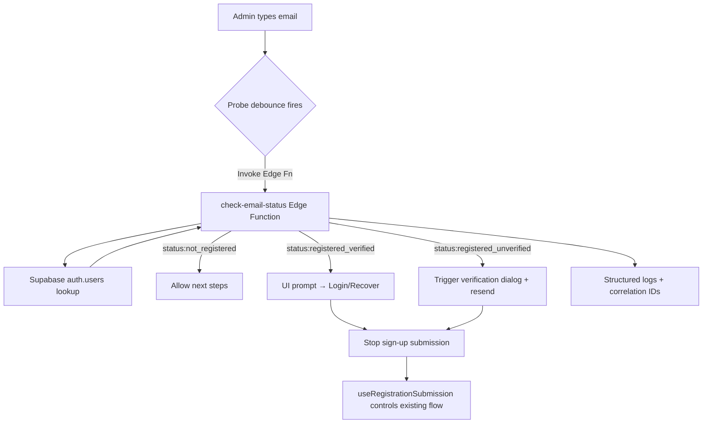

# Design Document

## Overview

Introduce an email status probe that runs before registration submits. The probe uses a new Supabase Edge Function to classify an admin email as new, registered+verified, or registered+unverified. The React registration wizard consumes this status through a dedicated hook that debounces calls, updates inline UI, and orchestrates different flows: redirect to login/password recovery for verified addresses and reopen the verification dialog for pending accounts. Logging, telemetry, and error-handling mirror existing patterns to keep the experience consistent.

## Architecture

The design adds three collaboration points:

1. **Edge Function (`check-email-status`)**: Deno function using service-role credentials to read `auth.users`. Returns `{ status, verified_at, attemptId? }`.
2. **Frontend Probe Hook (`useEmailStatusProbe`)**: Wraps `supabase.functions.invoke`, handles debounce, cancellation, and exposes status plus helper actions.
3. **UI Integration**: `RegistrationAdminStep` renders a status banner and actions; `useRegistrationForm` consumes probe results to gate submission and trigger existing verification dialog paths.

### High-Level Flow



### Integration Points

- `useRegistrationForm` subscribes to probe output to block or allow submission (`Requirement 2`, `Requirement 3`, `Requirement 4`).
- `RegistrationAdminStep` injects a new `EmailStatusBanner` component sourced from the hook state.
- `RegistrationVerificationDialog` receives an additional prop for re-verification context to distinguish fresh vs returning flows.
- Edge Function deployment follows the same Supabase CLI pipeline as `register-organization`, ensuring secrets and observability align.

## Components and Interfaces

- **Edge Function Handler (`supabase/functions/check-email-status/index.ts`)**
  - `POST /`: expects `{ email: string, attemptId?: string }`.
  - Response shape: `{ status: 'not_registered' | 'registered_verified' | 'registered_unverified', verifiedAt?: string | null, attemptId?: string }`.
  - Errors: `{ error: { code, message, details? } }`.
- **`useEmailStatusProbe` Hook**
  - API: `const { status, isLoading, error, actions } = useEmailStatusProbe({ email, attemptId, enabled });`
  - `actions` include `reset`, `forceCheck()`, `resumeVerification()` (for `registered_unverified` to call Supabase resend).
  - Internally uses `AbortController` for cancellation and a shared debounce utility.
- **`EmailStatusBanner` Component**
  - Props: `{ status, onLogin, onRecover, onDismiss, verificationPending }`.
  - Renders variant messaging and CTA buttons; accessible via ARIA `role="status"`.
- **`useRegistrationSubmission` updates**
  - Accepts an optional override to skip `supabase.auth.signUp` when the probe indicates verified accounts.
  - Offers helper to resend verification email when requested by UI.

## Data Models 1

```ts
type EmailStatusResponse =
  | { status: "not_registered"; attemptId?: string }
  | { status: "registered_verified"; attemptId?: string; verifiedAt: string }
  | { status: "registered_unverified"; attemptId?: string; lastSignInAt?: string | null };

type EmailStatusError = { error: { code: string; message: string; details?: unknown } };
```

## Error Handling 1

- **Edge Function**
  - Validation failures → 422 with `code = "validation_failed"`.
  - Missing service-role config → 500 `server_config`.
  - Supabase query issues → 502 `supabase_query_failed` with sanitized detail.
  - Rate-limited/malformed requests log IP/correlation and return 429 `rate_limited`.
- **Frontend**
  - Network or 5xx responses surface a dismissible warning banner (`status = "error"`). Submission is allowed but flagged.
  - Verified and unverified cases set `submissionBlockingReason` in `useRegistrationForm` so the form disables the submit button with specific messaging.

### Graceful Degradation 1

- If the probe fails repeatedly, the form reverts to legacy behavior (no blocking) and logs telemetry so support can investigate.
- Banner advises users to continue registration while acknowledging the check could not complete.

### Diagnostic Integration 1

- The hook logs via `logger.info` / `logger.error` with `attemptId`, `email`, and `status`.
- Edge Function writes structured console logs consumed by Supabase (mirroring `register-organization` approach) with correlation IDs to stitch requests.

## Testing Strategy

- **Edge Function**: unit tests with Deno test mocking Supabase client; integration tests hitting a Supabase sandbox verifying each status path and error handling.
- **Hook**: Vitest tests verifying debounce, cancellation, success/error states, and React 19 compatibility (no stale closure issues).
- **Component**: React Testing Library specs ensuring banner renders correct actions, ARIA attributes, and blocking behavior.
- **End-to-End**: Playwright or Vitest+JSDOM scenario verifying full flow: existing verified email → login prompt, unverified email → verification dialog reopens.
- **Regression**: Ensure sign-up still works for new emails and existing verification dialog behavior remains intact.

## Implementation Phases

### Phase 1 - Backend Foundations
- Scaffold `check-email-status` Edge Function with schema validation and CORS headers.
- Implement Supabase admin client lookup and response normalization.
- Add logging, env assertions, and Supabase function tests.
- Update Supabase config & documentation for deployment.

### Phase 2 - Frontend Probe & UX
- Build `useEmailStatusProbe` hook with debounce, cancellation, and logger integration.
- Integrate hook into `useRegistrationForm` / `RegistrationAdminStep`, introducing `EmailStatusBanner`.
- Wire verified/unverified outcomes to new UI actions and existing dialogs.
- Add Vitest coverage for hook and components.

### Phase 3 - Verification Flow Enhancements
- Connect resend verification action via Supabase auth API, ensuring proper error handling.
- Extend `RegistrationVerificationDialog` to display returning-user messaging and manual check logic.
- Instrument analytics/logging for probe outcomes and CTA usage.
- Conduct end-to-end tests and update release notes.

## Performance Considerations

- Debounce ensures at most one probe per 400 ms typing burst, preventing Edge Function overuse.
- Cache the latest result keyed by lowercase email to avoid redundant calls when users toggle steps.

### Minimal Impact Design

- Hook operates independently of existing submission logic; if disabled, legacy behavior remains.
- UI changes are additive components that do not modify underlying field wiring.

### Scalability

- Edge Function is stateless, using Supabase serverless scaling; response payloads are minimal JSON.
- Client caching reduces repeated calls for the same email within a session.

### Backward Compatibility (when applicable)

- Registration flow for new emails remains unchanged; the probe only adds guardrails for known emails.
- Feature can be behind a remote flag if staged rollout is required.

## Migration and Compatibility (when applicable)

- Deploy the new Edge Function via Supabase CLI, update `supabase/functions/.gitignore` if needed.
- Ensure CI scripts include function deployment/tests.
- Communicate new environment variable requirements (none beyond existing service-role key) to DevOps.
