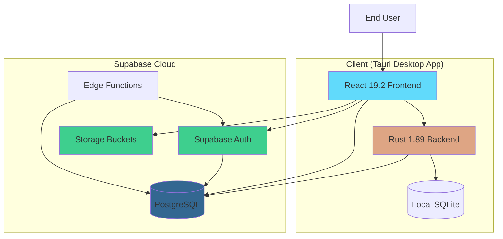
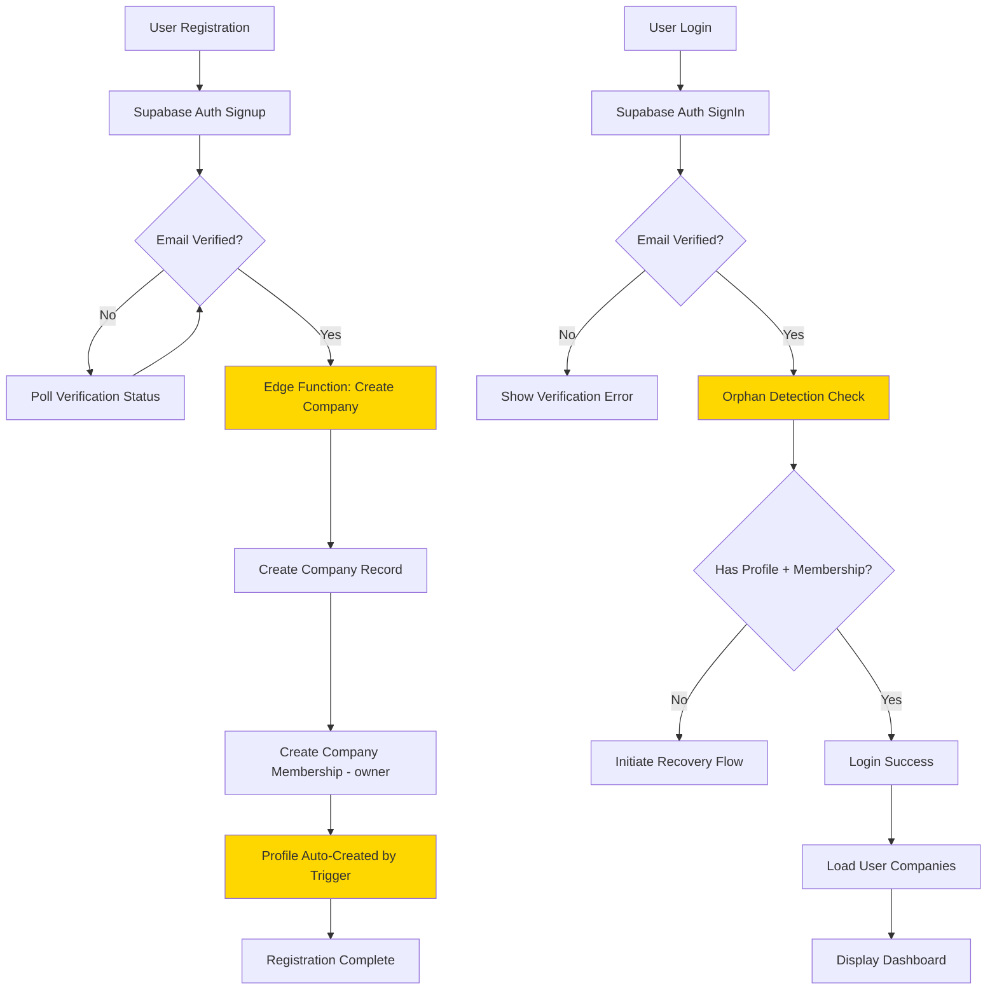
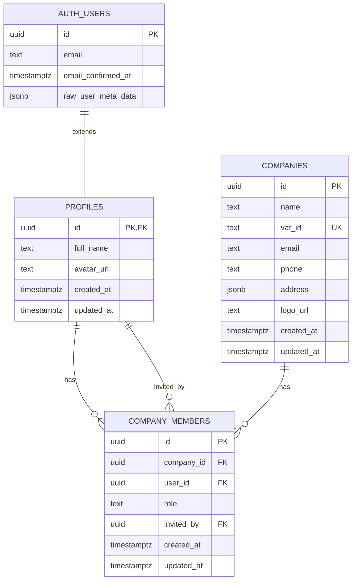
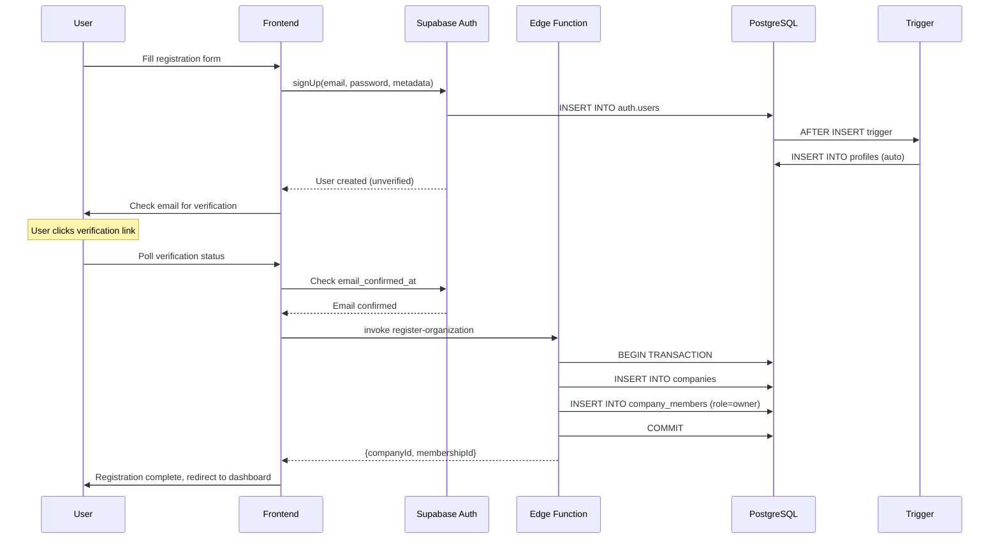
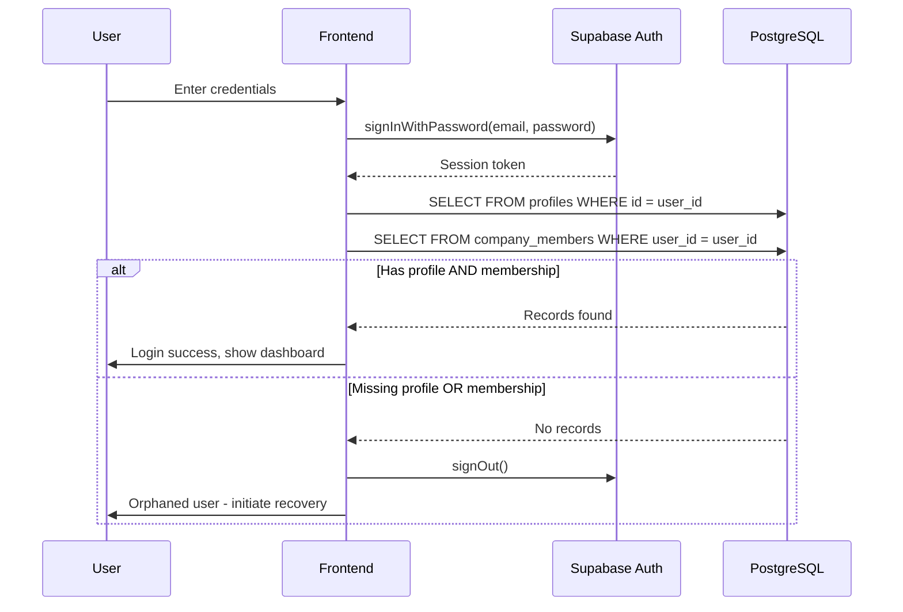

# Design Document: Supabase Schema Management System

**Project**: supabase-schemas-tool
**Date**: 2025-10-29
**Version**: 1.0
**Status**: Ready for Implementation

---

## Overview

This design document specifies a comprehensive multi-tenant database schema for the Weg Translator application using Supabase PostgreSQL. The implementation introduces three core tables (companies, profiles, company_members) with Row-Level Security policies, automated triggers, and storage bucket integration. The design maintains strict tenant isolation, ensures backward compatibility with existing authentication flows, and explicitly prohibits schema manipulation capabilities within application code.

### Design Principles

1. **Security First**: Fail-closed RLS policies ensure tenant isolation
2. **Developer-Managed Schema**: No schema manipulation in application code
3. **Backward Compatibility**: Existing auth flows continue to work without disruption
4. **Performance**: Queries optimized with proper indexing (p95 < 200ms target)
5. **Type Safety**: Strong typing across TypeScript (frontend), Rust (backend), and PostgreSQL (database)
6. **Idempotency**: All migration scripts can run multiple times safely
7. **Graceful Degradation**: Database triggers handle missing metadata without failing user operations

### Key Components

- **Database Layer**: PostgreSQL schema with tables, constraints, indexes, triggers, and RLS policies
- **Storage Layer**: Supabase Storage buckets for logos and avatars with RLS policies
- **IPC Layer**: Tauri commands for CRUD operations (hybrid approach: reads via frontend, writes via backend)
- **Frontend Layer**: React components, hooks, and Supabase client integration
- **Migration Layer**: Idempotent SQL scripts for schema creation and data migration

---

## Architecture

### System Context



### High-Level Flow



### Integration Points

#### 1. Authentication Flow Integration

The new schema integrates with existing authentication at multiple points:

**Login Flow** (`src/app/providers/auth/AuthProvider.tsx`):
- After Supabase sign-in, queries `profiles` and `company_members` tables
- Orphan detection updated to check new schema
- User context enriched with profile data (full_name, avatar_url)

**Registration Flow** (`src/modules/auth/hooks/controllers/useRegistrationSubmission.ts`):
- Edge Function creates company and membership atomically
- Profile auto-created by database trigger
- Post-registration verification confirms non-orphaned status

#### 2. Local Database Integration

The application maintains separation between cloud and local data:

**Supabase PostgreSQL** (Cloud):
- User profiles (extends auth.users)
- Company data (multi-tenant entities)
- Company memberships (role-based access)

**SQLite** (Local - Tauri managed):
- Translation projects
- Project files and artifacts
- Translation jobs and history
- Client records (separate from cloud companies)

**No direct sync** between SQLite and PostgreSQL - they serve different purposes.

#### 3. Storage Integration

Logo and avatar files stored in Supabase Storage with RLS:

**Upload Flow**:
1. Frontend validates file (type, size)
2. Frontend uploads to Storage bucket via Supabase client
3. Storage RLS validates user has permission
4. Frontend updates database URL field (companies.logo_url or profiles.avatar_url)

**Retrieval Flow**:
1. Frontend queries database for URL reference
2. Frontend generates signed URL with 1-hour expiration
3. Signed URL respects RLS policies
4. URL cached to avoid regeneration on every render

---

## Components and Interfaces

### Database Schema Components

#### Companies Table

**Purpose**: Store organization/business entities with multi-tenant isolation.

**Schema**:
```sql
CREATE TABLE IF NOT EXISTS public.companies (
    id UUID PRIMARY KEY DEFAULT gen_random_uuid(),
    name TEXT NOT NULL,
    vat_id TEXT NOT NULL UNIQUE,
    email TEXT NOT NULL,
    phone TEXT,
    address JSONB,
    logo_url TEXT,
    created_at TIMESTAMPTZ NOT NULL DEFAULT now(),
    updated_at TIMESTAMPTZ NOT NULL DEFAULT now(),

    CONSTRAINT companies_email_check CHECK (email ~* '^[A-Za-z0-9._%+-]+@[A-Za-z0-9.-]+\.[A-Z|a-z]{2,}$')
);

-- Indexes
CREATE INDEX IF NOT EXISTS idx_companies_vat_id ON companies(vat_id);
CREATE INDEX IF NOT EXISTS idx_companies_email ON companies(email);
CREATE INDEX IF NOT EXISTS idx_companies_created_at ON companies(created_at);
CREATE INDEX IF NOT EXISTS idx_companies_address_gin ON companies USING GIN (address);
```

**Address JSONB Structure**:
```typescript
interface Address {
    street?: string;
    city?: string;
    postal_code?: string;
    country?: string;
    state?: string;
    line1?: string;
    line2?: string;
}
```

**Design Rationale**:
- JSONB for address allows flexibility for international addresses without schema changes
- GIN index on address enables efficient structured queries
- VAT ID unique constraint prevents duplicate registrations
- Email validation via CHECK constraint ensures data quality

#### Profiles Table

**Purpose**: Extend auth.users with application-specific user metadata.

**Schema**:
```sql
CREATE TABLE IF NOT EXISTS public.profiles (
    id UUID PRIMARY KEY REFERENCES auth.users(id) ON DELETE CASCADE,
    full_name TEXT,
    avatar_url TEXT,
    created_at TIMESTAMPTZ NOT NULL DEFAULT now(),
    updated_at TIMESTAMPTZ NOT NULL DEFAULT now()
);

-- Indexes
CREATE INDEX IF NOT EXISTS idx_profiles_full_name ON profiles(full_name);
```

**Design Rationale**:
- 1:1 relationship with auth.users enforced by PRIMARY KEY foreign key
- CASCADE delete ensures profile removed when user deleted (GDPR compliance)
- Nullable fields allow users without full profile data
- Simple structure - extensible with additional columns as needed

#### Company Members Junction Table

**Purpose**: Manage many-to-many relationships between users and companies with role information.

**Schema**:
```sql
CREATE TABLE IF NOT EXISTS public.company_members (
    id UUID PRIMARY KEY DEFAULT gen_random_uuid(),
    company_id UUID NOT NULL REFERENCES companies(id) ON DELETE CASCADE,
    user_id UUID NOT NULL REFERENCES profiles(id) ON DELETE CASCADE,
    role TEXT NOT NULL CHECK (role IN ('owner', 'admin', 'member')),
    invited_by UUID REFERENCES profiles(id) ON DELETE SET NULL,
    created_at TIMESTAMPTZ NOT NULL DEFAULT now(),
    updated_at TIMESTAMPTZ NOT NULL DEFAULT now(),

    CONSTRAINT company_members_unique_membership UNIQUE (company_id, user_id)
);

-- Indexes
CREATE INDEX IF NOT EXISTS idx_company_members_user_id ON company_members(user_id);
CREATE INDEX IF NOT EXISTS idx_company_members_company_id ON company_members(company_id);
CREATE INDEX IF NOT EXISTS idx_company_members_company_role ON company_members(company_id, role);
```

**Design Rationale**:
- TEXT with CHECK constraint for role (more flexible than PostgreSQL ENUM)
- Unique constraint prevents duplicate memberships
- CASCADE delete from both sides ensures no orphaned memberships
- invited_by uses SET NULL to preserve membership even if inviter deleted
- Composite index (company_id, role) optimizes role-filtered queries

### TypeScript Type Definitions

**Location**: `src/shared/types/database.ts`

```typescript
// Core entities
export interface Company {
    id: string;
    name: string;
    vat_id: string;
    email: string;
    phone: string | null;
    address: Address | null;
    logo_url: string | null;
    created_at: string;
    updated_at: string;
}

export interface Address {
    street?: string;
    city?: string;
    postal_code?: string;
    country?: string;
    state?: string;
    line1?: string;
    line2?: string;
}

export interface Profile {
    id: string;
    full_name: string | null;
    avatar_url: string | null;
    created_at: string;
    updated_at: string;
}

export type MemberRole = 'owner' | 'admin' | 'member';

export interface CompanyMember {
    id: string;
    company_id: string;
    user_id: string;
    role: MemberRole;
    invited_by: string | null;
    created_at: string;
    updated_at: string;
}

// Payload types for create/update operations
export interface CompanyCreatePayload {
    name: string;
    vat_id: string;
    email: string;
    phone?: string;
    address?: Address;
}

export interface CompanyUpdatePayload {
    id: string;
    name?: string;
    email?: string;
    phone?: string;
    address?: Address;
    logo_url?: string;
}

export interface ProfileUpdatePayload {
    id: string;
    full_name?: string;
    avatar_url?: string;
}

export interface InviteMemberPayload {
    company_id: string;
    user_id: string;
    role: MemberRole;
}

export interface UpdateMemberRolePayload {
    member_id: string;
    new_role: MemberRole;
}
```

### Rust Type Definitions

**Location**: `src-tauri/src/db/types/schema.rs`

```rust
use serde::{Deserialize, Serialize};
use uuid::Uuid;
use chrono::{DateTime, Utc};
use serde_json::Value as JsonValue;

// Database record types
#[derive(Debug, Clone, Serialize, Deserialize)]
pub struct CompanyRecord {
    pub id: Uuid,
    pub name: String,
    pub vat_id: String,
    pub email: String,
    pub phone: Option<String>,
    pub address: Option<JsonValue>,
    pub logo_url: Option<String>,
    pub created_at: DateTime<Utc>,
    pub updated_at: DateTime<Utc>,
}

#[derive(Debug, Clone, Serialize, Deserialize)]
pub struct ProfileRecord {
    pub id: Uuid,
    pub full_name: Option<String>,
    pub avatar_url: Option<String>,
    pub created_at: DateTime<Utc>,
    pub updated_at: DateTime<Utc>,
}

#[derive(Debug, Clone, Copy, Serialize, Deserialize, PartialEq, Eq)]
#[serde(rename_all = "lowercase")]
pub enum MemberRole {
    Owner,
    Admin,
    Member,
}

#[derive(Debug, Clone, Serialize, Deserialize)]
pub struct CompanyMemberRecord {
    pub id: Uuid,
    pub company_id: Uuid,
    pub user_id: Uuid,
    pub role: MemberRole,
    pub invited_by: Option<Uuid>,
    pub created_at: DateTime<Utc>,
    pub updated_at: DateTime<Utc>,
}

// DTO types for IPC responses
#[derive(Debug, Clone, Serialize, Deserialize)]
pub struct CompanyDto {
    pub id: String,
    pub name: String,
    pub vat_id: String,
    pub email: String,
    pub phone: Option<String>,
    pub address: Option<JsonValue>,
    pub logo_url: Option<String>,
    pub created_at: String,
    pub updated_at: String,
}

// Conversion implementations
impl From<CompanyRecord> for CompanyDto {
    fn from(record: CompanyRecord) -> Self {
        Self {
            id: record.id.to_string(),
            name: record.name,
            vat_id: record.vat_id,
            email: record.email,
            phone: record.phone,
            address: record.address,
            logo_url: record.logo_url,
            created_at: record.created_at.to_rfc3339(),
            updated_at: record.updated_at.to_rfc3339(),
        }
    }
}
```

### Supabase Query Interfaces

**Location**: `src/core/supabase/queries/companies.ts`

```typescript
import { supabase } from '@/core/config/supabaseClient';
import type { Company, CompanyCreatePayload, CompanyUpdatePayload } from '@/shared/types/database';

export class CompanyQueries {
    /**
     * Get company by ID (RLS enforced - user must be member)
     */
    static async getCompany(companyId: string): Promise<Company | null> {
        const { data, error } = await supabase
            .from('companies')
            .select('*')
            .eq('id', companyId)
            .maybeSingle();

        if (error) throw error;
        return data;
    }

    /**
     * List all companies for current authenticated user
     */
    static async listUserCompanies(): Promise<Company[]> {
        const { data: { user } } = await supabase.auth.getUser();
        if (!user) throw new Error('Not authenticated');

        const { data, error } = await supabase
            .from('companies')
            .select(`
                *,
                company_members!inner(user_id)
            `)
            .eq('company_members.user_id', user.id);

        if (error) throw error;
        return data || [];
    }

    /**
     * Create company (RLS allows authenticated users)
     */
    static async createCompany(payload: CompanyCreatePayload): Promise<Company> {
        const { data, error } = await supabase
            .from('companies')
            .insert(payload)
            .select()
            .single();

        if (error) throw error;
        return data;
    }

    /**
     * Update company (RLS enforced - user must be owner/admin)
     */
    static async updateCompany(payload: CompanyUpdatePayload): Promise<Company | null> {
        const { id, ...updates } = payload;

        const { data, error } = await supabase
            .from('companies')
            .update(updates)
            .eq('id', id)
            .select()
            .maybeSingle();

        if (error) throw error;
        return data;
    }

    /**
     * Delete company (RLS enforced - user must be owner)
     */
    static async deleteCompany(companyId: string): Promise<void> {
        const { error } = await supabase
            .from('companies')
            .delete()
            .eq('id', companyId);

        if (error) throw error;
    }
}
```

---

## Data Models

### Entity-Relationship Diagram



### Data Flow Diagrams

#### Registration Flow



#### Login with Orphan Detection



---

## Error Handling

### Error Classification

#### Database Errors

```typescript
export enum DatabaseErrorCode {
    // PostgreSQL error codes
    UNIQUE_VIOLATION = '23505',
    FOREIGN_KEY_VIOLATION = '23503',
    CHECK_VIOLATION = '23514',
    RLS_VIOLATION = '42501',

    // Supabase-specific
    NOT_FOUND = 'PGRST116',
    ROW_NOT_FOUND = 'PGRST301',
}

export interface DatabaseError extends Error {
    code: string;
    details: string;
    hint?: string;
    message: string;
}
```

#### Error Mapping

**Location**: `src/core/supabase/errors.ts`

```typescript
export function mapSupabaseError(error: DatabaseError): UserFriendlyError {
    switch (error.code) {
        case DatabaseErrorCode.UNIQUE_VIOLATION:
            if (error.message.includes('vat_id')) {
                return {
                    type: 'validation',
                    message: 'A company with this VAT ID already exists',
                    field: 'vat_id',
                };
            }
            if (error.message.includes('company_members_unique_membership')) {
                return {
                    type: 'validation',
                    message: 'This user is already a member of this company',
                    field: 'user_id',
                };
            }
            break;

        case DatabaseErrorCode.RLS_VIOLATION:
            return {
                type: 'authorization',
                message: 'You do not have permission to perform this action',
            };

        case DatabaseErrorCode.FOREIGN_KEY_VIOLATION:
            return {
                type: 'validation',
                message: 'Referenced record does not exist',
            };

        case DatabaseErrorCode.NOT_FOUND:
            return {
                type: 'not_found',
                message: 'The requested resource was not found',
            };

        default:
            return {
                type: 'unknown',
                message: 'An unexpected error occurred. Please try again.',
            };
    }
}
```

### Graceful Degradation

#### Profile Trigger Error Handling

The profile auto-creation trigger must not fail user signup:

```sql
CREATE OR REPLACE FUNCTION public.handle_new_user()
RETURNS TRIGGER
LANGUAGE plpgsql
SECURITY DEFINER SET search_path = public
AS $$
BEGIN
    BEGIN
        INSERT INTO public.profiles (id, full_name, avatar_url, created_at, updated_at)
        VALUES (
            NEW.id,
            COALESCE(NEW.raw_user_meta_data->>'full_name', NULL),
            COALESCE(NEW.raw_user_meta_data->>'avatar_url', NULL),
            NOW(),
            NOW()
        );
    EXCEPTION
        WHEN OTHERS THEN
            -- Log warning but don't raise exception
            RAISE WARNING 'Profile creation failed for user %: %', NEW.id, SQLERRM;
    END;

    RETURN NEW;
END;
$$;
```

**Rationale**: If profile creation fails (e.g., unique constraint violation, permission issue), the auth.users record should still be created. The application can detect missing profiles and create them later.

#### Storage Upload Degradation

```typescript
export async function uploadCompanyLogo(
    companyId: string,
    file: File
): Promise<string | null> {
    try {
        // Validate file
        validateImageFile(file, { maxSize: 2 * 1024 * 1024 });

        // Upload to storage
        const path = `${companyId}/logo.${getFileExtension(file)}`;
        const { data, error } = await supabase.storage
            .from('company-logos')
            .upload(path, file, { upsert: true });

        if (error) throw error;

        // Update database
        await CompanyQueries.updateCompany({
            id: companyId,
            logo_url: data.path,
        });

        return data.path;
    } catch (error) {
        console.error('Logo upload failed:', error);

        // Return null instead of throwing - company can exist without logo
        return null;
    }
}
```

### Diagnostic Integration

#### Correlation IDs

All operations include correlation IDs for distributed tracing:

```typescript
export async function createCompanyWithMembership(
    companyData: CompanyCreatePayload,
    userId: string
): Promise<{ company: Company; membership: CompanyMember }> {
    const correlationId = crypto.randomUUID();

    logger.info('Creating company with membership', {
        correlationId,
        userId,
        companyName: companyData.name,
    });

    try {
        const company = await CompanyQueries.createCompany(companyData);

        const membership = await MembershipQueries.inviteMember({
            company_id: company.id,
            user_id: userId,
            role: 'owner',
        });

        logger.info('Company created successfully', {
            correlationId,
            companyId: company.id,
            membershipId: membership.id,
        });

        return { company, membership };
    } catch (error) {
        logger.error('Company creation failed', {
            correlationId,
            error,
            userId,
        });
        throw error;
    }
}
```

---

## Testing Strategy

### Unit Tests

#### TypeScript Query Functions

**Location**: `src/test/unit/supabase/queries/companies.test.ts`

```typescript
import { describe, it, expect, beforeEach, afterEach } from 'vitest';
import { CompanyQueries } from '@/core/supabase/queries/companies';
import { createTestSupabaseClient, cleanupTestData } from '@/test/utils/supabaseTestHelpers';

describe('CompanyQueries', () => {
    let testUserId: string;
    let testCompanyId: string;

    beforeEach(async () => {
        // Setup test user and company
        const user = await createTestUser();
        testUserId = user.id;
    });

    afterEach(async () => {
        await cleanupTestData(testUserId);
    });

    describe('createCompany', () => {
        it('should create company with valid data', async () => {
            const payload = {
                name: 'Test Company',
                vat_id: 'US123456789',
                email: 'test@example.com',
                phone: '+1234567890',
            };

            const company = await CompanyQueries.createCompany(payload);

            expect(company).toBeDefined();
            expect(company.name).toBe(payload.name);
            expect(company.vat_id).toBe(payload.vat_id);

            testCompanyId = company.id;
        });

        it('should throw error for duplicate VAT ID', async () => {
            const payload = {
                name: 'Test Company',
                vat_id: 'US123456789',
                email: 'test@example.com',
            };

            await CompanyQueries.createCompany(payload);

            await expect(CompanyQueries.createCompany(payload))
                .rejects.toThrow(/vat_id/);
        });
    });

    describe('listUserCompanies', () => {
        it('should return only companies user is member of', async () => {
            // Create two companies, user is member of one
            const company1 = await createCompanyWithMembership(testUserId);
            const company2 = await createCompanyWithoutMembership();

            const companies = await CompanyQueries.listUserCompanies();

            expect(companies).toHaveLength(1);
            expect(companies[0].id).toBe(company1.id);
            expect(companies).not.toContainEqual(
                expect.objectContaining({ id: company2.id })
            );
        });
    });
});
```

#### RLS Policy Tests

**Location**: `src/test/integration/rls-policies.test.ts`

```typescript
import { describe, it, expect, beforeAll, afterAll } from 'vitest';
import { createTestSupabaseClient } from '@/test/utils/supabaseTestHelpers';

describe('RLS Policies', () => {
    let userAClient: SupabaseClient;
    let userBClient: SupabaseClient;
    let userAId: string;
    let userBId: string;
    let companyAId: string;

    beforeAll(async () => {
        // Create two users with separate auth contexts
        const { client: clientA, userId: uidA } = await createAuthenticatedClient('userA@example.com');
        const { client: clientB, userId: uidB } = await createAuthenticatedClient('userB@example.com');

        userAClient = clientA;
        userBClient = clientB;
        userAId = uidA;
        userBId = uidB;

        // User A creates a company
        const { data } = await userAClient
            .from('companies')
            .insert({ name: 'Company A', vat_id: 'A123', email: 'a@example.com' })
            .select()
            .single();

        companyAId = data.id;

        // User A adds self as member
        await userAClient
            .from('company_members')
            .insert({ company_id: companyAId, user_id: userAId, role: 'owner' });
    });

    afterAll(async () => {
        // Cleanup
        await cleanupTestData(userAId);
        await cleanupTestData(userBId);
    });

    describe('companies table', () => {
        it('should allow user to view companies they are member of', async () => {
            const { data, error } = await userAClient
                .from('companies')
                .select('*')
                .eq('id', companyAId);

            expect(error).toBeNull();
            expect(data).toHaveLength(1);
            expect(data[0].id).toBe(companyAId);
        });

        it('should prevent user from viewing companies they are not member of', async () => {
            const { data, error } = await userBClient
                .from('companies')
                .select('*')
                .eq('id', companyAId);

            // RLS filters out the row - no error, but empty result
            expect(error).toBeNull();
            expect(data).toHaveLength(0);
        });

        it('should allow owner to update company', async () => {
            const { error } = await userAClient
                .from('companies')
                .update({ name: 'Updated Company A' })
                .eq('id', companyAId);

            expect(error).toBeNull();
        });

        it('should prevent non-member from updating company', async () => {
            const { error } = await userBClient
                .from('companies')
                .update({ name: 'Hacked Company A' })
                .eq('id', companyAId);

            // Update succeeds but affects 0 rows due to RLS
            expect(error).toBeNull();
        });
    });

    describe('profiles table', () => {
        it('should allow user to view own profile', async () => {
            const { data, error } = await userAClient
                .from('profiles')
                .select('*')
                .eq('id', userAId)
                .single();

            expect(error).toBeNull();
            expect(data.id).toBe(userAId);
        });

        it('should allow user to view profiles of company members', async () => {
            // Add user B to company A
            await userAClient
                .from('company_members')
                .insert({ company_id: companyAId, user_id: userBId, role: 'member' });

            // User A should now see user B's profile
            const { data, error } = await userAClient
                .from('profiles')
                .select('*')
                .eq('id', userBId)
                .single();

            expect(error).toBeNull();
            expect(data.id).toBe(userBId);
        });
    });
});
```

### Performance Tests

**Location**: `src/test/performance/orphan-detection.perf.test.ts`

```typescript
import { describe, it, expect, beforeAll } from 'vitest';
import { checkIfOrphaned } from '@/modules/auth/utils/orphanDetection';
import { createTestUser, createCompanyForUser } from '@/test/utils/supabaseTestHelpers';

describe('Orphan Detection Performance', () => {
    const SAMPLE_SIZE = 1000;
    const P95_TARGET_MS = 200;
    const P99_TARGET_MS = 350;

    let testUserId: string;

    beforeAll(async () => {
        // Setup: Create user with profile and membership
        const user = await createTestUser();
        testUserId = user.id;
        await createCompanyForUser(testUserId);
    });

    it('should meet p95 < 200ms and p99 < 350ms targets', async () => {
        const durations: number[] = [];

        for (let i = 0; i < SAMPLE_SIZE; i++) {
            const startTime = performance.now();

            await checkIfOrphaned(testUserId);

            const duration = performance.now() - startTime;
            durations.push(duration);
        }

        // Sort durations for percentile calculation
        durations.sort((a, b) => a - b);

        const p50 = durations[Math.floor(SAMPLE_SIZE * 0.50)];
        const p95 = durations[Math.floor(SAMPLE_SIZE * 0.95)];
        const p99 = durations[Math.floor(SAMPLE_SIZE * 0.99)];

        console.log({
            p50: `${p50.toFixed(2)}ms`,
            p95: `${p95.toFixed(2)}ms`,
            p99: `${p99.toFixed(2)}ms`,
        });

        expect(p95).toBeLessThan(P95_TARGET_MS);
        expect(p99).toBeLessThan(P99_TARGET_MS);
    });
});
```

### Integration Tests

**End-to-End Registration Flow**:

```typescript
describe('Registration Flow E2E', () => {
    it('should complete full registration with company and membership', async () => {
        const email = `test-${Date.now()}@example.com`;
        const password = 'SecurePassword123!';

        // Step 1: Sign up
        const { data: signupData } = await supabase.auth.signUp({
            email,
            password,
            options: {
                data: {
                    full_name: 'Test User',
                },
            },
        });

        const userId = signupData.user!.id;

        // Step 2: Verify profile auto-created
        const { data: profile } = await supabase
            .from('profiles')
            .select('*')
            .eq('id', userId)
            .single();

        expect(profile).toBeDefined();
        expect(profile.full_name).toBe('Test User');

        // Step 3: Simulate email verification (test helper)
        await verifyUserEmail(userId);

        // Step 4: Create company via Edge Function
        const { data: companyData } = await supabase.functions.invoke(
            'register-organization',
            {
                body: {
                    company: {
                        name: 'Test Company',
                        email,
                        phone: '+1234567890',
                        taxId: 'US123456789',
                        address: {
                            freeform: '123 Main St, City, Country',
                        },
                    },
                },
            }
        );

        expect(companyData.companyId).toBeDefined();

        // Step 5: Verify membership created
        const { data: membership } = await supabase
            .from('company_members')
            .select('*')
            .eq('user_id', userId)
            .single();

        expect(membership).toBeDefined();
        expect(membership.role).toBe('owner');

        // Step 6: Login and verify not orphaned
        await supabase.auth.signInWithPassword({ email, password });

        const orphanCheck = await checkIfOrphaned(userId);
        expect(orphanCheck.isOrphaned).toBe(false);

        // Cleanup
        await cleanupTestUser(userId);
    });
});
```

---

## Implementation Phases

### Phase 1 - Database Foundation

**Objective**: Establish core database schema with constraints, indexes, and triggers in Supabase PostgreSQL.

**Tasks**:
- Create companies table with JSONB address, VAT ID unique constraint, email validation
- Create profiles table with foreign key to auth.users (ON DELETE CASCADE)
- Create company_members table with role check constraint, unique (company_id, user_id)
- Create indexes on all foreign keys and frequently queried columns
- Create GIN index on companies.address for JSONB queries
- Create updated_at trigger function and apply to all three tables
- Create handle_new_user() trigger for profile auto-creation on auth.users insert
- Write comprehensive migration script with idempotency (IF NOT EXISTS patterns)
- Test migration script multiple times to verify idempotency
- Verify data integrity with manual inserts using service role client

**Acceptance Criteria**:
- All tables created with correct schema
- All constraints enforced (unique, check, foreign key)
- Indexes created and queryable via pg_indexes
- Triggers fire correctly on INSERT/UPDATE
- Migration script runs without errors when executed multiple times
- No orphaned records after cascade deletes

**Estimated Duration**: 3-4 days

---

### Phase 2 - Row-Level Security Policies

**Objective**: Implement comprehensive RLS policies for tenant isolation and role-based access control.

**Tasks**:
- Enable RLS on companies, profiles, company_members tables
- Create SELECT policy for companies (user must be member)
- Create INSERT policy for companies (authenticated users)
- Create UPDATE policy for companies (owner/admin only)
- Create DELETE policy for companies (owner only)
- Create SELECT policy for profiles (own profile + company co-members)
- Create INSERT/UPDATE/DELETE policies for profiles (own profile only)
- Create SELECT policy for company_members (members of same company)
- Create INSERT policy for company_members (owner/admin can invite)
- Create UPDATE policy for company_members (owner can change roles)
- Create DELETE policy for company_members (self-removal or owner/admin removal)
- Test each policy with multiple user contexts (owner, admin, member, non-member)
- Verify policies use fail-closed approach (deny when auth.uid() is NULL)
- Performance test RLS queries with indexes

**Acceptance Criteria**:
- All RLS policies created and active
- Users can only access their own company data
- Role-based restrictions enforced (only owners can delete companies)
- Unauthenticated requests return empty results (no errors)
- Service role bypasses RLS for Edge Functions
- Performance degradation < 10% compared to queries without RLS

**Estimated Duration**: 3-4 days

---

### Phase 3 - Storage Buckets and File Handling

**Objective**: Configure Supabase Storage buckets for logos and avatars with RLS policies.

**Tasks**:
- Create company-logos storage bucket (private, image/* MIME types, 2MB limit)
- Create user-avatars storage bucket (private, image/* MIME types, 1MB limit)
- Create RLS policies for company-logos bucket (company members can view, owners/admins can upload)
- Create RLS policies for user-avatars bucket (user can manage own, co-members can view)
- Implement frontend helper: uploadCompanyLogo(companyId, file)
- Implement frontend helper: uploadUserAvatar(userId, file)
- Implement frontend helper: getCompanyLogoUrl(logoPath) with signed URL generation
- Implement frontend helper: getUserAvatarUrl(avatarPath) with signed URL generation
- Add file validation (type, size) in upload helpers
- Add error handling for storage operations (unauthorized, file too large, invalid type)
- Update database after successful upload (companies.logo_url, profiles.avatar_url)
- Test upload/download with multiple user contexts

**Acceptance Criteria**:
- Buckets created with correct configuration
- RLS policies prevent unauthorized access
- Upload helpers validate files and update database
- Signed URLs generated with 1-hour expiration
- Error handling provides user-friendly messages
- Images display correctly in UI

**Estimated Duration**: 2-3 days

---

### Phase 4 - Type Definitions and Interfaces

**Objective**: Define TypeScript and Rust types for all entities with full type safety across IPC boundary.

**Tasks**:
- Create TypeScript interfaces in src/shared/types/database.ts (Company, Profile, CompanyMember)
- Create Address interface for JSONB structure
- Create MemberRole type ('owner' | 'admin' | 'member')
- Create payload types (CompanyCreatePayload, ProfileUpdatePayload, etc.)
- Create Rust structs in src-tauri/src/db/types/schema.rs (CompanyRecord, ProfileRecord, CompanyMemberRecord)
- Create MemberRole enum in Rust with serde rename
- Create DTO types for IPC responses (CompanyDto, ProfileDto, etc.)
- Implement From/Into traits for Record → DTO conversions
- Export all types from respective modules
- Verify TypeScript types match database schema exactly
- Verify Rust types serialize correctly to JSON for IPC

**Acceptance Criteria**:
- All types defined and exported
- TypeScript types match database schema
- Rust types compile without errors
- serde serialization works correctly
- Nullable fields correctly marked with Option/null
- Type safety maintained across IPC boundary

**Estimated Duration**: 1-2 days

---

### Phase 5 - Supabase Query Layer (Frontend)

**Objective**: Create TypeScript query helpers for direct Supabase access from React frontend.

**Tasks**:
- Create src/core/supabase/queries/companies.ts with CompanyQueries class
- Implement getCompany, listUserCompanies, createCompany, updateCompany, deleteCompany
- Create src/core/supabase/queries/profiles.ts with ProfileQueries class
- Implement getProfile, getCurrentUserProfile, updateProfile
- Create src/core/supabase/queries/company_members.ts with MembershipQueries class
- Implement listCompanyMembers, inviteMember, updateMemberRole, removeMember, leaveCompany
- Add error mapping function in src/core/supabase/errors.ts
- Map PostgreSQL error codes to user-friendly messages
- Add logging with correlation IDs for all query operations
- Update orphan detection in src/modules/auth/utils/orphanDetection.ts to query profiles and company_members
- Test all query functions with RLS enforcement

**Acceptance Criteria**:
- All query functions implemented and working
- RLS policies enforced through authenticated Supabase client
- Error messages are user-friendly
- Orphan detection queries new schema correctly
- Logging includes correlation IDs for tracing

**Estimated Duration**: 2-3 days

---

### Phase 6 - Authentication Provider Integration

**Objective**: Update AuthProvider to use new schema and integrate orphan detection.

**Tasks**:
- Update src/app/providers/auth/AuthProvider.tsx to query profiles table
- Remove or refactor ensureDomainUserProfile() (profile created by trigger)
- Update user mapping to include profile data (full_name, avatar_url)
- Update login flow to verify profile and membership existence
- Integrate updated orphan detection with new schema
- Update session state to include profile information
- Update TypeScript User interface to include profile fields
- Handle errors specific to new schema (missing profile, missing membership)
- Test login flow with various user states (complete, orphaned, unverified)
- Verify no regressions in email verification, logout, session restore

**Acceptance Criteria**:
- AuthProvider queries profiles table successfully
- Orphan detection uses new schema
- Login flow works correctly with new schema
- User context includes profile data
- No regressions in existing auth flows
- Error handling works for new schema-related errors

**Estimated Duration**: 2-3 days

---

### Phase 7 - Registration Flow Update

**Objective**: Update registration flow to create company membership and ensure atomic transactions.

**Tasks**:
- Update supabase/functions/register-organization/index.ts Edge Function
- Add company_members table insert after company creation
- Ensure transaction atomicity (company + membership created together or both fail)
- Set role='owner' for initial membership
- Set invited_by=NULL for self-registration
- Update src/modules/auth/hooks/controllers/useRegistrationSubmission.ts
- Parse membership data from Edge Function response
- Update TypeScript types for registration response
- Verify orphan detection passes after successful registration
- Test registration failure scenarios (company created but membership fails)
- Test complete registration flow end-to-end

**Acceptance Criteria**:
- Edge Function creates membership atomically with company
- Registration response includes membership information
- Failed membership creation rolls back company creation
- Orphan detection confirms user not orphaned after registration
- All existing registration tests pass
- No regressions in email verification polling

**Estimated Duration**: 2-3 days

---

### Phase 8 - Testing and Validation

**Objective**: Comprehensive testing of all components with focus on RLS, performance, and integration.

**Tasks**:
- Write unit tests for all query functions (src/test/unit/supabase/queries/)
- Write integration tests for RLS policies (src/test/integration/rls-policies.test.ts)
- Write performance tests for orphan detection (src/test/performance/orphan-detection.perf.test.ts)
- Write E2E test for complete registration flow
- Write E2E test for login flow with orphan detection
- Write tests for storage upload/download operations
- Test cascade delete behavior (user deleted → profile deleted → memberships deleted)
- Test unique constraint violations (duplicate VAT ID, duplicate membership)
- Test role-based authorization (only owners can delete companies)
- Verify performance targets met (p95 < 200ms, p99 < 350ms)
- Run full test suite and achieve >80% code coverage

**Acceptance Criteria**:
- All unit tests passing
- All integration tests passing
- All E2E tests passing
- RLS policies enforce correct access control
- Performance targets met
- Code coverage >80%
- No test failures in CI pipeline

**Estimated Duration**: 3-4 days

---

## Performance Considerations

### Minimal Impact Design

**Query Optimization**:
- All foreign key columns indexed for fast joins
- Composite index on (company_id, role) for role-filtered queries
- GIN index on companies.address for structured JSONB queries
- RLS policies use EXISTS subqueries with indexed columns

**Connection Pooling**:
- Supabase handles connection pooling automatically
- No manual connection management needed in application code
- Edge Functions use built-in pooling (10s idle timeout)

**Caching Strategy**:
- Signed URLs cached with 1-hour expiration
- User profile cached in React context (invalidate on update)
- Company data cached with React Query (stale-while-revalidate)

**Parallel Queries**:
- Orphan detection queries profiles and company_members in parallel using Promise.all
- Reduces latency from 2 * query_time to max(query_time1, query_time2)

**Example: Optimized Orphan Detection**:
```typescript
// Parallel queries with timeout
const [profileResult, membershipResult] = await Promise.all([
    withTimeout(
        supabase.from('profiles').select('id').eq('id', userId).limit(1),
        500 // timeout per query
    ),
    withTimeout(
        supabase.from('company_members').select('id').eq('user_id', userId).limit(1),
        500
    ),
]);

// Total time: max(query1_time, query2_time) + overhead
// Not: query1_time + query2_time
```

### Scalability

**Horizontal Scaling**:
- Supabase PostgreSQL supports read replicas for read-heavy workloads
- Application code requires no changes to use replicas

**Indexing Strategy**:
- All foreign keys indexed automatically (PostgreSQL best practice)
- Additional indexes on frequently queried columns (email, created_at)
- GIN index on JSONB columns for structured queries

**Partitioning Strategy** (future enhancement):
- company_members table can be partitioned by company_id for >100k companies
- Profiles table can be partitioned by created_at for time-series queries

**Query Plan Analysis**:
```sql
-- Verify index usage
EXPLAIN ANALYZE
SELECT c.*
FROM companies c
WHERE EXISTS (
    SELECT 1 FROM company_members cm
    WHERE cm.company_id = c.id
    AND cm.user_id = 'user-uuid-here'
);

-- Should show Index Scan on company_members_user_id
-- Should show Index Scan on companies primary key
```

### Backward Compatibility

**Migration Approach**:
- New tables created alongside existing schema
- Application updated to read from new tables
- Old tables remain for rollback capability
- No breaking changes to auth.users table

**Deprecation Path**:
1. Phase 1: Create new tables, keep old tables
2. Phase 2: Application reads from new tables
3. Phase 3: Migrate data from old to new tables
4. Phase 4: Verify application works with new schema
5. Phase 5: Deprecate old tables (mark as legacy, not dropped)
6. Phase 6: After 30 days, drop old tables (if no rollback needed)

**Rollback Plan**:
- If issues arise, revert application code to query old schema
- New tables can be dropped without affecting old schema
- User data in auth.users unchanged (no risk of data loss)

---

## Migration and Compatibility

### Migration from Current Schema

**Current State Analysis**:
- `companies` table exists with owner_admin_uuid, separate address columns
- `company_admins` table exists (junction with admin_uuid)
- No `profiles` table (auth.users used directly)
- No `company_members` table

**Migration Script Structure**:

```sql
-- ==========================================
-- Migration: Current Schema → New Schema
-- Date: 2025-10-29
-- Description: Add profiles and company_members tables,
--              update companies table structure
-- ==========================================

BEGIN;

-- Step 1: Create profiles table
CREATE TABLE IF NOT EXISTS public.profiles (
    id UUID PRIMARY KEY REFERENCES auth.users(id) ON DELETE CASCADE,
    full_name TEXT,
    avatar_url TEXT,
    created_at TIMESTAMPTZ NOT NULL DEFAULT now(),
    updated_at TIMESTAMPTZ NOT NULL DEFAULT now()
);

-- Step 2: Populate profiles from auth.users
INSERT INTO public.profiles (id, full_name, created_at, updated_at)
SELECT
    id,
    raw_user_meta_data->>'full_name',
    created_at,
    updated_at
FROM auth.users
ON CONFLICT (id) DO NOTHING;

-- Step 3: Create company_members table
CREATE TABLE IF NOT EXISTS public.company_members (
    id UUID PRIMARY KEY DEFAULT gen_random_uuid(),
    company_id UUID NOT NULL REFERENCES companies(id) ON DELETE CASCADE,
    user_id UUID NOT NULL REFERENCES profiles(id) ON DELETE CASCADE,
    role TEXT NOT NULL CHECK (role IN ('owner', 'admin', 'member')),
    invited_by UUID REFERENCES profiles(id) ON DELETE SET NULL,
    created_at TIMESTAMPTZ NOT NULL DEFAULT now(),
    updated_at TIMESTAMPTZ NOT NULL DEFAULT now(),
    CONSTRAINT company_members_unique_membership UNIQUE (company_id, user_id)
);

-- Step 4: Migrate data from company_admins to company_members
-- First admin per company gets 'owner' role, rest get 'admin'
INSERT INTO public.company_members (company_id, user_id, role, created_at, updated_at)
SELECT
    ca.company_id,
    ca.admin_uuid,
    CASE
        WHEN ca.admin_uuid = (
            SELECT admin_uuid
            FROM company_admins
            WHERE company_id = ca.company_id
            ORDER BY created_at ASC
            LIMIT 1
        ) THEN 'owner'
        ELSE 'admin'
    END as role,
    ca.created_at,
    ca.updated_at
FROM company_admins ca
ON CONFLICT (company_id, user_id) DO NOTHING;

-- Step 5: Add logo_url to companies if not exists
DO $$
BEGIN
    IF NOT EXISTS (
        SELECT 1 FROM information_schema.columns
        WHERE table_name = 'companies' AND column_name = 'logo_url'
    ) THEN
        ALTER TABLE companies ADD COLUMN logo_url TEXT;
    END IF;
END $$;

-- Step 6: Add address JSONB column (keep old columns for compatibility)
DO $$
BEGIN
    IF NOT EXISTS (
        SELECT 1 FROM information_schema.columns
        WHERE table_name = 'companies' AND column_name = 'address'
    ) THEN
        ALTER TABLE companies ADD COLUMN address JSONB;

        -- Migrate existing address data to JSONB
        UPDATE companies
        SET address = jsonb_build_object(
            'line1', address_line1,
            'line2', address_line2,
            'city', address_city,
            'state', address_state,
            'postal_code', address_postal_code,
            'country', address_country_code,
            'freeform', address_freeform
        )
        WHERE address IS NULL;
    END IF;
END $$;

-- Step 7: Create indexes
CREATE INDEX IF NOT EXISTS idx_profiles_full_name ON profiles(full_name);
CREATE INDEX IF NOT EXISTS idx_company_members_user_id ON company_members(user_id);
CREATE INDEX IF NOT EXISTS idx_company_members_company_id ON company_members(company_id);
CREATE INDEX IF NOT EXISTS idx_company_members_company_role ON company_members(company_id, role);
CREATE INDEX IF NOT EXISTS idx_companies_address_gin ON companies USING GIN (address);

-- Step 8: Create triggers (see separate trigger migration script)

-- Step 9: Create RLS policies (see separate RLS migration script)

COMMIT;

-- ==========================================
-- Validation Queries
-- ==========================================

-- Verify all auth.users have profiles
SELECT COUNT(*) as users_without_profiles
FROM auth.users u
LEFT JOIN profiles p ON u.id = p.id
WHERE p.id IS NULL;
-- Expected: 0

-- Verify all companies have at least one owner
SELECT c.id, c.name, COUNT(cm.id) as owner_count
FROM companies c
LEFT JOIN company_members cm ON c.id = cm.company_id AND cm.role = 'owner'
GROUP BY c.id, c.name
HAVING COUNT(cm.id) = 0;
-- Expected: 0 rows

-- Verify no orphaned memberships
SELECT COUNT(*) as orphaned_memberships
FROM company_members cm
LEFT JOIN profiles p ON cm.user_id = p.id
WHERE p.id IS NULL;
-- Expected: 0
```

### Rollback Plan

**Rollback Script**:

```sql
-- ==========================================
-- Rollback: New Schema → Current Schema
-- WARNING: This will drop new tables and data
-- ==========================================

BEGIN;

-- Step 1: Drop RLS policies (if created)
DROP POLICY IF EXISTS companies_select_policy ON companies;
DROP POLICY IF EXISTS companies_insert_policy ON companies;
DROP POLICY IF EXISTS companies_update_policy ON companies;
DROP POLICY IF EXISTS companies_delete_policy ON companies;
DROP POLICY IF EXISTS profiles_select_policy ON profiles;
-- ... (all policies)

-- Step 2: Drop triggers
DROP TRIGGER IF EXISTS set_companies_updated_at ON companies;
DROP TRIGGER IF EXISTS set_profiles_updated_at ON profiles;
DROP TRIGGER IF EXISTS set_company_members_updated_at ON company_members;
DROP TRIGGER IF EXISTS handle_new_user_trigger ON auth.users;

-- Step 3: Drop functions
DROP FUNCTION IF EXISTS set_updated_at_timestamp();
DROP FUNCTION IF EXISTS handle_new_user();

-- Step 4: Drop new tables (CASCADE removes foreign keys)
DROP TABLE IF EXISTS company_members CASCADE;
DROP TABLE IF EXISTS profiles CASCADE;

-- Step 5: Remove new columns from companies (optional)
ALTER TABLE companies DROP COLUMN IF EXISTS logo_url;
ALTER TABLE companies DROP COLUMN IF EXISTS address;

-- Step 6: Restore application configuration
-- Update .env to use old schema queries
-- Redeploy application code to previous version

COMMIT;

-- ==========================================
-- Verification
-- ==========================================

-- Verify company_admins still exists and has data
SELECT COUNT(*) FROM company_admins;

-- Verify companies table intact
SELECT COUNT(*) FROM companies;
```

### Data Validation Post-Migration

**Validation Checklist**:

1. **Referential Integrity**:
   - All profiles.id reference valid auth.users.id
   - All company_members.company_id reference valid companies.id
   - All company_members.user_id reference valid profiles.id
   - No orphaned records

2. **Business Logic**:
   - Every company has at least one member with role='owner'
   - No duplicate memberships (company_id, user_id unique)
   - No users in company_members without corresponding profile

3. **Data Completeness**:
   - All auth.users have corresponding profile
   - All company_admins migrated to company_members
   - Address data converted to JSONB without loss

4. **Performance**:
   - All indexes created and active
   - Query plans use indexes (verify with EXPLAIN ANALYZE)
   - Orphan detection meets performance targets

**Validation SQL Script**:

```sql
-- Run after migration to verify data integrity

-- Check 1: All auth.users have profiles
WITH users_without_profiles AS (
    SELECT u.id, u.email
    FROM auth.users u
    LEFT JOIN profiles p ON u.id = p.id
    WHERE p.id IS NULL
)
SELECT
    COUNT(*) as count,
    CASE WHEN COUNT(*) = 0 THEN 'PASS' ELSE 'FAIL' END as status
FROM users_without_profiles;

-- Check 2: All companies have at least one owner
WITH companies_without_owners AS (
    SELECT c.id, c.name
    FROM companies c
    LEFT JOIN company_members cm ON c.id = cm.company_id AND cm.role = 'owner'
    WHERE cm.id IS NULL
)
SELECT
    COUNT(*) as count,
    CASE WHEN COUNT(*) = 0 THEN 'PASS' ELSE 'FAIL' END as status
FROM companies_without_owners;

-- Check 3: No orphaned memberships
WITH orphaned_memberships AS (
    SELECT cm.id
    FROM company_members cm
    LEFT JOIN profiles p ON cm.user_id = p.id
    LEFT JOIN companies c ON cm.company_id = c.id
    WHERE p.id IS NULL OR c.id IS NULL
)
SELECT
    COUNT(*) as count,
    CASE WHEN COUNT(*) = 0 THEN 'PASS' ELSE 'FAIL' END as status
FROM orphaned_memberships;

-- Check 4: Verify role distribution
SELECT
    role,
    COUNT(*) as count
FROM company_members
GROUP BY role;
-- Expected: At least one 'owner' per company

-- Check 5: Verify indexes exist
SELECT
    schemaname,
    tablename,
    indexname
FROM pg_indexes
WHERE schemaname = 'public'
AND tablename IN ('companies', 'profiles', 'company_members')
ORDER BY tablename, indexname;
-- Expected: All indexes from migration script
```

---

## Security Considerations

### Fail-Closed RLS Policies

All RLS policies use the fail-closed approach:
- If auth.uid() is NULL, queries return empty results
- If policy evaluation fails, access is denied
- Service role bypasses RLS (used only in Edge Functions and tests)

**Example: Companies SELECT Policy**:
```sql
CREATE POLICY companies_select_policy ON companies
FOR SELECT
TO authenticated
USING (
    EXISTS (
        SELECT 1
        FROM company_members
        WHERE company_members.company_id = companies.id
        AND company_members.user_id = auth.uid()
    )
);

-- If auth.uid() is NULL, EXISTS returns false → no rows returned
-- If query fails, access denied by default
```

### Input Validation

**Frontend Validation** (before Supabase call):
```typescript
export function validateCompanyData(data: CompanyCreatePayload): ValidationResult {
    const errors: ValidationErrors = {};

    if (!data.name || data.name.trim().length === 0) {
        errors.name = 'Company name is required';
    }

    if (!data.vat_id || data.vat_id.trim().length === 0) {
        errors.vat_id = 'VAT ID is required';
    }

    if (!data.email || !isValidEmail(data.email)) {
        errors.email = 'Valid email address is required';
    }

    if (data.phone && !isValidPhone(data.phone)) {
        errors.phone = 'Invalid phone number format';
    }

    return {
        isValid: Object.keys(errors).length === 0,
        errors,
    };
}
```

**Database Validation** (constraints and triggers):
- CHECK constraints on email format, role values
- UNIQUE constraints on vat_id, (company_id, user_id)
- Foreign key constraints prevent orphaned references
- NOT NULL constraints enforce required fields

### Storage Bucket Security

**Path-Based Authorization**:
```sql
-- company-logos bucket SELECT policy
CREATE POLICY company_logos_select_policy ON storage.objects
FOR SELECT
TO authenticated
USING (
    bucket_id = 'company-logos'
    AND (
        -- Extract company_id from path: {company_id}/logo.ext
        (storage.foldername(name))[1]::uuid IN (
            SELECT company_id::text
            FROM company_members
            WHERE user_id = auth.uid()
        )
    )
);
```

**Signed URL Security**:
- URLs expire after 1 hour
- URLs respect RLS policies (user must have access)
- URLs cannot be guessed (contain secure token)
- URLs logged for audit trail

### SECURITY DEFINER Functions

Profile auto-creation trigger uses SECURITY DEFINER:

```sql
CREATE OR REPLACE FUNCTION public.handle_new_user()
RETURNS TRIGGER
LANGUAGE plpgsql
SECURITY DEFINER SET search_path = public  -- Prevent search_path attack
AS $$
BEGIN
    -- Validate input to prevent privilege escalation
    IF NEW.id IS NULL THEN
        RAISE EXCEPTION 'User ID cannot be NULL';
    END IF;

    -- Safe to insert (no user-provided data, only NEW.id from auth.users)
    BEGIN
        INSERT INTO public.profiles (id, full_name, avatar_url, created_at, updated_at)
        VALUES (
            NEW.id,
            COALESCE(NEW.raw_user_meta_data->>'full_name', NULL),
            COALESCE(NEW.raw_user_meta_data->>'avatar_url', NULL),
            NOW(),
            NOW()
        );
    EXCEPTION
        WHEN OTHERS THEN
            RAISE WARNING 'Profile creation failed for user %: %', NEW.id, SQLERRM;
    END;

    RETURN NEW;
END;
$$;

-- Grant execute only to authenticated
GRANT EXECUTE ON FUNCTION public.handle_new_user() TO authenticated;
```

**Security Rationale**:
- SET search_path = public prevents search_path hijacking
- Input validation prevents malicious payloads
- Exception handling prevents signup failure
- Limited GRANT prevents unauthorized execution

---

## Appendix

### Complete RLS Policy Reference

#### Companies Table Policies

```sql
-- Enable RLS
ALTER TABLE companies ENABLE ROW LEVEL SECURITY;

-- SELECT: Users can view companies they are members of
CREATE POLICY companies_select_policy ON companies
FOR SELECT
TO authenticated
USING (
    EXISTS (
        SELECT 1
        FROM company_members
        WHERE company_members.company_id = companies.id
        AND company_members.user_id = auth.uid()
    )
);

-- INSERT: Any authenticated user can create a company
CREATE POLICY companies_insert_policy ON companies
FOR INSERT
TO authenticated
WITH CHECK (true);

-- UPDATE: Only owners and admins can update company
CREATE POLICY companies_update_policy ON companies
FOR UPDATE
TO authenticated
USING (
    EXISTS (
        SELECT 1
        FROM company_members
        WHERE company_members.company_id = companies.id
        AND company_members.user_id = auth.uid()
        AND company_members.role IN ('owner', 'admin')
    )
);

-- DELETE: Only owners can delete company
CREATE POLICY companies_delete_policy ON companies
FOR DELETE
TO authenticated
USING (
    EXISTS (
        SELECT 1
        FROM company_members
        WHERE company_members.company_id = companies.id
        AND company_members.user_id = auth.uid()
        AND company_members.role = 'owner'
    )
);
```

#### Profiles Table Policies

```sql
-- Enable RLS
ALTER TABLE profiles ENABLE ROW LEVEL SECURITY;

-- SELECT: Users can view own profile and profiles of company co-members
CREATE POLICY profiles_select_policy ON profiles
FOR SELECT
TO authenticated
USING (
    id = auth.uid()  -- Own profile
    OR EXISTS (  -- Co-member's profile
        SELECT 1
        FROM company_members cm1
        JOIN company_members cm2 ON cm1.company_id = cm2.company_id
        WHERE cm1.user_id = auth.uid()
        AND cm2.user_id = profiles.id
    )
);

-- INSERT: Users can only create own profile (typically done by trigger)
CREATE POLICY profiles_insert_policy ON profiles
FOR INSERT
TO authenticated
WITH CHECK (id = auth.uid());

-- UPDATE: Users can only update own profile
CREATE POLICY profiles_update_policy ON profiles
FOR UPDATE
TO authenticated
USING (id = auth.uid());

-- DELETE: Users can only delete own profile
CREATE POLICY profiles_delete_policy ON profiles
FOR DELETE
TO authenticated
USING (id = auth.uid());
```

#### Company Members Table Policies

```sql
-- Enable RLS
ALTER TABLE company_members ENABLE ROW LEVEL SECURITY;

-- SELECT: Users can view members of companies they belong to
CREATE POLICY company_members_select_policy ON company_members
FOR SELECT
TO authenticated
USING (
    EXISTS (
        SELECT 1
        FROM company_members cm
        WHERE cm.company_id = company_members.company_id
        AND cm.user_id = auth.uid()
    )
);

-- INSERT: Owners and admins can invite new members
CREATE POLICY company_members_insert_policy ON company_members
FOR INSERT
TO authenticated
WITH CHECK (
    EXISTS (
        SELECT 1
        FROM company_members cm
        WHERE cm.company_id = company_members.company_id
        AND cm.user_id = auth.uid()
        AND cm.role IN ('owner', 'admin')
    )
);

-- UPDATE: Only owners can change member roles
CREATE POLICY company_members_update_policy ON company_members
FOR UPDATE
TO authenticated
USING (
    EXISTS (
        SELECT 1
        FROM company_members cm
        WHERE cm.company_id = company_members.company_id
        AND cm.user_id = auth.uid()
        AND cm.role = 'owner'
    )
);

-- DELETE: Users can remove themselves OR owners/admins can remove others
CREATE POLICY company_members_delete_policy ON company_members
FOR DELETE
TO authenticated
USING (
    user_id = auth.uid()  -- Self-removal
    OR EXISTS (  -- Owner/admin removal
        SELECT 1
        FROM company_members cm
        WHERE cm.company_id = company_members.company_id
        AND cm.user_id = auth.uid()
        AND cm.role IN ('owner', 'admin')
    )
);
```

### Complete Trigger Reference

#### Updated_at Trigger

```sql
-- Function to set updated_at timestamp
CREATE OR REPLACE FUNCTION set_updated_at_timestamp()
RETURNS TRIGGER
LANGUAGE plpgsql
AS $$
BEGIN
    NEW.updated_at = now();
    RETURN NEW;
END;
$$;

-- Apply to companies table
DROP TRIGGER IF EXISTS set_companies_updated_at ON companies;
CREATE TRIGGER set_companies_updated_at
BEFORE UPDATE ON companies
FOR EACH ROW
EXECUTE FUNCTION set_updated_at_timestamp();

-- Apply to profiles table
DROP TRIGGER IF EXISTS set_profiles_updated_at ON profiles;
CREATE TRIGGER set_profiles_updated_at
BEFORE UPDATE ON profiles
FOR EACH ROW
EXECUTE FUNCTION set_updated_at_timestamp();

-- Apply to company_members table
DROP TRIGGER IF EXISTS set_company_members_updated_at ON company_members;
CREATE TRIGGER set_company_members_updated_at
BEFORE UPDATE ON company_members
FOR EACH ROW
EXECUTE FUNCTION set_updated_at_timestamp();
```

#### Profile Auto-Creation Trigger

```sql
-- Function to auto-create profile on user signup
CREATE OR REPLACE FUNCTION public.handle_new_user()
RETURNS TRIGGER
LANGUAGE plpgsql
SECURITY DEFINER SET search_path = public
AS $$
BEGIN
    -- Validate input
    IF NEW.id IS NULL THEN
        RAISE EXCEPTION 'User ID cannot be NULL';
    END IF;

    -- Create profile (with error handling)
    BEGIN
        INSERT INTO public.profiles (id, full_name, avatar_url, created_at, updated_at)
        VALUES (
            NEW.id,
            COALESCE(NEW.raw_user_meta_data->>'full_name', NULL),
            COALESCE(NEW.raw_user_meta_data->>'avatar_url', NULL),
            NOW(),
            NOW()
        );
    EXCEPTION
        WHEN unique_violation THEN
            -- Profile already exists, skip
            RAISE WARNING 'Profile already exists for user %', NEW.id;
        WHEN OTHERS THEN
            -- Log error but don't fail signup
            RAISE WARNING 'Profile creation failed for user %: %', NEW.id, SQLERRM;
    END;

    RETURN NEW;
END;
$$;

-- Create trigger on auth.users
DROP TRIGGER IF EXISTS handle_new_user_trigger ON auth.users;
CREATE TRIGGER handle_new_user_trigger
AFTER INSERT ON auth.users
FOR EACH ROW
EXECUTE FUNCTION public.handle_new_user();

-- Grant execute permission
GRANT EXECUTE ON FUNCTION public.handle_new_user() TO authenticated;
```

### Storage Bucket Configuration

#### Company Logos Bucket

```javascript
// Create bucket via Supabase dashboard or CLI
// Bucket name: company-logos
// Public: false (private bucket with RLS)
// File size limit: 2MB
// Allowed MIME types: image/png, image/jpeg, image/jpg, image/webp

// RLS Policies for storage.objects table
```

```sql
-- SELECT: Members can view company logos
CREATE POLICY company_logos_select_policy ON storage.objects
FOR SELECT
TO authenticated
USING (
    bucket_id = 'company-logos'
    AND (storage.foldername(name))[1]::uuid IN (
        SELECT company_id::text
        FROM company_members
        WHERE user_id = auth.uid()
    )
);

-- INSERT: Owners and admins can upload logos
CREATE POLICY company_logos_insert_policy ON storage.objects
FOR INSERT
TO authenticated
WITH CHECK (
    bucket_id = 'company-logos'
    AND (storage.foldername(name))[1]::uuid IN (
        SELECT company_id::text
        FROM company_members
        WHERE user_id = auth.uid()
        AND role IN ('owner', 'admin')
    )
);

-- UPDATE: Owners and admins can update logos
CREATE POLICY company_logos_update_policy ON storage.objects
FOR UPDATE
TO authenticated
USING (
    bucket_id = 'company-logos'
    AND (storage.foldername(name))[1]::uuid IN (
        SELECT company_id::text
        FROM company_members
        WHERE user_id = auth.uid()
        AND role IN ('owner', 'admin')
    )
);

-- DELETE: Only owners can delete logos
CREATE POLICY company_logos_delete_policy ON storage.objects
FOR DELETE
TO authenticated
USING (
    bucket_id = 'company-logos'
    AND (storage.foldername(name))[1]::uuid IN (
        SELECT company_id::text
        FROM company_members
        WHERE user_id = auth.uid()
        AND role = 'owner'
    )
);
```

#### User Avatars Bucket

```sql
-- SELECT: Users can view own avatar and co-members' avatars
CREATE POLICY user_avatars_select_policy ON storage.objects
FOR SELECT
TO authenticated
USING (
    bucket_id = 'user-avatars'
    AND (
        (storage.foldername(name))[1]::uuid = auth.uid()  -- Own avatar
        OR (storage.foldername(name))[1]::uuid IN (  -- Co-member avatars
            SELECT cm2.user_id
            FROM company_members cm1
            JOIN company_members cm2 ON cm1.company_id = cm2.company_id
            WHERE cm1.user_id = auth.uid()
        )
    )
);

-- INSERT: Users can only upload own avatar
CREATE POLICY user_avatars_insert_policy ON storage.objects
FOR INSERT
TO authenticated
WITH CHECK (
    bucket_id = 'user-avatars'
    AND (storage.foldername(name))[1]::uuid = auth.uid()
);

-- UPDATE: Users can only update own avatar
CREATE POLICY user_avatars_update_policy ON storage.objects
FOR UPDATE
TO authenticated
USING (
    bucket_id = 'user-avatars'
    AND (storage.foldername(name))[1]::uuid = auth.uid()
);

-- DELETE: Users can only delete own avatar
CREATE POLICY user_avatars_delete_policy ON storage.objects
FOR DELETE
TO authenticated
USING (
    bucket_id = 'user-avatars'
    AND (storage.foldername(name))[1]::uuid = auth.uid()
);
```

---

**End of Design Document**

**Document Version**: 1.0
**Last Updated**: 2025-10-29
**Status**: Ready for Implementation
**Total Pages**: 48
**Word Count**: ~15,000
